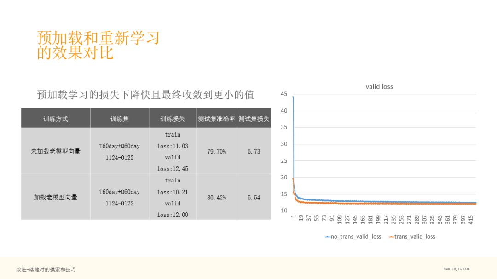

## Embedding在民宿推荐中的应用

民宿越来越成为旅游消费的新热潮，作为国内最大的民宿平台，途家在应用 AI 技术进行个性化商品推荐方面进行了不少探索。民宿行业的数据，具有用户消费频次低，用户兴趣点不好描述等特点，基于内容和普通协同过滤的方法效果都不明显，受 graphic embedding ，word2vec 的启发， 我们运用 Embedding 技术有效建立了商品之间的相似关系，运用在物物相似推荐场景通过 AB 测试效果明显胜出。这里对这方面的主要工作进行一个介绍和分享：

- 背景：民宿推荐 & Embedding
- 方案：业务中 Embedding 如何落地
- 改进：落地时的摸索和技巧
- 后续：未来计划

#### 一、背景

民宿在国内还算是比较新的行业，发展比较快，在国外民宿已经发展很多年了，沙发客文化在国外比较流行。

图中右侧部分，为途家 APP 的界面，左边为 list ，右边为点击第一个房间的详情，如果没有用过民宿的同学可以感受下。民宿列表页和携程、去哪儿酒店有明显区别，他们的图是比较小的，而民宿看起来图片很大，什么原因呢？其实民宿是非标住宿，个性化较强，住酒店的话，可能你想好几星，位置，价位，就可以选择了，但是民宿，人们很多时候，会想住一个山景房，或者一个木屋，住在海边，或者是繁华地段，需求方面会注入更多个性化因素。

总结下，民宿个性化推荐特点：

- 消费低频，它是旅游需求，相对低频，且用户行为中位置选择占主导，这导致如果应用传统的协同过滤方法，不容易出效果，即使得到的结果也仅仅体现出位置相近的关系。

- 商品特色数据不易标注，民宿的商品比较特殊，除了房子基本信息，还有很多潜在信息，不容易表达和标注。

- 用户核心需求不好挖掘，当给出能住几个人，在什么位置，是别墅还是农家乐等信息，用户往往还是无法做出选择，还是会详细的看看房子的图片，或者和商户再进行一些沟通，询问些问题，比如是否适合小孩入住，是否有宠物，因此用户的核心需求也不好挖掘。

这就是民宿推荐上的一些特点。

#### 二、方案

为了在民宿推荐上引入更多的个性化，我们考察了三类个性化推荐的方案：

- 基于内容的推荐

依赖的数据：这个方法很直接，如果我们可以把房屋的各个维度的数据描述出来，都打上标签，我们就可以进行推荐，比如装修风格，图片怎么样，是否有些有趣的特色。

特点：可覆盖新品，需要大量前序数据挖掘和标注工作，潜在特性不易表达，数据描述的全面性和准确性难保证。

- 基于协同过滤的 item-to-item 相似推荐

在这里我们不用 user-to-user ，因为它是低频消费的场景，用户之间的相似度很难挖掘，所以我们这里重点考察 item-to-item 相似推荐。

依赖的数据：用户行为日志

特点：不需要数据标注，从高层角度进行推荐；无法覆盖新品，在酒店民宿上应用会陷入以地标相似为主的囧境，弱化了其他个性化特征。

- 基于 embedding 的 item-to-item 相似推荐

Embedding 可以挖掘商品多维度的潜在个性，通过向量之间的内积，发现物品之间的相似性。

依赖的数据：用户行为日志

特点：不需要数据标注，从高层角度进行推荐；无法覆盖新品，可以挖掘除了地标特征外的多维度相似性。

**Embedding**

- 下面介绍下 Embedding：
  - Embedding 是指把超高维 one hot 离散型变量，表达成一个相对低维的向量 ( 如从100000维降到64维 )
  - 在民宿场景下，把房子用一个向量表示，这个向量的内积越大，就表示相似度越高。

- 这种向量可以表示房屋的原理是：
  - 我们收集了大量的用户日志，用户在短时间内会浏览很多房子
  - 我们认为，用户在下单前，他的搜索都是基于同一个需求的，所以在短时间内浏览的房子是具有内在相似性的。

**Embedding 方案比较**

- 我们考察了几种 Embedding 方案：
  - Graphic Embedding：大家可以看到上图 ( a ) : 用户搜索时的时序，图 ( b ) ：把时序用网络来表达，其中 u1 用户的行为 DAB ，就可以把 D-A-B 连线，多个用户的连线放在一起，就形成了网络。这种方式考虑了用户点击行为之间的顺序，和不同用户行为序列的交叠， 这在我们的场景中没有必要性，且会增加很多计算量。
  - Rnn-Language Model：这个模型复杂度高，有顺序考虑，在数据集不大时，收益也不明显。
  - Skip-Gram Model：回归到简洁的模型，其实模型的复杂度是跟我们的数据和真实的场景有关的，有时候需要复杂的模型，有时候可能简洁的模型更好。这个模型简单来说是一个短时词袋模型，复杂度低，很适合对大量的语料进行建模计算。2013年 Mikolov 等人正是回归到简单的 Skip-Gram 模型开启了 NLP 领域的新阶段。

**Skip-Gram Model**

- 简单介绍下 Skip-Gram Model：
  - 它是实现 word to vector 的经典方法，利用词语在上下文中的共现现象，为每个词生成一个低维向量表示(几百维)。
  - 我们可以看右边的网络图，非常简洁，输入为 w(t) ，中间层为高维的 projection 层，最后为输出层，可以采用 softfmax 、也可以采用二分类，Skip-Gram 采用了二分类，通过负采样的方式，避免了对大量输出的分类。
  - 下面为一个语言的例子，输入为 quick ，输出为 the 或者 brown ，然后做了负采样 java ，这就构建了正负样本，可以进行学习了。

- 网络参数：
  - Projection 层：Enxd ，这个就是我们说的 Embedding ，n 指 n 个词，d 指我们想把这个词表达成多少维的向量。
  - Output层：Wnxd ，也是每个词都有 d 维的参数，然后还有一个偏置 bn
  - 我们用 wi 表示输入，wo 表示输出，Vwi 表示 Embedding 向量。

- 预测概率：
  -  可以看到这里我们要预测某个词出现在上下文中的概率，就是求解在给定输入词 wi 的时候，wo 的概率是多大。

- 正负采样：
  - 这里 Skip-Gram 采用的是正负采样，取前后 A 词作为正样本，在词典中任取 B 词作为负样本。为什么取负样本？因为不能只去学习正样本，两个词之间不是所有属性都相近，需要负样本来学出来到底哪些属性相近，哪些属性不相近。

损失函数：

**Skip-Gram Model 实现 HouseToVector**

- 接下来把 Skip-Gram 落地到民宿场景中，把一个个民宿表达成向量。
  - 如上图，左边为自然语言的一个句子
    - 白框 The cat plays with the dog 是一个正常的句子
    - 后面俩个黄色的词其实和这个句子无关，我们把它采样进来做一个负例
    - 学习的时候The作为输入，cat 和 plays 作为正样本，car 和 driving 作为负样本，这样构成一个学习样本去学习它的 Embedding 。
  - 在我们的业务中
    - 这个序列其实就是一个个房子，就是用户在列表页看到的房子，并且是点击过的房子
    - 黄色为用户跳过的房子，这样就和我们的语言模型对应上了，也有正样本和负样本
    - 图中蓝色的框为用户的 book ，即用户的下单。可以看出，用户的潜在需求与短期内点击过的房子具有相似性，与跳过的房子不相似，与下单房子的相似性具有高权重。

- 上图左边的概述，就是我们如何把 Skip-Gram Model 如何映射到民宿场景中的：
  - 连续的浏览点击行为作为单一需求上下文  w(1),w(2)…w(t)….
  - 若两个行为间隔在半小时以上，则分到两个不同需求上下文中
  - 一个上下文中点击的房子作为正样本 wa ，跳过的房子作为负样本 wb
  - 当天下单的房子作为当天所有上下文的正样本 wa ，且权重更大(当作5个点击)
  - 正样本中任何一个房子可以作为输入 wi
  - 其前后2个正样本及下单房子作为输出中的正样本 wa
  - 采样一个上下文中跳过的8个房子作为输出中的负样本 wb
  - 补充采样上下文中目的地(可能多个)的若干个房子作为负样本 wb
  - 一个训练样本包括, 输入：1个房子，输出:  64个房子

- 模型训练
  - 百万级的房源，用64维的向量来表达，参数其实就是 E 矩阵和 W 矩阵，对 W 矩阵进行 L2 正则化，Batch size 为1024，使用了100个 Epoch ，训练了1天，训练的样本量是由800万浏览点击上下文对应的4000万训练样本，700万评估样本，采用 Tesla M40 训练平台。

可以看下我们的 loss 曲线，黄色为评估集，蓝色为训练集，可以看到这个曲线是比较符合预期的，没有太大的抖动，说明这样的方法合适民宿 Embedding 建模。

模型评估除了刚刚的 loss 曲线评估，我们还需要一些产品维度的评估，包括：预测准确率，单一维度相似性。右图为单一维度相似性的对比图。

我们再说个具体的例子，就是途家 app 列表页的一个变化。上图中红直线标出了几个房子位置发生了上移，原因是和作图中用户点击的房子具有相似性，直线上小字是相似度。

这个是我们在线 ABtest 的一个效果，可以看到蓝色是我们的上线日期，上线之后，有一个明显的转化率的提升。

另外我们还做了一个工具提供给供应链的同事使用，用来进行联想搜索, 左上角是输入的房子，下面是根据 Embedding 最相似的若干房子：

**三、改进**

**落地中的一些技巧**

- 关于训练集和训练参数：
  - 过滤掉停留时长太短的点击行为

  - 过滤掉点击数量太多的用户行为

  - 上下文不能太长： +/-2个点击,  行为间隔<30分钟

  - 下单参与到用户当天所有上下文中

  - 负采样：

    √ 一定要采样用户跳过没点的房子，数量不能比正样本多太多

    √ 一定要采样同目的地的其他房子，数量和用户跳过房子相当

- 学习率：足够小，自适应降低

- L2正则化：针对 W ，采用较强的约束，batch-related：只把当前 batch 里出现的房子加入到 L2 正则项里。

**应用 Embedding 中的一些技巧**

- 数据后处理：

  √ 预测前需要对所有 Embedding 向量规范化

  √ 过滤掉在训练集中总出现次数小于10的房子

- 推荐方案：对用户一天内最近5次点过的房子向量求均值，再求与候选房子的相似度

- 冷启动问题：

  √ 找到与新上房子最接近的房子小集合，对小集合中的 Embedding 向量求均值作为该新房子的 Embedding 向量

  √ 小集合确定方法：在距离，房型，价格，图片分，面积，人数等已有数据方面尽量接近

**Embedding 的迭代更新**

说下比较重要的一点，就是训练一次生成百万级向量之后，过了一段时间，由于民宿增长非常快，每天都有很多新的民宿进来，过一段时间，我需要重新训练，这个代价是比较大的，就是说如果用新的训练样本去训练，可能以前的房子最近没什么人看，那么它的向量可能会丢失，我们的做法：

- 收集最近2月的用户行为日志，生成新训练样本

- 预加载上一版模型参数：

  

- 新增的 p 个房子补充到参数矩阵末尾随机初始化：

  

- 只用新训练样本进行训练，导出 Embedding 矩阵同步到线上推荐模型。

这样方式的特点：

- 老的房子向量可以存留和持续更新
- 及时加入新的房子向量

**预加载和重新学习的效果对比**

然后我们对比一个房子，假设这个房子在新的训练集中不存在，只在老的训练集中存在，通过右图，可以看到，第二列是预加载后训练的模型，第三列是重新训练（不预加载参数进行训练），发现，如果把原来老房子的向量加到重新训练的 Embedding 矩阵中，其实没意义，可以看到第三列的相似度差了很多，基本上像在随机乱猜。可见预加载训练很有必要。

**四、后续**

我们优化的未来计划：

- 引入丰富的行为类型，包括收藏，聊天，点评；聊天其实是比较重要的，用户下单前往往会和商户简单聊几句，如果发生聊天，我们会认为这是一个更重的正样本。
- 考虑用户的时序行为，引入 Attention 机制。
- 引入其他属性，作为副信息和 Embedding 一起学习，顺便把其他属性的 Embedding 也提取出来。