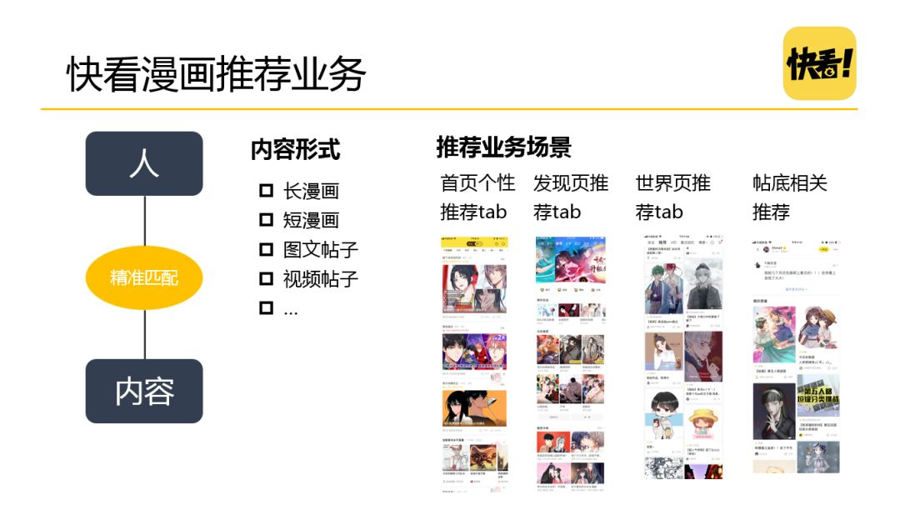
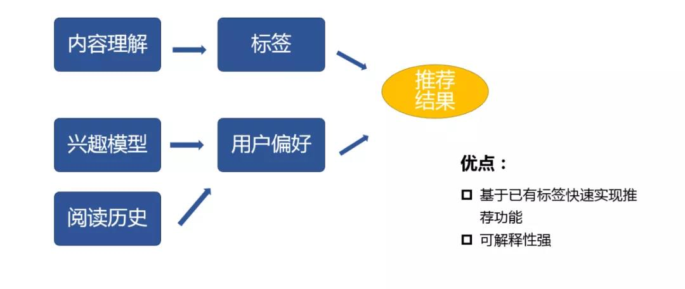
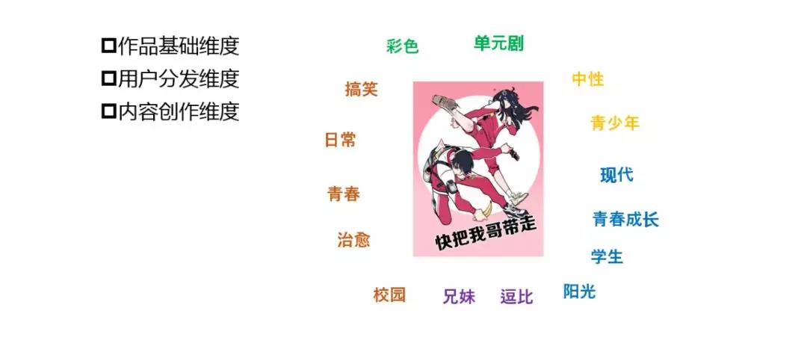
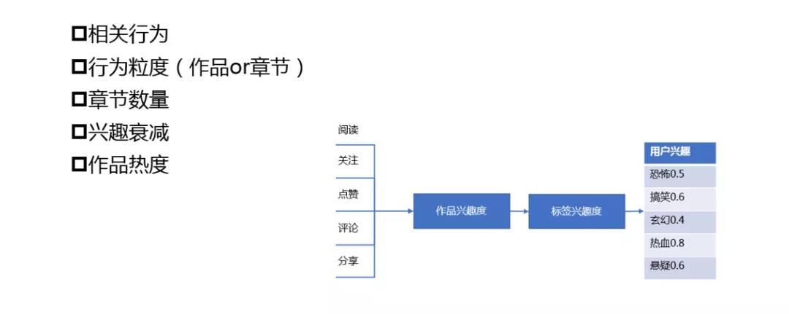
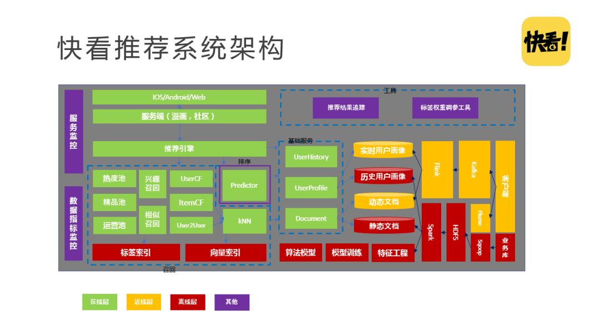

### 快看漫画个性化推荐

#### 一 业务介绍

- 关于快看漫画
  - 快看漫画（快看世界[2014]旗下） app 是中国新生代内容社区和原创 IP 平台
  - 截止2019年7月总用户量已经突破2亿，注册用户量突破1亿，MAU4000万
  - 绝大多数用户属于高活跃、高粘性的95后、00后
  - 被 QuestMobile 等机构评为“最受00后欢迎的产品”
  
- 推荐业务发展方向
  - 很多人来到快看漫画，主要是看漫画
  - 但内容不只是漫画，还有社区的UGC内容
  - 从产品属性来讲，现在更倾向于漫画，但未来重点的战略是强化社区属性
  - 对于推荐而言，是长内容（漫画）和短内容（社区）结合

- **快看漫画推荐业务**
  
  
  
  - 首页个性推荐 tab，发现页推荐 tab，世界页推荐 tab，贴底相关推荐
  - 内容形式包含：长漫画、短漫画、图文帖子、视频帖子等
  - 推荐业务要解决的问题：如何为4000万MAU更好的分发长内容和短内容

#### 二 技术挑战

- **内容形式多样**
  - 短内容（短视频、新闻资讯、用户帖子等）特点：
    - 占用用户碎片化时间，阅读时间短
    - 兴趣点通常单一
  - 长内容（漫画、小说等）特点：
    - 占用用户大块的时间，阅读周期长
    - 连续性、周期性、多章节多兴趣点
  - 针对多样的内容形式，我们面临的技术挑战：
    - 技术上如何捕捉长内容的连续性、周期性、多兴趣点等特征？
    - 快看漫画既有长内容又有短内容，如何较好的融合两类内容？
-  **内容风格独特**
  - 快看漫画有大量的文本信息（帖子内容、弹幕、评论）和海量的图像信息（漫画图像、帖子图片），其带来的挑战为：
    - 如何进行漫画类图像内容理解？图中古风的图片可能比较好理解，但是如何分辨校园和都市，通过图像是很难判别的。
    - 独特的社区文化（比如二次元），新生代文化“暗语”（如上图帖子中的内容，对这方面不了解的人都很难理解，对于机器来说更难理解），给文本内容理解带来挑战。

#### 技术探索：算法

-  **推荐算法演进**
  
  - 如果现在界定为深度学习时代，各大公司的产品都已经上了深度学习模型，深度学习的效果是非常好的，但是它的平台搭建周期是非常长的，并且很难被解释，是一个黑盒的东西，看不到摸不到，很难干预。对于前深度学习时代，也就是传统机器学习模型来说，它的可解释性强，训练起来比较容易，并且容易部署。
  
- 快看推荐算法迭代
  
  
  
  - 快看推荐算法起步相对于推荐领域是比较晚的
  - 相对于漫画垂直领域还是比较早的
  - 2019年以前更多的是基于内容的推荐
  - 2019年上半年引入了协同过滤
  - 2019年到现在排序主要用到的是 XGBoost
  - 未来会考虑深度学习

##### 基于内容的推荐

- 基于内容的推荐
  
  
  
  - 最大的难点在于对内容的理解
  - 快看漫画有比较专业的运营和内容团队，在做推荐之前已经有了一些比较基础和简单的标签，可以快速的应用起来
  - 做内容推荐，我们需要有很好的内容理解，构造好物品的画像
  - 另外，需要很好的理解用户的兴趣偏好，构建用户的用户画像
  - 把两者很好的结合就可以得到推荐的结果
  - 内容推荐，可解释性较强，对于在内容方面有很深积累的公司，可以快速构建
  
- 基于内容推荐-快看漫画标签体系
  
  
  
  - 分为三个维度：
    - 作品基础维度：搞笑、青春、治愈等
    - 用户分发维度：男性、女性、青少年等
    - 内容创作维度：青春成长、兄妹、学生等
  - 即使有专业的标签团队来打标签，建立很好的标签体系也需要很长的时间
  - 因为人和人之间的感受和认知是有差距的，如何制定标准，保证每个作品打的标签是无差别的，是一个很专业的问题
  
- 基于内容推荐-用户兴趣模型
  
  
  
  - 相关行为：关注、点赞、评论、分享等
  - 行为粒度：会精确到关注的作品或具体某个章节
  - 章节数量：章节数量不等，有的作品很长，有的作品很短，如何判断用户对一个感兴趣，对另一个作品不感兴趣
  - 兴趣衰减：用户的兴趣是周期性的，会存在兴趣衰减的情况
  - 作品热度：需考虑热门作品，大家都在看的内容
  
- 基于内容推荐总结
  - 存在以下缺点：
    - 非常依赖标签
    - 推荐粒度较粗，如果用户兴趣单一的话，召回会不足
    - 缺乏新颖性
  - 第一次上线基于内容推荐的模型，DAU 人均阅读次数率提升35%，效果还是很不错的

##### 基于协同过滤

**基于内容之后，引入了协同过滤，下面为已实现了的三种算法：**

- 基于物品的协同过滤 ( Item-Based )，对于漫画来讲，作品数量不是特别大，可以很快的离线计算完成。
- 基于用户的协同过滤 ( User-Based )，4000万MAU，挑战更大，下面将重点介绍。
- 基于模型的协同过滤 ( Model-Based )

由于协同过滤都是基于矩阵来完成的，我们采用的是业界常用的 KNN 近邻算法。

① KNN 召回

因为，基于用户的协同算法用户相似度计算量巨大，所以，针对 KNN 近邻算法，我们做了调研，对 Nmslib 和 Faiss 库做了对比：

它们都是开源的，可能 Faiss 会比较知名一点，因为是 Facebook 开源的，它们的实现语言都是 C++，都实现了 Python 绑定，但是 Faiss 会支持 GPU，都实现了目前最快的 HNSW 分层索引算法，右边为网上找的两个算法在单机 CPU 上的 benchmark，训练集大概 100+W，维度是200，查找的是100个近邻。大家可以看到，最外层绿色的线就是 Nmslib 实现的 HNSW 算法，紧接着深绿色的就是 Faiss 实现的 HNSW 算法，对比 Nmslib 会慢一点，再往下一条线是 Faiss 实现的 IVF 算法，它会稍微差一些，但是它可以支持 GPU 并行计算，所以按照 GPU 去考量，那么这个明显是胜出的，所以我们综合考虑，选择了 Faiss 作为近邻计算的基础库。

这里简单介绍下 Faiss 实现的算法。

Faiss IndexIVFFlat 实现过程：

- 训练 & 建索引

① 聚类（找到聚类中心存储在量化器 quantizer 中）

② 找到每个向量最近的聚类中心点

③ 建立倒排id ( id 编号 ) list

④ 建立倒排 code ( 真实向量的倒排索引 ) list

- 搜索 topK

① 搜出查询向量最近的 n 个聚类中心点 id 及对应的距离

② 构建 k 个元素最大堆

③ Id 对应的倒排 list 每个向量计算距离后放入最大堆

④ 堆排序，最后做堆排序就可以得到 TopK

下面的 Faiss IndexIVFPQ，相当于一个升级优化版本，实现更复杂些，会计算残差，通过构建二级索引实现计算的加速。整体来说，我们实现了 User-Based CF 的实时在线召回。

② 基于协同过滤总结

- 协同过滤上线后，DAU 人均阅读次数提升了31%，同时协同过滤存在的缺点为：
  - 倾向于推荐热门内容 ( 当然可以通过一些方法对热门内容进行打压 )
  - 对新用户和新内容不友好
  - 相似矩阵的计算量大 ( 可以通过 ANN 的方式来解决 )

**5.** **召回排序模型**

我们有了基于内容的召回，基于协同过滤的召回，每个召回都有自己的排序结果，我们会考虑如何把这些结果合并起来，前期是基于规则的，后期我们采用 CTR 预估的方式，使用传统的召回+排序的结构。

① 常用 CTR 预估算法

常用的 CTR 预估算法有：LR、FM & FFM、GBDT ( 树模型 )、DNN ( 深度神经网络 )。

LR 模型

优势：

- 模型简单，善于处理离散化特征 ( 包括 id 类特征 )
- 容易实现分布式，可处理大规模特征和样本集

劣势：

- 特征需要离散化
- 特征之间在模型中是孤立的，需要做大量特征工程来做特征交叉

XGBoost 模型

优势：

- 树模型具有一定的组合特征能力
- 善于处理联系特征，可进行特征筛选，人工特征工程量少

劣势：

- 具有很强的记忆行为，不利于挖掘长尾特征
- 组合特征的能力有限

FM & FFM 模型

优势：

- 可以自动进行特征间的组合
- 通过引入特征隐向量，加速了训练的复杂度，善于处理稀疏数据

劣势：

- 工作量接近深度学习，效果不如深度学习
- FFM 计算复杂度高

DNN 模型

优势：

- 可直接输入原始特征，减少交叉特征选择
- 效果好

劣势：

- 可解释性差
- 模型可能较大，调参复杂，需要较大的工程支持

综上，我们最终选择人工特征工程量较少的 XGBoost 方案。

② 召回排序模型总结

- 上线召回排序模型之后，DAU 人均阅读次数提升36.6%，目前的现状和问题：
  - 特征还需要进一步挖掘
  - 模型的训练效果有待提升，需要工程上的提升
  - 探索尝试新模型提升效果

#### 技术探索：系统架构

**1.** **架构的重要性**

架构的重要性：算法是大脑，架构是骨架，如果没有好的推荐系统架构，算法很难落地。

好的推荐系统需要具备的特质：

- 实时响应请求
- 及时、准确、全面的记录用户反馈
- 优雅降级，即使在服务出现问题的时候，也能推荐出个性化的结果
- 快速迭代推荐策略、算法

**2.** **经典 Netflix 推荐系统架构**

这是 Netflix 在2013年公布的推荐系统架构，把推荐系统分为了三层：

- 离线层：一个用户产生行为，通过事件分发，分发到离线层和近线层，离线部分是通过 hive 和 pig 这种通过离线的任务把数据分发到模型训练和一些离线计算上。
- 进线层（准实时层）：近线层有个组件叫 Manhattan，相当于今天常用的 Flink 和 Strom，把实时计算结果存储到 Cassandra 相当于 HBase，然后还有 EVcache 相当于 redis。
- 在线层：在线层会用离线计算的模型和近线计算的结果，得出在线的排序结果。

这就是当时 Netflix 的推荐系统架构。

**3.** **快看推荐系统架构**

我们在做快看推荐系统架构的时候，实际上是没有参考 Netflix 的架构，但是，当我们完成之后发现，各个层也可以按照这个方式去划分：

- 近线层（橙色，实时数据流过程）：客户端采集的日志数据，通过 Kafka、Flink 传递到实时用户画像和动态文档。
- 离线层（红色）：业务库数据通过 sqoop 导到 HDFS 后在 Spark 上计算，然后是离线模型，包括特征工程，模型训练，算法模型，向量索引，用户画像等等。
- 在线层（绿色）：包括在线的召回、排序、推荐、服务端、ios/android 等等。
- 工具（紫色）：标签权重模型、推荐结果追踪、数据指标监控和服务监控。

**4.** **AB 实验平台**

快看的 AB 实验平台在功能上是非常完善的，是从产品各层级自上而下统一的实验标识，方便联动；实现了设备随机、用户随机、流量随机的随机分组方式；通过实验分层支持正交实验，可以在一个层做多组实验；同时支持互斥实验，确保流量调整时用户稳定落在某一分组。

对于指标计算，进行了显著性的总结和功效的总结，并且指标可配置，在做实验的时候想关注哪些指标可以进行配置，方便查看算法实验的效果。

**5.** **推荐结果追踪工具**

推荐往往会有一些 Bad case 暴露出来，如果没有做追踪，就很难查找那块儿出了问题，因此我们做了个性化推荐全链路的跟踪系统，保证了推荐的结果是因为什么推荐的，或者为什么没有被推荐，这样就保证了一个可解释性。如何解决的？我们会把当时的历史画像 Snapshot 和上下文，通过 HBase 记录下来。

**▌****总结与未来规划**

**1.** **总结**

本次分享主要介绍了快看和快看的推荐业务，从算法和系统两方面介绍了快看推荐技术在起步阶段的一些探索，并且介绍了大规模k近邻计算方法、AB 实验平台搭建等常用技术的落地方案。

**2.** **未来规划**

- 内容理解是推荐业务的基石，目前这块儿还比较欠缺，未来将探索漫画领域的图像和文本内容理解技术。
- 传统机器学习方法探索充分之后将尝试深度学习推荐算法，以期更好的推荐效果。

