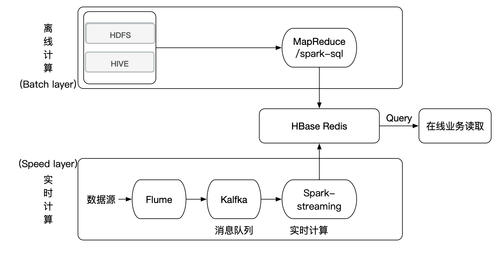
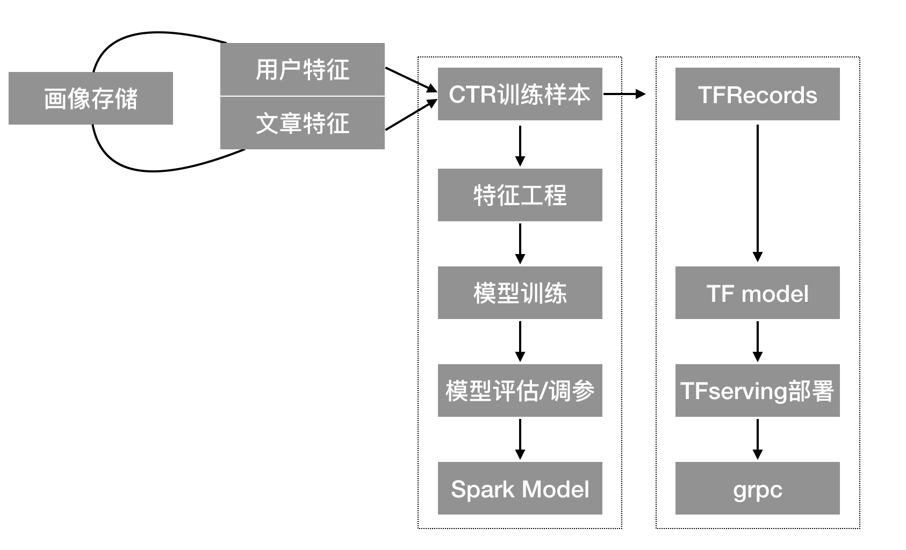

# 3.3 离线召回与排序介绍

## 学习目标

- 目标
  - 了解大数据推荐离线在线的特点
  - 说明召回模块与排序模块的设计、作用
  - 知道头条推荐召回排序设计
- 应用
  - 无

#### 黑马召回与排序业务流程

### 3.3.1 大数据的离线与在线架构

关于整套大数据实时推荐的离线与在线部分解释：

| 计算方式 | 特点                                                         | 任务                                                         | 举例                                                         | 缺点                                              | 框架                              |
| -------- | ------------------------------------------------------------ | ------------------------------------------------------------ | ------------------------------------------------------------ | ------------------------------------------------- | --------------------------------- |
| 离线     | 1、支持处理大数据量 2、进行批量任务计算 3、可以加入机器提升效率 | 1、挖掘用户、物品标签  2、用户物品离线特征处理 3、批量推荐结果召回计算 4、批量机器学习算法 | 1、矩阵分解 2、LR模型训练                                    | 1、无法及时捕获用户的兴趣 2、无法给用户及时的推荐 | spark sql,hive                    |
| 在线     | 1、运行简单的算法和逻辑  2、立即对用户反馈                   | 1、解决用户冷启动 2、融合排序 3、多样性提升 4、过滤逻辑      | 1、取出离线阶段的推荐电影 2、运行LR进行在线排序 3、过滤文章，输出推荐结果 | 1、相应时间有速度要求 2、计算时间复杂度有要求     | flume,kafka,spark streaming,hbase |

### 3.3.2 召回与排序介绍

召回：从海量文章数据中得到若干候选文章召回集合(数量较多)

排序：从召回集合中读取推荐文章，构建样本特征进行排序过滤筛选

#### 3.3.2.1 推荐算法复习

#### 3.3.2.2 召回模块

* 召回模块组成：多路召回池，召回缓存
* 召回模块：会存在多种召回方式/算法进行召回集合存储
  * 离线计算：基于历史数据定时更新用户的召回结果
  * 在线计算：快速进行推荐系统的推荐结果，解决冷启动问题

#### 3.3.2.3 排序模块

* 排序模块：主要就是模型的训练以及部署，然后在实时推荐时候进行召回结果的排序计算

**离线排序模型训练**

* 画像离线计算得到CTR预估训练所需要的样本数据
* 排序模型技术：Spark与TensorFlow

**实时推荐排序模型排序操作**

训练出来的模型，到时候在实时推荐当中，读取召回集合之后，进行实时排序

### 3.3.3 黑马头条推荐的召回排序设计

* 匿名用户：
  * 通常使用用户冷启动方案，**区别在于user_id为匿名用户手机识别号(黑马头条不允许匿名用户)**

* 所有只正针对于登录用户：

* 用户冷启动（前期点击行为较少情况）
  * 非个性化推荐
    * **热门召回**：自定义热门规则，根据当前时间段热点定期更新维护人点文章库
    * **新文章召回**：为了提高新文章的曝光率，建立新文章库，进行推荐
  * 个性化推荐：
    * **基于内容的协同过滤在线召回**：基于用户实时兴趣画像相似的召回结果用于首页的个性化推荐
* 后期离线部分（用户点击行为较多，用户画像完善）
  *  建立用户长期兴趣画像（详细）：包括用户各个维度的兴趣特征
  *  训练排序模型
    *  **LR模型、FTRL、Wide&Deep**
  *  离线部分的召回：
     *  **基于模型协同过滤推荐离线召回**：ALS
     *  **基于内容的离线召回**：或者称基于用户画像的召回

