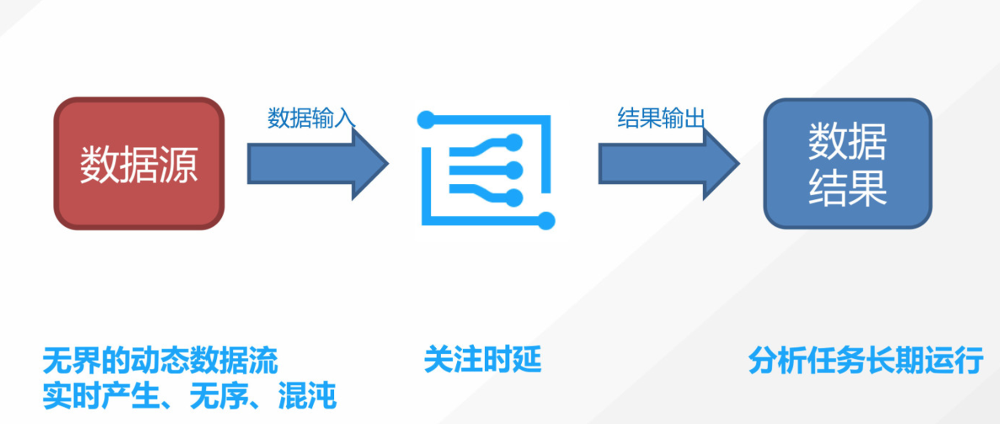
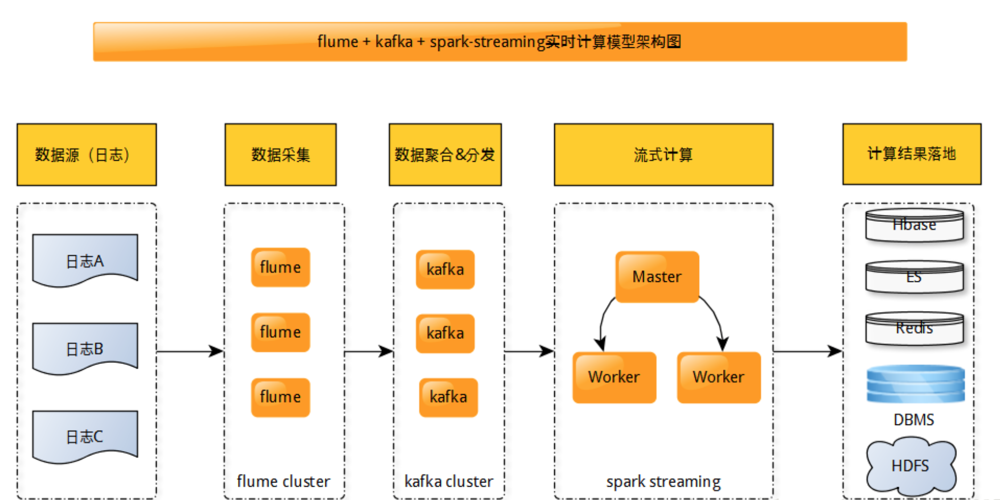

# 4.1 实时计算业务介绍

## 学习目标

- 目标
  - 了解实时流计算
  - 了解实时计算的业务需求
  - 知道实时计算的作用
- 应用
  - 无

随着移动设备、物联网设备的持续增长，流式数据呈现了爆发式增长，同时，越来越多的业务场景对数据处理的实时性有了更高的要求，基于离线批量计算的数据处理平台已经无法满足海量数据的实时处理需求，在这个背景下，各种实时流处理平台应运而生。 

介绍流计算之前我们先来看看大数据领域里常见的批量计算的工作原理。这里涉及了几个步骤：首先要将数据从数据源装载到大数据的存储里面，比如说HDFS这样的分布式文件系统。然后我们就可以用不同特点的分析引擎，如Hive、Spark等引擎对这个数据集进行全量的分析，从而得到一个结果。 

那么流计算的场景是怎么样的呢？ 

公司随着业务的上涨，都会和恶意的用户做对抗。比如做刷量投票的、做数据窃取的，甚至还有进行网络攻击的。比如我们大家所熟知的12306网站，会有黄牛刷票。 

假设我们已经拿到了这个应用的的实时访问日志，我们怎样才能快速分析这些日志，并判断是否发生攻击，已经找到攻击的根源呢？ 

攻击的时间是非常快速的，如果我们还是用以往的批处理的方式来分析所得日志的话，即使我们事后得到一个报告，也是没有任何意义的，攻击所带来的伤害已经发生了。这也是体现流计算实施的一个典型场景。

刚才的例子， 对实时性要求非常高的数据处理中，原来先存后算的架构是无法满足要求的。所以在流式计算里，我们是希望能够随着数据的流动，实时地进行加工处理，并实时地吐出计算结果。 

**实时流处理概述**

- 实时计算：数据的即时处理
- 流式计算：数据是持续不断的输入的
- 实时流式计算：将上述两个概念结合

**流计算的特点是：** 

* 数据不是静态的，而是随着时间的推移逐步流入系统中的一个动态数据流，通常会有非常多的数据源，不同数据源的数据都是根据自己的特点，实时产生的，并且不同的数据源之间的数据流的顺序是无法控制的。如果要存放这些数据流，是无法得到完全一样的数据流的。同时，这些数据都是由数据流实时产生的，数据的流速也是无法预测的。 
* 数据流进入系统之后，它本身的数据价值和生命周期较短，所以相比之下处理时延就显得格外重要。 
* 流式数据分析的任务通常是长期运行的，采用一种事件驱动，或消息驱动的方式来输出分析结果。 

**Spark Streaming：微批处理框架的代表**

它是把实时输入的数据流以时间片，比如说一秒为单位，切成块，每一块就是一个RDD。它会生成一个Spark Job来处理RDD，并且分批次提交到集群中去运行。运行每个Job的过程和真正的Spark任务没有什么区别。也就是说，Spark Streaming是以单位为计算，而不是以消息来计算。这样大大减少了Ack所需的开销，显著提高了吞吐量。

**Spark Streaming的优点：**

* 吞吐量高
* 容错支持exactly once——能够通过RDD的check point实现exactly once
* 生态活跃，外围工具多——Spark本身的生态非常活跃，编程接口也良好，拥有非常多算子的函数库，支持的外围工具也很多

**Spark Streaming的缺点：**

* 微批处理，延迟较高——由于采用微批处理模式，它的延迟只能到秒级，如果将微批改的更小，会消耗更多的管理开销

### 4.1.1 实时计算业务需求

实时（在线）计算：

* 解决用户冷启动问题
* 实时计算能够根据用户的点击实时反馈，快速跟踪用户的喜好

### 4.1.2 黑马推荐业务图

