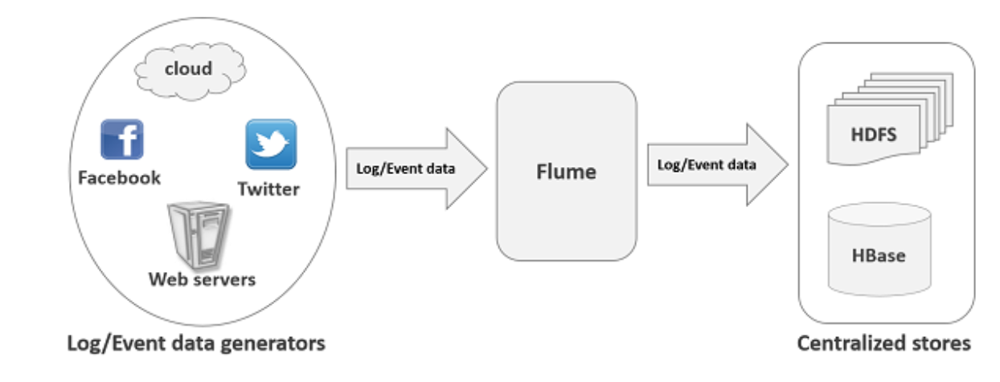
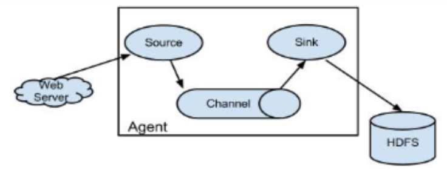
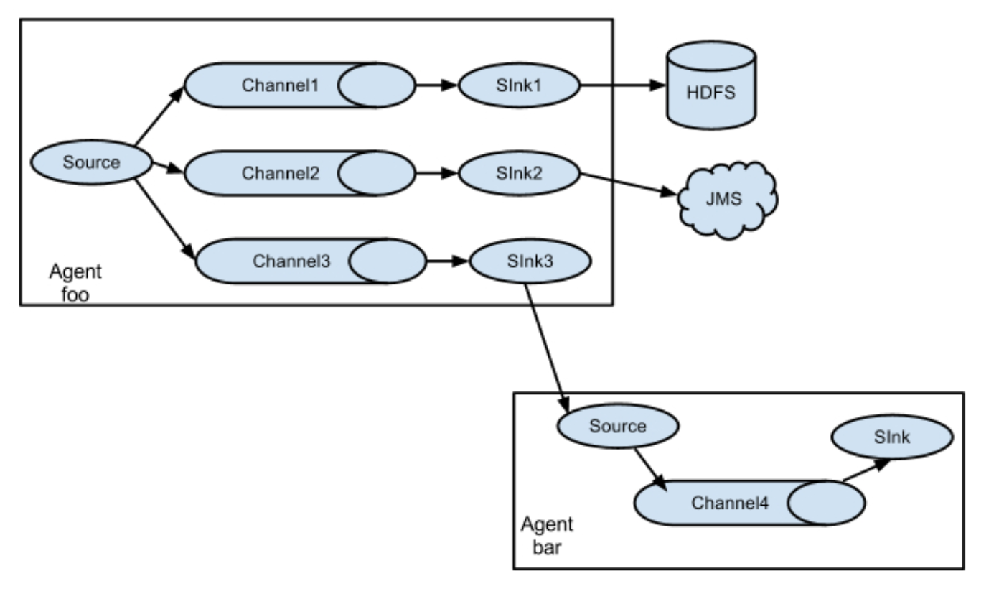
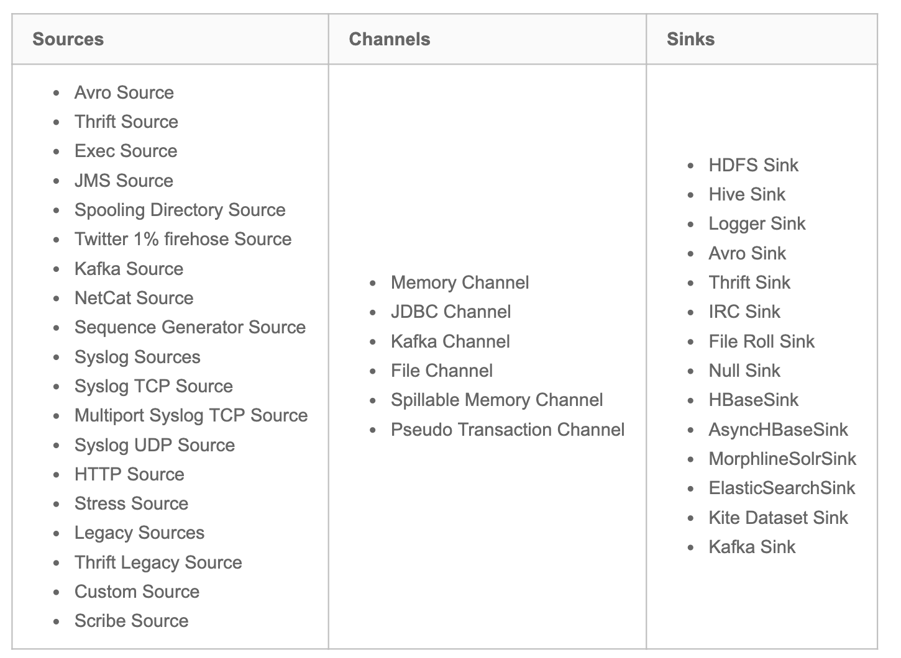
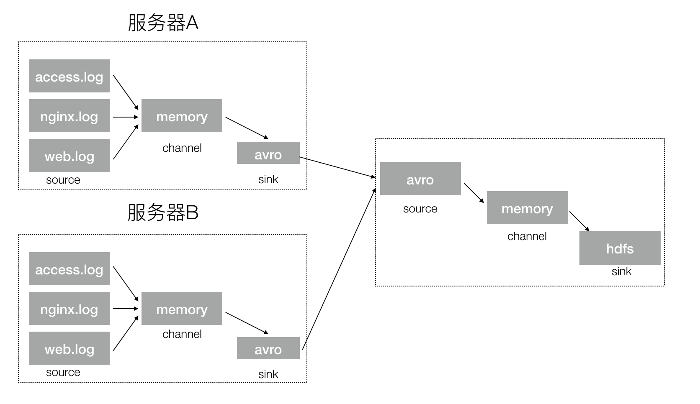

# 4.2 Flume

## 学习目标

- 目标
  - 了解Flume结构
  - 掌握Flume的安装
  - 知道Flume的参数配置、插件以及作用
  - 了解Flume的负载均衡
- 应用
  - 应用Flume监听端口数据并输出到控制台
  - 实现Flume采集文件/目录到HDFS

### 4.2.1 Flume概述

Flume是由cloudera软件公司产出的可分布式日志收集系统，后与2009年被捐赠了apache软件基金会，为hadoop相关组件之一。尤其近几年随着flume的不断被完善以及升级版本的逐一推出，特别是flume-ng;同时flume内部的各种组件不断丰富，用户在开发的过程中使用的便利性得到很大的改善，现已成为apache top项目之一。

#### 4.2.1.1 什么是Flume

*  定义：apache Flume 是一个从可以收集例如日志，事件等数据资源，并将这些数量庞大的数据从各项数据资源中集中起来存储的工具/服务，或者数集中机制。




Flume是分布式的日志收集系统，它将各个服务器中的数据收集起来并送到目的地。

**Flume发展史**

当前 Flume 有两个版本。Flume 0.9X 版本的统称 Flume OG（original generation），Flume1.X 版本的统称 Flume NG(Flume-728)（next generation）。由于 Flume NG 经过核心组件、核心配置以及代码架构重构，与 Flume OG 有很大不同，使用时请注意区分。改动的另一原因是将 Flume 纳入 apache 旗下，Cloudera Flume 改名为 Apache Flume。

#### 4.2.1.2 应用场景

比如一个电子商务网站，想从消费用户中访问点特定的节点区域来分析消费者的行为或者购买意图。这样我们就可以更加快速的将他想要的推送到界面上，实现这一点，我们需要将获取到的她访问的页面以及点击的产品数据等日志数据信息收集并移交给Hadoop平台上去分析。现在流行的内容推送，比如广告定点投放以及新闻私人定制也是基于次，不过不一定是使用FLume,也有其他一些产品，比如facebook的Scribe，还有Apache新出的另一个明星项目chukwa，还有淘宝Time Tunnel。

**同类产品对比**

- Flume：Cloudera/Apache Java 
- Scribe：Facebook C/C++ 不再维护 对于负载均衡效果不佳
- Chukwa：Yahoo/Apache Java 不再维护 负载均衡，容错效果不佳
- Fluentd：和flume类似，Ruby
- Logstash：ELK(ElasticSearch,Logstash,Kibana) 

### 4.2.2 Flume结构

Flume内部有一个或者多个Agent,然而对于每一个Agent来说,它就是一共独立的守护进程(JVM),它从客户端哪儿接收收集,或者从其他的 Agent哪儿接收,然后迅速的将获取的数据传给下一个目的节点sink,或者agent.

* flume的外部结构：


> 数据发生器（如：facebook,twitter）产生的数据被被单个的运行在数据发生器所在服务器上的agent所收集，之后数据收容器从各个agent上汇集数据并将采集到的数据存入到HDFS或者HBase中

* flume 的Agent



Agent主要由: source,channel,sink三个组件组成

* **Source**：采集源，用于跟数据源对接，以获取数据
  * 从数据发生器接收数据,并将接收的数据以Flume的**event格式**传递给一个或者多个通道channal,Flume提供多种数据接收的方式,比如Avro,Thrift等
* **Channel**: 存储容器,它将从source处接收到的event格式的数据缓存起来,直到它们被sinks消费掉
  * channal是一个完整的事务,这一点保证了数据在收发的时候的一致性. 并且它可以和任意数量的source和sink链接. 支持的类型有: JDBC channel , File System channel , Memort channel等.
* **Sink**：下沉地，采集数据的传送目的，用于往下一级 agent 传递数据或者往最终存储系统传递数据
  * sink将数据存储到集中存储器比如Hbase和HDFS,它从channals消费数据(events)并将其传递给目标地

总结：Flume就是将数据从数据源(source)收集过来，Flume会先缓存数据(channel),再将收集到的数据送到指定的目的地(sink)，最后Flume在删除自己缓存的数据 

####Flume 事件

  事件作为Flume内部数据传输的最基本单元.它是由一个转载数据的字节数组(该数据组是从数据源接入点传入，并传输给传输器，也就是HDFS/HBase)和一个可选头部构成.

典型的Flume 事件如下面结构所示：


一个完整的 event 包括：event header、event body 信息，其中 event 信息就是 flume 收集到的日记记录。

* event 将传输的数据进行封装。如果是文本文件，通常是一行记录， event 也是事务的基本单位。event 从 source，流向 channel，再到 sink，本身为一个字节数组，并可携带 headers(头信息)信息。event 代表着一个数据的最小完整单元，从外部数据源来，向外部的目的地去。

### 4.2.3 Flume采集结构图

* 单agent 采集数据


* 单agent多sink



* 多agent


### 4.2.4 Flume安装使用

前置条件

- Java 1.7 or later
- 为sources，channels和sinks提供充足的内存
- 为channles提供充足的磁盘空间
- 为agent提供读和写权限

Flume 的安装非常简单，上传安装包到数据源所在节点上然后解压  `tar -zxvf apache-flume-1.9.0-bin.tar.gz`，然后进入 flume 的目录，修改 conf 下的 flume-env.sh，在里面配置 JAVA_HOME。配置flume环境变量：

```
vi ~/.bash_profile
export FLUME_HOME=/root/bigdata/flume/bin
export PATH=$FLUME_HOME/bin:$PATH

source /root/.bash_profile
```

检查是否配置成功：flume-ng version查看flume版本。根据数据采集需求**配置采集方案**，描述在配置文件中(文件名可任意自定义)

#### Flume使用

 在Flume配置文件中,我们需要

* 需要命名当前使用的Agent的名称
* 命名Agent下的source的名字
* 命名Agent下的channal的名字
* 命名Agent下的sink的名字
* 将source和sink通过channal绑定起来.

* 测试案例：
  * 1、flume的conf目录创建一个test.conf文件,输入以下配置
  * 2、启动agent去采取数据

```python
# Name the components on this agent
a1.sources = r1
a1.sinks = k1
a1.channels = c1

# Describe/configure the source
a1.sources.r1.type = netcat
a1.sources.r1.bind = 192.168.19.137
a1.sources.r1.port = 44444

# Describe the sink
a1.sinks.k1.type = logger

# Use a channel which buffers events in memory
a1.channels.c1.type = memory
a1.channels.c1.capacity = 1000
a1.channels.c1.transactionCapacity = 100

# Bind the source and sink to the channel
a1.sources.r1.channels = c1
a1.sinks.k1.channel = c1
```

**启动agent命令：**

```shell
/root/bigdata/flume/bin/flume-ng agent -c conf -f /root/bigdata/flume/conf/test.conf -n a1 -Dflume.root.logger=INFO,console
```

* -c conf:指定 flume 自身的配置文件所在目录

* -f conf/netcat-logger.conf:指定我们所描述的采集方案

* -n a1:指定我们这个 agent 的名字

**测试**

先要往 agent 采集监听的端口上发送数据，让 agent 有数据可采。随便在一个能跟 agent 节点联网的机器上：

`telnet anget-hostname port`例如：`telnet localhost 44444`

输入效果：

```python
1234

19/06/26 17:27:25 INFO sink.LoggerSink: Event: { headers:{} body: 31 32 33 34 0D                                  1234. }
```

### 4.2.5 Flume进阶

#### 4.2.5.1 Flume可选配置参数

Flume支持各种各样的sources,sinks,channels,它们支持的类型如下:



**Source**

- Avro Source 序列化数据源
- ThriftSource 序列化数据源
- Exec Source 执行Linux命令行的数据源
- NETCAT Source 通过指定端口，ip监控的数据源
- Kafka Source 直接对接Kafka的数据源
- 自定义Source

**Channel**

- Memory Channel
- File Channel
- Kafka Channel
- JDBC Channel

**Sink**

- HDFS Sink 写入到HDFS
- Hive Sink 写入到Hive
- Avro Sink 写入到序列化
- HBase Sinks 写入到HBase
  - HBase Sink 同步写入到HBase
  - Async HBase Sink 异步写入到Hbase 

#### 配置过程

* source
* channels
* sink

一般来说,在Flume中会存在着多个Agent,所以我们需要给它们分别取一个名字来区分它们,注意名字不要相同,名字保持唯一。如果我们需要在一个Agent上配置n个sink,m个channel(n>1, m>1), 例如:

```shell
那么只需要这样配置即可:
#Agent取名为 agent_name
#source 取名为 source_name ,一次类推
agent_name.source = source_name ,source_name1
agent_name.channels = channel_name,channel_name1
agent_name.sinks = sink_name,sink_name1
```

**Source的配置**

注： 需要特别说明，在Agent中对于存在的N(N>1)个source，其中的每一个source都需要单独进行配置，首先我们需要对source的type进行设置，然后在对每一个type进行对应的属性设置.其通用的模式如下：

```shell
agent_name.sources. source_name.type = value 
agent_name.sources. source_name.property2 = value 
agent_name.sources. source_name.property3 = value 
```

**Channels的配置**

 Flume在source和sink配间提供各种管道（channels）来传递数据.因而和source一样，它也需要配置属性，同source一样，对于N（N>0）个channels,

需要单个对它们注意设置属性，它们的通用模板为：

```shell
agent_name.channels.channel_name.type = value 
agent_name.channels.channel_name. property2 = value 
agent_name.channels.channel_name. property3 = value 
```

具体的例子，假如我们选用memory channel类型，那么我先要配置管道的类型

```
agent_name.channels.MemoryChannel.type = memory
```

但是我们现在只是设置好了管道自个儿属性，我们还需要将其和sink，source链接起来，也就是绑定，绑定设置如下，我们可以分别写在source，sink处，也可以集中写在channel处

```shell
agent_name.sources.Avro.channels = MemoryChannel
agent_name.sinks.HDFS.channels =  MemoryCHannel
```

**Sink的配置**

sink的配置和Source配置类似，它的通用格式：

```shell
agent_name.sinks. sink_name.type = value 
agent_name.sinks. sink_name.property2 = value 
agent_name.sinks. sink_name.property3 = value
```

具体例子，比如我们设置Sink类型为HDFS ,那么我们的配置单就如下：

```shell
agent_name.sinks.HDFS.type = hdfs
agent_name.sinks.HDFS.path = HDFS‘s path
```

#### 4.2.5.2 Flume 配置参数

* sources

**Avro**:监听Avro端口，从Avro client streams接收events。

Avro Source被设计为高扩展的RPC服务器端，能从其他的Flume Agent的Avro Sink或者使用Flume的SDK发送数据的客户端应用，接受数据到一个Flume Agent中。

* 利用Avro Source可以实现多级流动、扇出流、扇入流等效果。另外也可以接受通过flume提供的Avro客户端发送的日志信息。字体加粗的属性必须进行设置。


**Thrift Source**

ThriftSource 与Avro Source 基本一致。只要把source的类型改成thrift即可，例如a1.sources.r1.type = thrift，比较简单。

**Spooling Directory Source**
Spooling Directory Source监测配置的目录下新增的文件，并将文件中的数据读取出来。其中，Spool Source有2个注意地方，第一个是拷贝到spool目录下的文件不可以再打开编辑，第二个是spool目录下不可包含相应的子目录。这个主要用途作为对日志的准实时监控。可选参数过多，不展示。

* spooldir监控目录配置示例：

```
#监控指定的目录，如果有新文件产生，那么将文件的内容显示到控制台  
#配置一个agent agent的名称可以自定义  
#指定agent的 sources，sinks，channels  
#分别指定 agent的 sources，sinks，channels 的名称 名称可以自定义  
a1.sources=s1  
a1.channels=c1  
a1.sinks=k1  
  
#配置 source 根据 agent的 sources 的名称来对 source 进行配置  
#source 的参数是根据 不同的数据源 配置不同---在文档查找即可  
#配置目录 source  flume这个文件夹用于存储需要读取的文件  
a1.sources.s1.type=spooldir  
a1.sources.s1.spoolDir=/home/hadoop/apps/apache-flume-1.8.0-bin/flume  
  
#配置 channel 根据 agent的 channels的名称来对 channels 进行配置  
#配置内存 channel  
a1.channels.c1.type=memory  
  
#配置 sink 根据 agent的sinks 的名称来对 sinks 进行配置  
#配置一个 logger sink  
a1.sinks.k1.type=logger  
  
#绑定 特别注意 source的channel 的绑定有 s,sink的 channel的绑定没有 s  
a1.sources.s1.channels=c1  
a1.sinks.k1.channel=c1
```

### 4.2.7 案例：从A服务器采集文件内容到B服务器

* 需求：将A服务器中的日志实时采集到B服务器(使用一台模拟)
  * A服务器：监控一个文件实时采集新增的数据输出B服务器
  * B服务器：从指定网络端口采集数据输出到控制台

1、A服务器中flume配置采集源，即 source :  **exec-source**, 下沉目标，即 sink  :  **avro sink**， source 和 sink 之间的传递通道——memory channel

```python
#exec-memory-avro.conf

exec-memory-avro.sources = exec-source
exec-memory-avro.sinks = avro-sink
exec-memory-avro.channels = memory-channel

# Describe/configure the source
exec-memory-avro.sources.exec-source.type = exec
exec-memory-avro.sources.exec-source.command = tail -F /root/logs/collect.log
exec-memory-avro.sources.exec-source.shell = /bin/sh -c

# Describe the sink
exec-memory-avro.sinks.avro-sink.type = avro
exec-memory-avro.sinks.avro-sink.hostname = 192.168.19.137
exec-memory-avro.sinks.avro-sink.port = 44444


# Use a channel which buffers events in memory
exec-memory-avro.channels.memory-channel.type = memory

# Bind the source and sink to the channel
exec-memory-avro.sources.exec-source.channels = memory-channel
exec-memory-avro.sinks.avro-sink.channel = memory-channel
```

2、B服务器中flume配置， 采集源，即 source :  **avro-source**

```python
#avro-memory-logger.conf
avro-memory-logger.sources = avro-source
avro-memory-logger.sinks = logger-sink
avro-memory-logger.channels = memory-channel

# Describe/configure the source
avro-memory-logger.sources.avro-source.type = avro
avro-memory-logger.sources.avro-source.bind = 192.168.19.137
avro-memory-logger.sources.avro-source.port = 44444

# Describe the sink
avro-memory-logger.sinks.logger-sink.type = logger

# Use a channel which buffers events in memory
avro-memory-logger.channels.memory-channel.type = memory

# Bind the source and sink to the channel
avro-memory-logger.sources.avro-source.channels = memory-channel
avro-memory-logger.sinks.logger-sink.channel = memory-channel
```

启动：**先启动B服务器**

```shell
/root/bigdata/flume/bin/flume-ng agent --conf conf --conf-file /root/bigdata/flume/conf/b.conf --name avro-memory-logger -Dflume.root.logger=INFO,console
```

后启动A服务器:

```shell
/root/bigdata/flume/bin/flume-ng agent --conf conf --conf-file /root/bigdata/flume/conf/a.conf --name exec-memory-avro -Dflume.root.logger=INFO,console
```

之前我们打印的collect.log文件，进行收集之后输出：

```
19/06/26 23:41:51 INFO sink.LoggerSink: Event: { headers:{} body: 32 30 31 39 2D 30 36 2D 32 34 20 30 37 3A 35 39 2019-06-24 07:59 }
19/06/26 23:41:51 INFO sink.LoggerSink: Event: { headers:{} body: 32 30 31 39 2D 30 36 2D 32 34 20 30 37 3A 35 39 2019-06-24 07:59 }
19/06/26 23:41:51 INFO sink.LoggerSink: Event: { headers:{} body: 32 30 31 39 2D 30 36 2D 32 34 20 30 37 3A 35 39 2019-06-24 07:59 }
19/06/26 23:41:51 INFO sink.LoggerSink: Event: { headers:{} body: 32 30 31 39 2D 30 36 2D 32 34 20 30 37 3A 35 39 2019-06-24 07:59 }
19/06/26 23:41:51 INFO sink.LoggerSink: Event: { headers:{} body: 32 30 31 39 2D 30 36 2D 32 34 20 30 37 3A 35 39 2019-06-24 07:59 }
19/06/26 23:41:51 INFO sink.LoggerSink: Event: { headers:{} body: 32 30 31 39 2D 30 36 2D 32 34 20 30 37 3A 35 39 2019-06-24 07:59 }
19/06/26 23:41:51 INFO sink.LoggerSink: Event: { headers:{} body: 32 30 31 39 2D 30 36 2D 32 34 20 30 37 3A 35 39 2019-06-24 07:59 }
19/06/26 23:41:51 INFO sink.LoggerSink: Event: { headers:{} body: 32 30 31 39 2D 30 36 2D 32 34 20 30 37 3A 35 39 2019-06-24 07:59 }
19/06/26 23:41:51 INFO sink.LoggerSink: Event: { headers:{} body: 32 30 31 39 2D 30 36 2D 32 34 20 30 37 3A 35 39 2019-06-24 07:59 }
19/06/26 23:41:51 INFO sink.LoggerSink: Event: { headers:{} body: 32 30 31 39 2D 30 36 2D 32 34 20 30 37 3A 35 39 2019-06-24 07:59 }
```

### 4.2.8 案例：采集目录到HDFS

采集需求：**服务器的某特定目录下，会不断产生新的文件，每当有新文件出现，就需要把文件采集到 HDFS 中去**

根据需求，定义source,channel,sink

* 采集源，即 source——监控文件目录 :  **spooldir**
* 下沉目标，即 sink——HDFS 文件系统  :  **hdfs sink**

* source 和 sink 之间的传递通道——channel，可用 file channel 也可以用内存 channel

配置文件编写：

```
# Name the components on this agent 
spool-memory-hdfs.sources = spool-source
spool-memory-hdfs.sinks = hdfs-sink
spool-memory-hdfs.channels = memory-channel

# Describe/configure the source
# 注意：不能往监控目中重复丢同名文件
spool-memory-hdfs.sources.spool-source.type = spooldir
spool-memory-hdfs.sources.spool-source.spoolDir = /root/logs/
spool-memory-hdfs.sources.spool-source.fileHeader = true

# Describe the sink 
spool-memory-hdfs.sinks.hdfs-sink.type = hdfs
spool-memory-hdfs.sinks.hdfs-sink.hdfs.path = hdfs://192.168.19.137:9000/headlines/events/%Y-%m-%d/
spool-memory-hdfs.sinks.hdfs-sink.hdfs.filePrefix = events-
spool-memory-hdfs.sinks.hdfs-sink.hdfs.round = true
spool-memory-hdfs.sinks.hdfs-sink.hdfs.roundValue = 10
spool-memory-hdfs.sinks.hdfs-sink.hdfs.roundUnit = minute
spool-memory-hdfs.sinks.hdfs-sink.hdfs.rollInterval = 3
spool-memory-hdfs.sinks.hdfs-sink.hdfs.rollSize = 20
spool-memory-hdfs.sinks.hdfs-sink.hdfs.rollCount = 5
spool-memory-hdfs.sinks.hdfs-sink.hdfs.batchSize = 1
spool-memory-hdfs.sinks.hdfs-sink.hdfs.useLocalTimeStamp = true
#生成的文件类型，默认是 Sequencefile，可用 DataStream，则为普通文本 
spool-memory-hdfs.sinks.hdfs-sink.hdfs.fileType = DataStream

# Use a channel which buffers events in memory 
spool-memory-hdfs.channels.memory-channel.type = memory
spool-memory-hdfs.channels.memory-channel.capacity = 1000
spool-memory-hdfs.channels.memory-channel.transactionCapacity = 100
 
# Bind the source and sink to the channel
spool-memory-hdfs.sources.spool-source.channels = memory-channel
spool-memory-hdfs.sinks.hdfs-sink.channel = memory-channel
```

### 4.2.9 案例：采集文件内容到HDFS

采集需求：**比如业务系统生成的日志，日志内容不断增加，需要把追加到日志文件中的数据实时采集到 hdfs**

* 采集源，即 source——监控文件内容更新 :  exec  ‘tail -F file’
* 下沉目标，即 sink——HDFS 文件系统  :  hdfs sink
* Source 和 sink 之间的传递通道——channel，可用 file channel 也可以用内存 channel

配置文件编写：

```
#Name the components on this agent 
exec-memory-hdfs.sources = exec-source
exec-memory-hdfs.sinks = hdfs-sink
exec-memory-hdfs.channels = memory-channel

# Describe/configure the source
exec-memory-hdfs.sources.exec-source.type = exec
exec-memory-hdfs.sources.exec-source.command = tail -F /root/logs/collect.log
exec-memory-avro.sources.exec-source.shell=/bin/sh -c

# Describe the sink 
exec-memory-hdfs.sinks.hdfs-sink.type = hdfs
exec-memory-hdfs.sinks.hdfs-sink.hdfs.path = hdfs://192.168.19.137:9000/headlines/events/%Y-%m-%d/
exec-memory-hdfs.sinks.hdfs-sink.hdfs.filePrefix = events-
exec-memory-hdfs.sinks.hdfs-sink.hdfs.round = true
exec-memory-hdfs.sinks.hdfs-sink.hdfs.roundValue = 10
exec-memory-hdfs.sinks.hdfs-sink.hdfs.roundUnit = minute
exec-memory-hdfs.sinks.hdfs-sink.hdfs.rollInterval = 3
exec-memory-hdfs.sinks.hdfs-sink.hdfs.rollSize = 20
exec-memory-hdfs.sinks.hdfs-sink.hdfs.rollCount = 5
exec-memory-hdfs.sinks.hdfs-sink.hdfs.batchSize = 1
exec-memory-hdfs.sinks.hdfs-sink.hdfs.useLocalTimeStamp = true
#生成的文件类型，默认是 Sequencefile，可用 DataStream，则为普通文本 
exec-memory-hdfs.sinks.hdfs-sink.hdfs.fileType = DataStream

# Use a channel which buffers events in memory 
exec-memory-hdfs.channels.memory-channel.type = memory
exec-memory-hdfs.channels.memory-channel.capacity = 1000
exec-memory-hdfs.channels.memory-channel.transactionCapacity = 100

 
# Bind the source and sink to the channel
exec-memory-hdfs.sources.exec-source.channels = memory-channel
exec-memory-hdfs.sinks.hdfs-sink.channel = memory-channel
```

启动：

```
/root/bigdata/flume/bin/flume-ng agent --conf conf --conf-file /root/bigdata/flume/conf/spool-memory-hdfs.conf --name exec-memory-hdfs -Dflume.root.logger=INFO,console
```

- channel参数解释：
  - capacity：默认该通道中最大的可以存储的 event 数量
  - trasactionCapacity：每次最大可以从 source 中拿到或者送到 sink 中的 event数量
- sinks参数解析：
  - rollInterval：默认值：30
    - hdfs sink 间隔多长将临时文件滚动成最终目标文件，单位：秒；如果设置成 0，则表示不根据时间来滚动文件；注：滚动（roll）指的是，hdfs sink 将临时文件重命名成最终目标文件，并新打开一个临时文件来写入数据；
  - rollSize:默认值：1024
    - 当临时文件达到该大小（单位：bytes）时，滚动成目标文件；如果设置成 0，则表示不根据临时文件大小来滚动文件；
  - rollCount：默认值：10，当 events 数据达到该数量时候，将临时文件滚动成目标文件；如果设置成 0，则表示不根据 events 数据来滚动文件；
  - round：默认值：false，是否启用时间上的“舍弃”，这里的“舍弃”，类似于“四舍五入”。
  - roundValue：默认值：1时间上进行“舍弃”的值；
  - roundUnit：默认值：seconds，时间上进行“舍弃”的单位，包含：second,minute,hour
  - exec-memory-hdfs.sinks.hdfs-sink.hdfs.useLocalTimeStamp = true：添加时间戳，创建文件可以使用时间(也可以通过FLume的拦截器插件实现)

示例：

```
a1.sinks.k1.hdfs.path = /flume/events/%y-%m-%d/%H%M/
a1.sinks.k1.hdfs.round = true
a1.sinks.k1.hdfs.roundValue = 10
a1.sinks.k1.hdfs.roundUnit = minute
```

  当时间为 2015-10-16 17:38:59 时候，hdfs.path 依然会被解析为：

  /flume/events/20151016/17:30/00,  因为设置的是舍弃 10 分钟内的时间，因此，该目录每 10 分钟新生成一个。

### 4.2.10 Flume插件

* Interceptors拦截器
  * 用于source和channel之间,用来更改或者检查Flume的events数据

* 管道选择器 channels Selectors：
  * 在多管道是被用来选择使用那一条管道来传递数据(events). 管道选择器又分为如下两种:
    * 默认管道选择器:  每一个管道传递的都是相同的events
    *  多路复用通道选择器:  依据每一个event的头部header的地址选择管道

flume中的拦截器（interceptor），用户Source读取events发送到Sink的时候，在events header中加入一些有用的信息，或者对events的内容进行过滤，完成初步的数据清洗

#### Interceptors拦截器

* Timestamp Interceptor
  * 时间戳拦截器，将当前时间戳（毫秒）加入到events header中，key名字为：timestamp，值为当前时间戳。用的不是很多。比如在使用HDFS Sink时候，根据events的时间戳生成结果文件，hdfs.path = hdfs://cdh5/tmp/dap/%Y%m%d
  * hdfs.filePrefix = log_%Y%m%d_%H：会根据时间戳将数据写入相应的文件中。但可以用其他方式代替（设置useLocalTimeStamp = true）

* Static Interceptor：静态拦截器

  * 用于在events header中加入一组静态的key和value。
  * 根据上面的Source，拦截器的配置如下：
  * sources..interceptors = i1
  * .sources.interceptors.i1.key = static_key
  * sources..interceptors.i1.value = static_value
  * Regex FilteringInterceptor

* Regex Filtering Interceptor:拦截器用于过滤事件

  * 筛选出与配置的正则表达式相匹配的事件。可以用于包含事件和排除事件。常用于数据清洗，通过正则表达式把数据过滤出来。

  * 官网配置：

    | **Property Name** | **Default** | **Description**                                              |
    | ----------------- | ----------- | ------------------------------------------------------------ |
    | **type**          | –           | The component type name has to be regex_filter               |
    | regex             | ”.*”        | Regular expression for matching against events               |
    | excludeEvents     | false       | If true, regex determines events to exclude, otherwise regex determines events to include(excludeEvents 为true的时候为排除所有匹配正则表达式的数据) |

  * `1:2:3.4`

    ```
    a1.sources.r1.interceptors.i1.regex = (\\d):(\\d):(\\d)
    ```

其它拦截器：

UUID Interceptor：UUID拦截器，用于在每个events header中生成一个UUID字符串，例如：b5755073-77a9-43c1-8fad-b7a586fc1b97。生成的UUID可以在sink中读取并使用。

Host Interceptor：主机名拦截器。将运行Flume agent的主机名或者IP地址加入到events header中，key名字为：host（也可自定义）。

### 4.2.11 日志收集实战案例：

* **案例场景**：A、B 两台日志服务机器实时生产日志主要类型为 access.log、nginx.log、web.log
  * 现在要求：把 A、B  机器中的 access.log、nginx.log、web.log  采集汇总到 C 机器上

然后统一收集到 hdfs 中。但是在 hdfs 中要求的目录为：

```
/source/logs/access/20160101/**

/source/logs/nginx/20160101/**

/source/logs/web/20160101/**
```

**利用拦截器在数据中添加标识，进行数据的区分**，flume的收集架构图



* 配置实现

1、在服务器 A 和服务器 B 上创建配置文件，exec-memory-avro.conf，配置如下

```python
# Name the components on this agent 
exec-memory-avro.sources = access-source nginx-source web-source
exec-memory-avro.sinks = avro-sink
exec-memory-avro.channels = memory-channel

# Describe/configure the source
exec-memory-avro.sources.access-source.type = exec
exec-memory-avro.sources.access-source.command = tail -F /root/logs/access.log
exec-memory-avro.sources.access-source.interceptors = i1
exec-memory-avro.sources.access-source.interceptors.i1.type = static
# static 拦截器的功能就是往采集到的数据的 header 中插入自己定义的 key-value 对
exec-memory-avro.sources.access-source.interceptors.i1.key = type
exec-memory-avro.sources.access-source.interceptors.i1.value = access

exec-memory-avro.sources.nginx-source.type = exec
exec-memory-avro.sources.nginx-source.command = tail -F /root/logs/nginx.log
exec-memory-avro.sources.nginx-source.interceptors = i2
exec-memory-avro.sources.nginx-source.interceptors.i2.type = static
exec-memory-avro.sources.nginx-source.interceptors.i2.key = type
exec-memory-avro.sources.nginx-source.interceptors.i2.value = nginx

exec-memory-avro.sources.web-source.type = exec
exec-memory-avro.sources.web-source.command = tail -F /root/logs/web.log
exec-memory-avro.sources.web-source.interceptors = i3
exec-memory-avro.sources.web-source.interceptors.i3.type = static
exec-memory-avro.sources.web-source.interceptors.i3.key = type
exec-memory-avro.sources.web-source.interceptors.i3.value = web


# Describe the sink 
exec-memory-avro.sinks.avro-sink.type = avro
exec-memory-avro.sinks.avro-sink.hostname = 192.168.19.137
exec-memory-avro.sinks.avro-sink.port = 44444

# Use a channel which buffers events in memory 
exec-memory-avro.channels.memory-channel.type = memory
exec-memory-avro.channels.memory-channel.capacity = 20000
exec-memory-avro.channels.memory-channel.transactionCapacity = 10000

# Bind the source and sink to the channel
exec-memory-avro.sources.access-source.channels = memory-channel
exec-memory-avro.sources.nginx-source.channels = memory-channel
exec-memory-avro.sources.web-source.channels = memory-channel
exec-memory-avro.sinks.avro-sink.channel = memory-channel
```

2、在服务器 C 上创建配置文件 avro-memory-hdfs.conf  文件内容为

```python
# 定义 agent 名， source、channel、sink 的名称
avro-memory-hdfs.sources = avro-source
avro-memory-hdfs.sinks = hdfs-sink
avro-memory-hdfs.channels = memory-channel

#定义 source
avro-memory-hdfs.sources.avro-source.type = avro
avro-memory-hdfs.sources.avro-source.bind = 192.168.19.137
avro-memory-hdfs.sources.avro-source.port =44444
#添加时间拦截器
avro-memory-hdfs.sources.avro-source.interceptors = i1
avro-memory-hdfs.sources.avro-source.interceptors.i1.type = org.apache.flume.interceptor.TimestampInterceptor$Builder

#定义 sink
avro-memory-hdfs.sinks.hdfs-sink.type = hdfs
#%{type} 可以将前面的数据中的key对应的value取出
avro-memory-hdfs.sinks.hdfs-sink.hdfs.path=hdfs://192.168.19.137:9000/headlines/logs/%{type}/%Y-%m-%d
avro-memory-hdfs.sinks.hdfs-sink.hdfs.filePrefix =events
avro-memory-hdfs.sinks.hdfs-sink.hdfs.fileType = DataStream
avro-memory-hdfs.sinks.hdfs-sink.hdfs.writeFormat = Text
#时间类型
avro-memory-hdfs.sinks.hdfs-sink.hdfs.useLocalTimeStamp = true
#生成的文件不按条数生成
avro-memory-hdfs.sinks.hdfs-sink.hdfs.rollCount = 0
#生成的文件按时间生成
avro-memory-hdfs.sinks.hdfs-sink.hdfs.rollInterval = 30
#生成的文件按大小生成
avro-memory-hdfs.sinks.hdfs-sink.hdfs.rollSize  = 10485760
#批量写入 hdfs 的个数
avro-memory-hdfs.sinks.hdfs-sink.hdfs.batchSize = 10000
#flume 操作 hdfs 的线程数（包括新建，写入等）
avro-memory-hdfs.sinks.hdfs-sink.hdfs.threadsPoolSize=10
#操作 hdfs 超时时间
avro-memory-hdfs.sinks.hdfs-sink.hdfs.callTimeout=30000

#定义 channels
avro-memory-hdfs.channels.memory-channel.type = memory
avro-memory-hdfs.channels.memory-channel.capacity = 20000
avro-memory-hdfs.channels.memory-channel.transactionCapacity = 10000

#组装 source、channel、sink
avro-memory-hdfs.sources.avro-source.channels = memory-channel
avro-memory-hdfs.sinks.hdfs-sink.channel = memory-channel
```

3、 配置完成之后，在服务器 A 和 B 上的/root/logs有数据文件 access.log、nginx.log、web.log。模拟生成日志文件

```shell
while true;do echo "access ..." >> /root/logs/access.log;sleep 0.5;done

while true;do echo "nginx ..." >> /root/logs/nginx.log;sleep 0.5;done

while true;do echo "web ..." >> /root/logs/web.log;sleep 0.5;done
```

先启动服务器 C 上的 flume，启动命令在 flume 安装目录下执行 ：

```
/root/bigdata/flume/bin/flume-ng agent -c conf -f /root/bigdata/flume/conf/avro-memory-hdfs.conf -name avro-memory-hdfs -Dflume.root.logger=DEBUG,console
```

然后在启动服务器上的 A 和 B，启动命令在 flume 安装目录下执行 ：

```
/root/bigdata/flume/bin/flume-ng agent -c conf -f /root/bigdata/flume/conf/exec-memory-avro.conf -name exec-memory-avro - Dflume.root.logger=DEBUG,console
```

###  4.2.12 Flume优化(了解)

* 负载均衡（load balance）、容错(failover)

#### 4.2.12.1 load balance

负载均衡是用于解决一台机器(一个进程)无法解决所有请求而产生的一种算法。Load balancing Sink Processor 能够实现 load balance 功能，如下图 Agent1 是一个路由节点，负责将 Channel 暂存的 Event 均衡到对应的多个 Sink 组件上，而每个 Sink 组件分别连接到一个独立的 Agent 上，示例配置，如下所示：


常见配置：

```shell
a1.sinkgroups = g1

a1.sinkgroups.g1.sinks = k1 k2 k3

a1.sinkgroups.g1.processor.type = load_balance

a1.sinkgroups.g1.processor.backoff = true	# 如果开启，则将失败的 sink 放入黑名单

a1.sinkgroups.g1.processor.selector = round_robin	# 另外还支持 random

a1.sinkgroups.g1.processor.selector.maxTimeOut=10000 #在黑名单放置的超时时间，超时结束时，若仍然无法接收，则超时时间呈指数增长
```

#### 4.2.12.2 容错(failover)

**Failover Sink Processor** 能够实现 failover 功能，具体流程类似 load balance，但是内部处理机制与 load balance 完全不同。

**Failover Sink Processor 维护一个优先级 Sink 组件列表，只要有一个 Sink组件可用，Event 就被传递到下一个组件。**故障转移机制的作用是将失败的 Sink降级到一个池，在这些池中它们被分配一个冷却时间，随着故障的连续，在重试之前冷却时间增加。一旦 Sink 成功发送一个事件，它将恢复到活动池。 Sink 具有与之相关的优先级，数量越大，优先级越高。
例如，具有优先级为 100 的 sink 在优先级为 80 的 Sink 之前被激活。如果在发送事件时汇聚失败，则接下来将尝试下一个具有最高优先级的 Sink 发送事件。如果没有指定优先级，则根据在配置中指定 Sink 的顺序来确定优先级。

常见配置：

```python
a1.sinkgroups = g1
a1.sinkgroups.g1.sinks = k1 k2 k3
a1.sinkgroups.g1.processor.type = failover
a1.sinkgroups.g1.processor.priority.k1 = 5 #优先级值, 绝对值越大表示优先级越高
a1.sinkgroups.g1.processor.priority.k2 = 7
a1.sinkgroups.g1.processor.priority.k3 = 6
a1.sinkgroups.g1.processor.maxpenalty = 20000 #失败的 Sink 的最大回退期（millis）
```

