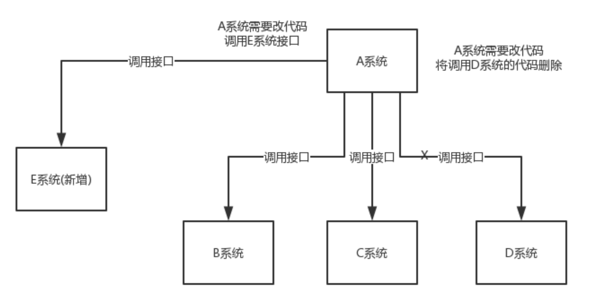
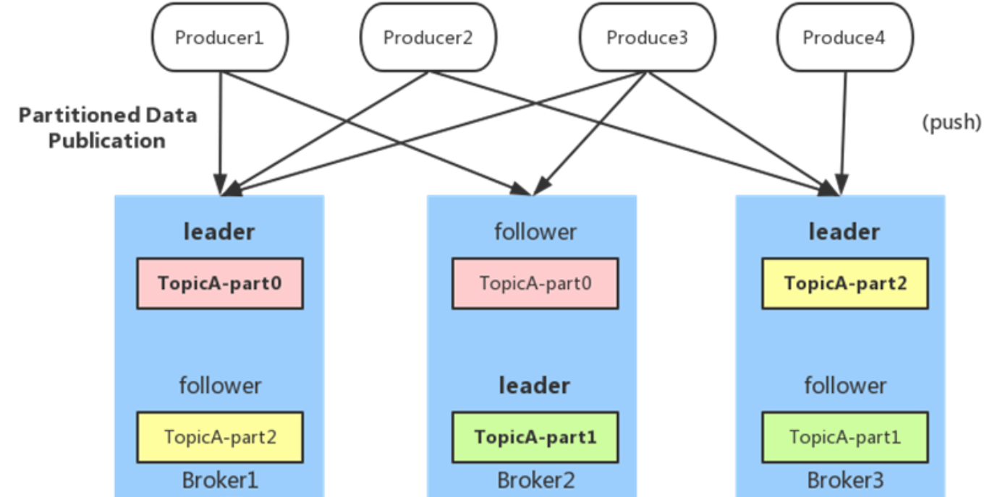
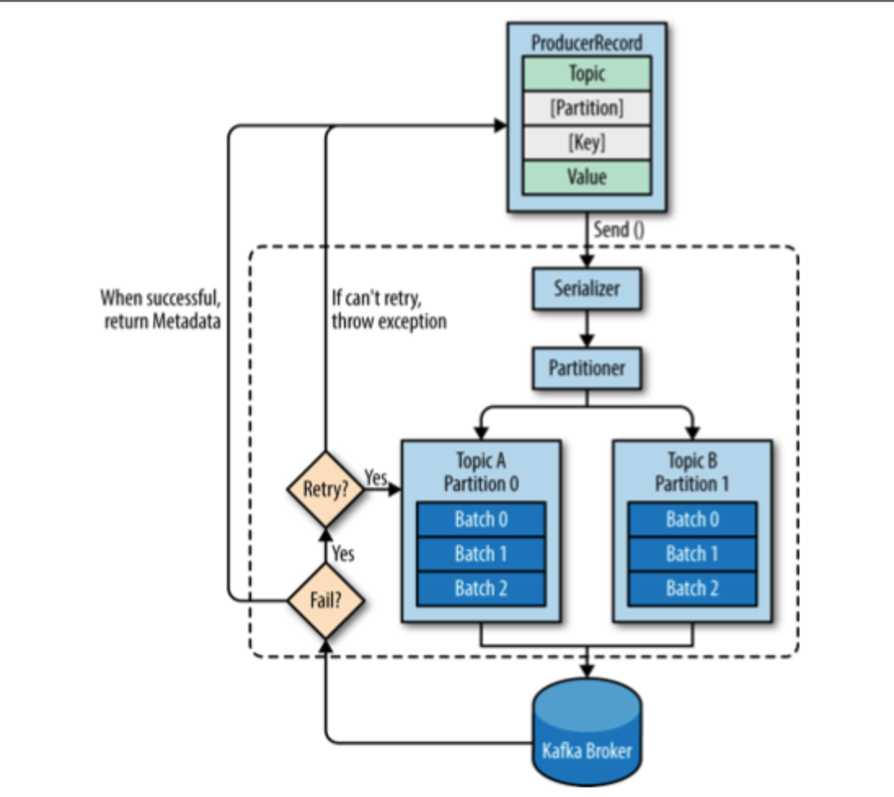

# 4.2 Kafka

## 学习目标

- 目标
  - 了解kafka概念
  - 了解kafka的设计模式
  - 掌握kafka的集群部署
  - 说明Kafka的常用操作指令
  - 了解Kafka的整体架构
  - 知道Kafka的生产者、消费者的数据分发、负载均衡
  - 说明Kafka的文件存储机制
  - 说明Kafka为什么性能高
- 应用
  - 应用kafka的python api完成生产消费案例

### 为何使用消息系统

* 场景：
  * 1、很多业务数据，如页面访问量（Page View）、被查看内容方面的信息以及搜索情况等内容，这种数据通常的处理方式是先把各种活动以日志的形式写入某种文件，然后周期性地对这些文件进行统计分析
  * 2、系统之间的数据传输交互
* 目的：**解耦**、**异步**

* 例子：

如：这样一个场景。A 系统发送数据到 BCD 三个系统，通过接口调用发送。如果增加了一个E 系统也要这个数据呢？假如现有的C 系统现在不需要了呢？(可以理解Web部分数据与AI系统或者推荐系统的数据交互)



A 系统产生一条比较关键的数据，很多系统都需要 A 系统将这个数据发送过来。A 系统要时时刻刻考虑 BCDE 四个系统如果挂了该咋办？要不要重发，要不要把消息存起来？

* 解决：
* 如果使用 MQ，A 系统产生一条数据，发送到 MQ 里面去，哪个系统需要数据自己去 MQ 里面消费。如果新系统需要数据，直接从 MQ 里消费即可；如果某个系统不需要这条数据了，就取消对 MQ 消息的消费即可。这样下来，A 系统压根本不需要维护这个代码，也不需要考虑人家是否调用成功、失败超时等情况


当然引入MQ缺点也存在：

- 系统可用性降低：系统引入的外部依赖越多，越容易挂掉。本来你就是 A 系统调用 BCD 三个系统的接口就好了，ABCD 四个系统好好的，没问题，加个 MQ 进来，万一 MQ 宕机了？MQ 一挂，整套系统崩溃的，你不就完了？如何保证消息队列的高可用？
  - 一些MQ设计就回保证高可用(如Kafka)
- 系统复杂度提高：加个 MQ 进来，你怎么保证消息没有重复消费？怎么处理消息丢失的情况？怎么保证消息传递的顺序性？

### 4.3.1 Kafka简介


> Kafka® is used for building real-time data pipelines and streaming apps. It is horizontally scalable, fault-tolerant, wicked fast, and runs in production in thousands of companies.

Kafka 是一种分布式的，基于发布 / 订阅的消息系统，原本开发自 LinkedIn，用作 LinkedIn 的活动流（Activity Stream）和运营数据处理管道（Pipeline）的基础。

- Kafka被用于构建实时数据管道和流处理。支持横向扩展，容错，极快，能够在上千台服务器上运行。
- Apache Kafka 是一个开源**消息**系统，由 Scala 写成。是由 Apache 软件基金会开发的一个开源消息系统项目。Kafka 最初是由 LinkedIn 开发，并于 2011 年初开源。2012 年 10 月从 Apache Incubator 毕业。该项目的目标是为处理实时数据提供一个统一、高通量、低等待的平台。 ：官网：kafka.apache.org
- **Kafka** 是一个**分布式消息队列**：生产者、消费者的功能。它提供了类似于**JMS**的特性，但是在设计实现上完全不同，此外它并不是**JMS**规范的实现。

主要设计目标如下：

- 以时间复杂度为 O(1) 的方式提供消息持久化能力，即使对 TB 级以上数据也能保证常数时间复杂度的访问性能。
- 高吞吐率。即使在非常廉价的商用机器上也能做到单机支持每秒 100K 条以上消息的传输。
- 支持 Kafka Server 间的消息分区，及分布式消费，同时保证每个 Partition 内的消息顺序传输。
- 同时支持离线数据处理和实时数据处理。
- Scale out：支持在线水平扩展。

### 4.3.2 生产者消费者模式

什么是**「生产者消费者模型」**：**生产者消费者问题***（Producer-consumer problem），也称***有限缓冲问题***（Bounded-buffer problem），是一个***多线程同步***问题的经典案例。该问题描述了共享固定大小缓冲区的两个线程——即所谓的“生产者”和“消费者”——在实际运行时会发生的问题。生产者的主要作用是生成一定量的数据放到缓冲区中，然后重复此过程。与此同时，消费者也在缓冲区消耗这些数据。该问题的关键就是要保证生产者不会在缓冲区满时加入数据，消费者也不会在缓冲区中空时消耗数据。


### 4.3.3 Kafka安装使用

安装kafka配置, 

- 1、下载kafka_2.11-2.1.0.tgz，解压

- 2、配置KAFKA_HOME

#### 使用测试：

- 1、开启zookeeper,需要在一直在服务器端实时运行，以守护进程运行

```
/root/bigdata/kafka/bin/zookeeper-server-start.sh -daemon /root/bigdata/kafka/config/zookeeper.properties
```

- 2、kafka的服务：

```python
/root/bigdata/kafka/bin/kafka-server-start.sh /root/bigdata/kafka/config/server.properties
```

- 3、开启生产者与消费者

```shell
 开启消息生产者
/root/bigdata/kafka/bin/kafka-console-producer.sh --broker-list 192.168.19.137:9092 --sync --topic click-trace
 开启消费者
/root/bigdata/kafka/bin/kafka-console-consumer.sh --bootstrap-server 192.168.19.137:9092 --topic  click-trace
```

### 4.3.4 Kafka架构


一个典型的Kafka集群中包含若干Producer（可以是web前端产生的Page View，或者是服务器日志，系统CPU、Memory等），若干broker（Kafka支持水平扩展，一般broker数量越多，集群吞吐率越高），若干Consumer Group，以及一个Zookeeper集群。

**基本概念：**

- **Broker**：Kafka集群包含一个或多个服务器，这种服务器被称为broker
  - 作用：接收 Producer 和 Consumer 的请求，并把 Message 持久化到本地磁盘。
- **Topic**：每条发布到Kafka集群的消息都有一个类别，这个类别被称为Topic。（物理上不同Topic的消息分开存储，逻辑上一个Topic的消息虽然保存于一个或多个broker上但用户只需指定消息的Topic即可生产或消费数据而不必关心数据存于何处）
- **Partition**：Parition是物理上的概念，每个Topic包含一个或多个Partition.
- **Producer**：负责发布消息到Kafka broker
- **Consumer**：消息消费者，向Kafka broker读取消息的客户端。
- **Consumer Group**：每个Consumer属于一个特定的Consumer Group（可为每个Consumer指定group name，若不指定group name则属于默认的group）。
- **Zookeeper**：保存着集群broker、topic、partition等meta数据；负责broker故障发现，partition leader选举，负载均衡等功能

**运行过程**

Producer使用push模式将消息发布到broker，Consumer使用pull模式从broker订阅并消费消息。 　

### 4.3.5 Kafka设计原理

#### 4.3.5.1内部组件设计

####1、Topic & Partition(存储设计原理)

* 1、Topic 在逻辑上可以被认为是一个 queue，每条消费都必须指定它的 Topic，可以简单理解为必须指明把这条消息放进哪个 queue 里。为了使得 Kafka 的吞吐率可以线性提高
* 2、物理上把 Topic 分成一个或多个 Partition，每个 Partition 在物理上对应一个文件夹，该文件夹下存储这个 Partition 的所有消息和索引文件。
  * 若创建 topic1 和 topic2 两个 topic，且分别有 13 个和 19 个分区，则整个集群上会相应会生成共 32 个文件夹（本文所用集群共 8 个节点，此处 topic1 和 topic2 replication-factor 均为 1），如下图所示。
  * 注：一般建议选择 broker num * consumer num ，这样平均每个 consumer 会同时读取broker数目个 partition , 这些 partiton 压力可以平摊到每台 broker 上。

**partition的数据文件**

* offset：offset表示Message在这个partition中的偏移量，offset不是该Message在partition数据文件中的实际存储位置，而是逻辑上一个值，可以认为offset是partition中Message的id
* MessageSize：MessageSize表示消息内容data的大小
* data：data为Message的具体内容

partition中的每条Message包含三个属性：partition的数据文件由以上格式的Message组成，按offset由小到大排列在一起。 如果一个partition只有一个数据文件，Kafka通过**分段**和**索引**来提高查找效率。

* **数据文件分段segment**: partition物理上由多个segment文件组成，每个segment大小相等，顺序读写。每个segment数据文件以该段中最小的offset命名，文件扩展名为.log。这样在查找指定offset的Message的时候，用二分查找就可以定位到该Message在哪个segment数据文件中。

* **数据文件索引**: 数据文件分段使得可以在一个较小的数据文件中查找对应offset的Message了，但是这依然需要顺序扫描才能找到对应offset的Message。为了进一步提高查找的效率，Kafka为每个分段后的数据文件建立了索引文件，文件名与数据文件的名字是一样的，只是文件扩展名为.index


索引文件中包含若干个索引条目，每个条目表示数据文件中一条Message的索引。索引包含两个部分，分别为相对offset和position。

**segment中index<—->data file对应关系物理结构如下：**


* 查找过程：
  * 查找某个offset的消息，先二分法找出消息所在的segment文件（因为每个segment的命名都是以该文件中消息offset最小的值命名）；然后，加载对应的.index索引文件到内存，同样二分法找出小于等于给定offset的最大的那个offset记录（相对offset，position）；最后，根据position到.log文件中，顺序查找出offset等于给定offset值的消息。

> 重要：由于消息在partition的segment数据文件中是顺序读写的，且消息消费后不会删除（删除策略是针对过期的segment文件），这种顺序磁盘IO存储设计是Kafka高性能很重要的原因。
>
> Kafka运行时很少有大量读磁盘的操作，主要是定期批量写磁盘操作，因此操作磁盘很高效。这跟Kafka文件存储中读写message的设计是息息相关的。Kafka中读写message有如下特点:
>
> 写message(生产者)
>
> - 消息从java堆转入page cache(即物理内存)。
> - 由异步线程刷盘,消息从page cache刷入磁盘。
>
> 读message(消费者)
>
> - 消息直接从page cache转入socket发送出去。
> - 当从page cache没有找到相应数据时，此时会产生磁盘IO,从磁 盘Load消息到page cache,然后直接从socket发出去

总结：Kafka高效文件存储设计特点

- Kafka把topic中一个parition大文件分成多个小文件段，通过多个小文件段，就容易定期清除或删除已经消费完文件，减少磁盘占用。
- 通过索引信息可以快速定位message和确定response的最大大小。
- 通过index元数据全部映射到memory，可以避免segment file的IO磁盘操作。
- 通过索引文件稀疏存储，可以大幅降低index文件元数据占用空间大小。

#### 2、Producer(生产者)



producer采用推（push）模式将消息发布到broker，每条消息都被追加（append）到分区（patition）中，属于顺序写磁盘（顺序写磁盘效率比随机写内存要高，保障kafka吞吐率）



* 1、**我们需要创建一个ProducerRecord，这个对象需要包含消息的主题（topic）和值（value），可以选择性指定一个键值（key）或者分区（partition）**。key和value序列化为ByteArrays，以便它们可以通过网络发送。
* 2、**发送到分配器（partitioner）：如果我们指定了分区，那么分配器返回该分区即可；**否则，分配器将会基于键值来选择一个分区并返回。选择完分区后，生产者知道了消息所属的主题和分区，它将这条记录添加到相同主题和分区的批量消息中，**另一个线程负责发送这些批量消息到对应的Kafka broker。**
* 3、broker接收到数据的时候，如果数据已被成功写入到Kafka，会返回一个包含topic、分区和偏移量offset的RecordMetadata对象；
  * 如果broker写入数据失败，会返回一个异常信息给生产者。当生产者接收到异常信息时会尝试重新发送数据，如果尝试失败则抛出异常。

####3、Consumer Group


* 任何Consumer必须属于有一个Consumer Group
  * 使用 Consumer high level API 时，同一 Topic 的一条消息只能被同一个 Consumer Group 内的一个 Consumer 消费，但多个 Consumer Group 可同时消费这一消息。	

* 特点：Kafka 用来实现一个 Topic 消息的广播（发给所有的 Consumer）和单播（发给某一个 Consumer）的手段。一个 Topic 可以对应多个 Consumer Group。
  * 如果需要实现广播，只要每个 Consumer 有一个独立的 Group 就可以了。
  * 要实现单播只要所有的 Consumer 在同一个 Group 里。用 Consumer Group 还可以将 Consumer 进行自由的分组而不需要多次发送消息到不同的 Topic。

消费之后一般会删除已经被消费的消息，而Kafka集群会保留所有的消息，无论其被消费与否。当然，因为磁盘限制，不可能永久保留所有数据（实际上也没必要），因此Kafka提供两种策略删除旧数据。一是基于时间，二是基于Partition文件大小。例如可以通过配置`$KAFKA_HOME/config/server.properties`，让Kafka删除一周前的数据，也可在Partition文件超过1GB时删除旧数据，配置如下所示。

```python
# The minimum age of a log file to be eligible for deletion
log.retention.hours=168
# The maximum size of a log segment file. When this size is reached a new log segment will be created.
log.segment.bytes=1073741824
# The interval at which log segments are checked to see if they can be deleted according to the retention policies
log.retention.check.interval.ms=300000
# If log.cleaner.enable=true is set the cleaner will be enabled and individual logs can then be marked for log compaction.
log.cleaner.enable=false
```

#### 4.3.5.3 Message Queue常见对比

- **RabbitMQ**：RabbitMQ 是使用 Erlang 编写的一个开源的消息队列，本身支持很多的协议：AMQP，XMPP, SMTP, STOMP，也正因如此，它非常重量级，更适合于企业级的开发。同时实现了 Broker 构架，消息在发送给客户端时先在中心队列排队。对路由，负载均衡或者数据持久化都有很好的支持。
- **Kafka/Jafka**
  - 快速持久化，可以在 O(1) 的系统开销下进行消息持久化；
  - 高吞吐；，完全的分布式系统，Broker、Producer、Consumer 都原生自动支持分布式，自动实现负载均衡；Kafka 相对于 ActiveMQ 是一个非常轻量级的消息系统，除了性能非常好之外，还是一个工作良好的分布式系统。

### Kafka、ActiveMQ、RabbitMQ、RocketMQ 有什么优缺点？

| 特性                     | ActiveMQ                              | RabbitMQ                                           | RocketMQ                                                     | Kafka                                                        |
| :----------------------- | :------------------------------------ | :------------------------------------------------- | :----------------------------------------------------------- | :----------------------------------------------------------- |
| 单机吞吐量               | 万级，比 RocketMQ、Kafka 低一个数量级 | 同 ActiveMQ                                        | 10 万级，支撑高吞吐                                          | 10 万级，高吞吐，一般配合大数据类的系统来进行实时数据计算、日志采集等场景 |
| topic 数量对吞吐量的影响 |                                       |                                                    | topic 可以达到几百/几千的级别，吞吐量会有较小幅度的下降，这是 RocketMQ 的一大优势，在同等机器下，可以支撑大量的 topic | topic 从几十到几百个时候，吞吐量会大幅度下降，在同等机器下，Kafka 尽量保证 topic 数量不要过多，如果要支撑大规模的 topic，需要增加更多的机器资源 |
| 时效性                   | ms 级                                 | 微秒级，这是 RabbitMQ 的一大特点，延迟最低         | ms 级                                                        | 延迟在 ms 级以内                                             |
| 可用性                   | 高，基于主从架构实现高可用            | 同 ActiveMQ                                        | 非常高，分布式架构                                           | 非常高，分布式，一个数据多个副本，少数机器宕机，不会丢失数据，不会导致不可用 |
| 消息可靠性               | 有较低的概率丢失数据                  |                                                    | 经过参数优化配置，可以做到 0 丢失                            | 同 RocketMQ                                                  |
| 功能支持                 | MQ 领域的功能极其完备                 | 基于 erlang 开发，并发能力很强，性能极好，延时很低 | MQ 功能较为完善，还是分布式的，扩展性好                      | 功能较为简单，主要支持简单的 MQ 功能，在大数据领域的实时计算以及日志采集被大规模使用 |

**如何选择MQ**

* 所以中小型公司，技术实力较为一般，技术挑战不是特别高，用 RabbitMQ 是不错的选择；
* 如果是大数据领域的实时计算、日志采集等场景，用 Kafka 是业内标准的，绝对没问题，社区活跃度很高，绝对不会黄，何况几乎是全世界这个领域的事实性规范。

### 4.3.6 Kafka Python API

#### 4.3.6.1 环境安装

- 下载安装kafka-python:`pip install kafka-python`
- 验证是否安装成功:`import kafka`

#### 4.3.6.2 命令使用

- 1、创建topic命令
  - bin/kafka-topics.sh --create --zookeeper localhost:2181 --replication-factor 1 --partitions 1 **--topic test**
  - replication-factor：副本数量
  - partitions：分区数量
- 2、通过生产者发送消息
  - bin/kafka-console-producer.sh --broker-list localhost:9092 --topic test
- 3、通过消费者消费消息
  - bin/kafka-console-consumer.sh --bootstrap-server localhost:9092 --topic test --from-beginning
  - -from-beginning：从最开始生产队的数据开始消费
- 其它Kafka命令
  - 查看所有topic
    - bin/kafka-topics.sh --list --zookeeper localhost:2181

#### 4.3.6.3 Python 代码使用创建生产者

创建Kafka生产者有三个基本属性：

- bootstrap.servers：属性值是一个host:port的broker列表。
- key.serializer：因此需要将这些对象序列化成字节数组。key.serializer指定的类需要实现org.apache.kafka.common.serialization.Serializer接口，Kafka客户端包中包含了几个默认实现，例如ByteArraySerializer、StringSerializer和IntegerSerialier。
- value.serializer：属性值是类的名称。这个属性指定了用来序列化消息记录的类，与key.serializer差不多。

- 命令行方式：普通的发送方式：

  - 导入KafkaProducer，创建连接到192.168.19.137:9092
  - 向这个Broker的Producer,循环向test_topic这个Topic发送100个消息，消息内容都是'some_message_bytes'，这种发送方式不指定Partition，kafka会均匀的把这些消息分别写入n个Partiton里面

  ```python
  >>> from kafka import KafkaProducer
  >>> producer = KafkaProducer(bootstrap_servers='192.168.19.137:9092')
  >>> for _ in range(100):
  ...     producer.send('test_topic',b'some_message_bytes')
  ```

  **注：kafka发送的数据是字节，需要将字符串转换为字节**

- 2、命令行方式：发送json字符串

  ```python
  >>> producer = KafkaProducer(bootstrap_servers='node-teach:9092',value_serializer=lambda v: json.dumps(v).encode('utf-8'))
  >>> producer.send('test_topic', {'key1': 'value1'})
  <kafka.producer.future.FutureRecordMetadata object at 0x2a9ebd0>
  >>> 
  ```

- 3、命令行方式：发送普通字符串

  compression_type：压缩类型，'gzip'

  ```python
  >>> producer = KafkaProducer(bootstrap_servers='node-teach:9092',compression_type='gzip')
  >>> producer.send('test_topic', b'msg')
  ```

#### 4.3.6.3 案例：生产者消费者代码

* 目的：实现一个消息发送与消息接受功能程序
* 步骤：
  * 1、创建producer，利用producer将某个目录下的所有文件名发送到指定topic，并由consumer来接收
  * 2、 创建consumer进行消费

1、创建producer，利用producer将某个目录下的所有文件名发送到指定topic，并由consumer来接收

```python
from kafka import KafkaProducer
import json
import os
import time
 
producer = KafkaProducer(bootstrap_servers='192.168.19.137:9092')
 
def log(str):
	t = time.strftime(r"%Y-%m-%d %H-%M-%S",time.localtime())
	print("[%s]%s"%(t,str))
 
def list_file(path):
	dir_list = os.listdir(path);
	for f in dir_list:
		 producer.send('test_topic',f.encode())
		 producer.flush()
		 log('send: %s' % (f))	
 
list_file("/root/logs/")
producer.close()
```

2、创建consumer进行消费

```python
from kafka import KafkaConsumer
import time
 
def log(str):
        t = time.strftime(r"%Y-%m-%d %H-%M-%S",time.localtime())
        print("[%s]%s"%(t,str))
 
log('start consumer')
consumer=KafkaConsumer('test_topic',bootstrap_servers=['192.168.19.137:9092'])
for msg in consumer:
        recv = "%s:%d:%d: key=%s value=%s" %(msg.topic,msg.partition,msg.offset,msg.key,msg.value)
        log(recv)
```

### 4.3.8 High Available(高可用)(了解)

**为什么需要高可用**

* Kafka在0.8以前的版本中，并不提供High Availablity机制，一旦一个或多个Broker宕机，则宕机期间其上所有Partition都无法继续提供服务。若该Broker永远不能再恢复，亦或磁盘故障，则其上数据将丢失
  * Kafka从0.8开始提供High Availability机制。本文从Data Replication和Leader Election两方面介绍了Kafka的HA机制。

#### 4.3.8.1 Replication(副本)设计

作为消息中间件，数据的可靠性以及系统的可用性，必然依赖数据副本的设计。

Kafka的replica副本单元是topic的partition，一个partition的replica数量不能超过broker的数量，因为一个broker最多只会存储这个partition的一个副本。所有消息生产、消费请求都是由partition的leader replica来处理，其他follower replica负责从leader复制数据进行备份。

Replica均匀分布到整个集群，Replica的算法如下：

- 将所有Broker（假设共n个Broker）和待分配的Partition排序
- 将第i个Partition分配到第（i mod n）个Broker上
- 将第i个Partition的第j个Replica分配到第（(i + j) mode n）个Broker上


如图，TopicA有三个partition：part0、part1、part2，每个partition的replica数等于2（一个是leader，另一个是follower），按照以上算法会均匀落到三个broker上。

#### 4.3.8.2 Leader Election(选举机制)

* 为什么需要Leader？
  * 引入Replication之后，同一个Partition可能会有多个Replica，而这时需要在这些Replica中选出一个Leader，Producer和Consumer只与这个Leader交互，其它Replica作为Follower从Leader中复制数据。因为需要保证同一个Partition的多个Replica之间的数据一致性（其中一个宕机后其它Replica必须要能继续服务并且即不能造成数据重复也不能造成数据丢失）。

如果没有一个Leader，所有Replica都可同时读/写数据，那就需要保证多个Replica之间互相（N×N条通路）同步数据，数据的一致性和有序性非常难保证，大大增加了Replication实现的复杂性，同时也增加了出现异常的几率。而引入Leader后，只有Leader负责数据读写，Follower只向Leader顺序Fetch数据（N条通路），系统更加简单且高效。 

#### 4.3.8.3 kafka消息投递（delivery guarantee）

要确定Kafka的消息是否丢失或重复，从两个方面分析入手：消息发送和消息消费

- At most once——最多一次，消息可能会丢失，但不会重复
- At least once——最少一次，消息不会丢失，可能会重复
- Exactly once——只且一次，消息不丢失不重复，只且消费一次。

但是整体的消息投递语义需要Producer端和Consumer端两者来保证。

### 4.3.9 总结

* 了解消息系统使用的原因

* Kafka的架构
* Kafka的生产者、消费者、存储机制
* Kafka PythonAPI使用
* 常见MQ使用比较
* 了解Kafka的高可用

