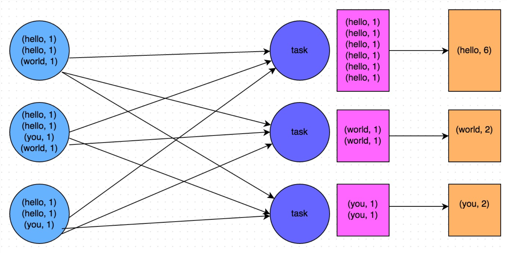
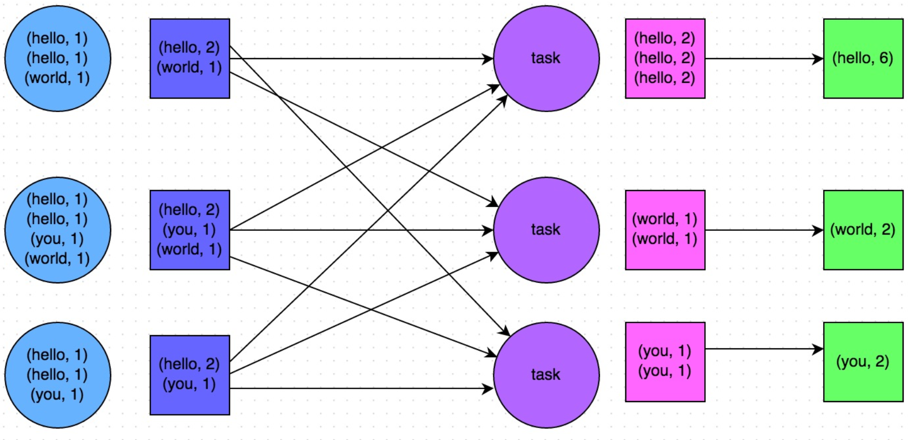
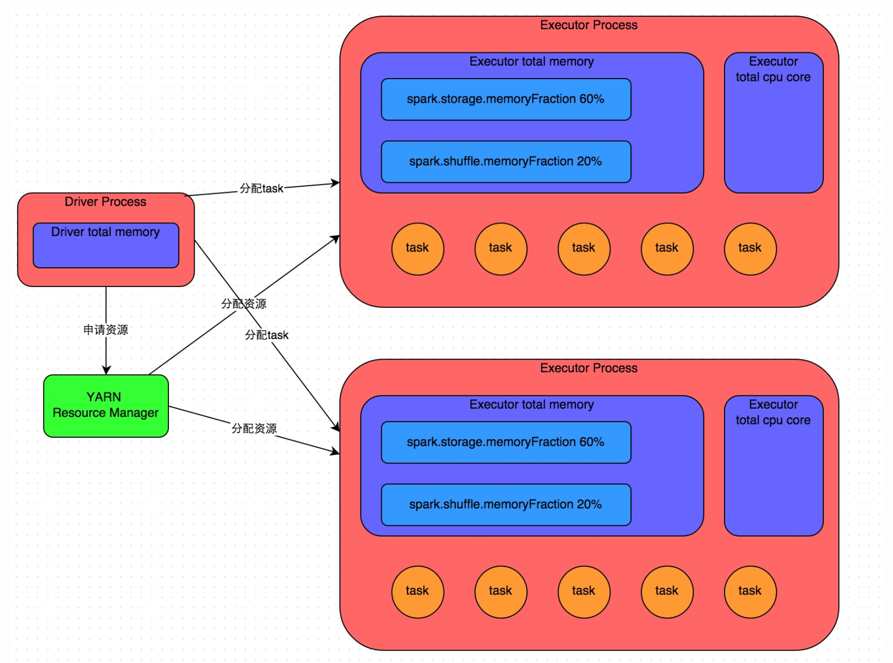
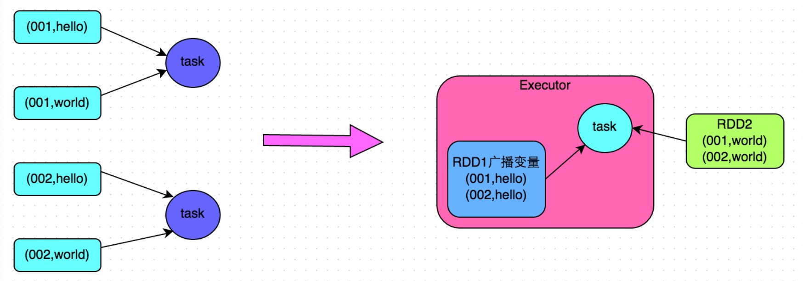

# 4.7 Spark性能优化

## 学习目标

- 目标
  - 知道常用原则
  - 知道Spark的工作原理以及参数优化
  - 知道数据倾斜原理以及解决方案
- 应用
  - 无

在大数据计算领域，Spark已经成为了越来越流行、越来越受欢迎的计算平台之一。Spark的功能涵盖了大数据领域的离线批处理、SQL类处理、流式/实时计算、机器学习、图计算等各种不同类型的计算操作，应用范围与前景非常广泛。

然而，通过Spark开发出高性能的大数据计算作业，并不是那么简单的。如果没有对Spark作业进行合理的调优，Spark作业的执行速度可能会很慢，这样就完全体现不出Spark作为一种快速大数据计算引擎的优势来。因此，想要用好Spark，就必须对其进行合理的性能优化。

### 4.7.1 基本原则

了解以下一些Spark基本开发原则，包括：RDD lineage设计、算子的合理使用、特殊操作的优化等

####原则一：避免创建重复的RDD

* 我们在开发过程中要注意：对于同一份数据，只应该创建一个RDD，不能创建多个RDD来代表同一份数据。

一些Spark初学者在刚开始开发Spark作业时，或者是有经验的工程师在开发RDD lineage极其冗长的Spark作业时，可能会忘了自己之前对于某一份数据已经创建过一个RDD了，从而导致对于同一份数据，创建了多个RDD。这就意味着，我们的Spark作业会进行多次重复计算来创建多个代表相同数据的RDD，进而增加了作业的性能开销。

####原则二：对多次使用的RDD进行持久化

* Spark中对于一个RDD执行多次算子的默认原理是这样的：每次你对一个RDD执行一个算子操作时，都会重新从源头处计算一遍，计算出那个RDD来，然后再对这个RDD执行你的算子操作。这种方式的性能是很差的。
* 解决：对多次使用的RDD进行持久化。此时Spark就会根据你的持久化策略，将RDD中的数据保存到内存或者磁盘中。以后每次对这个RDD进行算子操作时，都会直接从内存或磁盘中提取持久化的RDD数据，然后执行算子，而不会从源头处重新计算一遍这个RDD，再执行算子操作。

* 第一种：cache

```python
# cache()方法表示：使用非序列化的方式将RDD中的数据全部尝试持久化到内存中。
# 此时再对rdd1执行两次算子操作时，只有在第一次执行map算子时，才会将这个rdd1从源头处计算一次。第二次执行reduce算子时，就会直接从内存中提取数据进行计算，不会重复计算一个rdd。
rdd = sc.parallelize((2 for _ in range(10))).map(lambda x: 1).cache()
rdd.reduce()
```

* 第二种:使用persist()

```python
#persist()方法表示：手动选择持久化级别，并使用指定的方式进行持久化。
# 而且其中的_SER后缀表示，使用序列化的方式来保存RDD数据，此时RDD中的每个partition都会序列化成一个大的字节数组，然后再持久化到内存或磁盘中。序列化的方式可以减少持久化的数据对内存/磁盘的占用量，进而避免内存被持久化数据占用过多，从而发生频繁GC。
persist(storageLevel=StorageLevel(False, True, False, False, 1))[source]
Set this RDD’s storage level to persist its values across operations after the first time it is computed. This can only be used to assign a new storage level if the RDD does not have a storage level set yet. If no storage level is specified defaults to (MEMORY_ONLY).

>>> rdd = sc.parallelize(["b", "a", "c"])
>>> rdd.persist().is_cached
True
```

对于persist()方法而言，我们可以根据不同的业务场景选择不同的持久化级别。

- **DISK_ONLY** = StorageLevel(True, False, False, False, 1)
- **DISK_ONLY_2** = StorageLevel(True, False, False, False, 2)
- **MEMORY_AND_DISK** = StorageLevel(True, True, False, False, 1)
- **MEMORY_AND_DISK_2** = StorageLevel(True, True, False, False, 2)
- **MEMORY_AND_DISK_SER** = StorageLevel(True, True, False, False, 1)
- **MEMORY_AND_DISK_SER_2** = StorageLevel(True, True, False, False, 2)
- **MEMORY_ONLY** = StorageLevel(False, True, False, False, 1)
- **MEMORY_ONLY_2** = StorageLevel(False, True, False, False, 2)
- **MEMORY_ONLY_SER** = StorageLevel(False, True, False, False, 1)
- **MEMORY_ONLY_SER_2** = StorageLevel(False, True, False, False, 2)
- **OFF_HEAP** = StorageLevel(True, True, True, False, 1)

#### Spark的持久化级别

| 持久化级别                              | 含义解释                                                     |
| :-------------------------------------- | :----------------------------------------------------------- |
| MEMORY_ONLY                             | 使用未序列化的Java对象格式，将数据保存在内存中。如果内存不够存放所有的数据，则数据可能就不会进行持久化。那么下次对这个RDD执行算子操作时，那些没有被持久化的数据，需要从源头处重新计算一遍。这是默认的持久化策略，使用cache()方法时，实际就是使用的这种持久化策略。 |
| MEMORY_AND_DISK                         | 使用未序列化的Java对象格式，优先尝试将数据保存在内存中。如果内存不够存放所有的数据，会将数据写入磁盘文件中，下次对这个RDD执行算子时，持久化在磁盘文件中的数据会被读取出来使用。 |
| MEMORY_ONLY_SER                         | 基本含义同MEMORY_ONLY。唯一的区别是，会将RDD中的数据进行序列化，RDD的每个partition会被序列化成一个字节数组。这种方式更加节省内存，从而可以避免持久化的数据占用过多内存导致频繁GC。 |
| MEMORY_AND_DISK_SER                     | 基本含义同MEMORY_AND_DISK。唯一的区别是，会将RDD中的数据进行序列化，RDD的每个partition会被序列化成一个字节数组。这种方式更加节省内存，从而可以避免持久化的数据占用过多内存导致频繁GC。 |
| DISK_ONLY                               | 使用未序列化的Java对象格式，将数据全部写入磁盘文件中。       |
| MEMORY_ONLY_2, MEMORY_AND_DISK_2, 等等. | 对于上述任意一种持久化策略，如果加上后缀_2，代表的是将每个持久化的数据，都复制一份副本，并将副本保存到其他节点上。这种基于副本的持久化机制主要用于进行容错。假如某个节点挂掉，节点的内存或磁盘中的持久化数据丢失了，那么后续对RDD计算时还可以使用该数据在其他节点上的副本。如果没有副本的话，就只能将这些数据从源头处重新计算一遍了。 |

#####如何选择一种最合适的持久化策略？

- **默认情况下，性能最高的当然是MEMORY_ONLY，但前提是你的内存必须足够足够大**
- **如果使用MEMORY_ONLY级别时发生了内存溢出，那么建议尝试使用MEMORY_ONLY_SER级别。该级别会将RDD数据序列化后再保存在内存中，此时每个partition仅仅是一个字节数组而已，大大减少了对象数量，并降低了内存占用**。
- **如果纯内存的级别都无法使用，那么建议使用MEMORY_AND_DISK_SER策略，而不是MEMORY_AND_DISK策略。因为既然到了这一步，就说明RDD的数据量很大，内存无法完全放下**。
- **通常不建议使用DISK_ONLY和后缀为_2的级别：因为完全基于磁盘文件进行数据的读写，会导致性能急剧降低，有时还不如重新计算一次所有RDD**。后缀为_2的级别，必须将所有数据都复制一份副本，并发送到其他节点上，数据复制以及网络传输会导致较大的性能开销，除非是要求作业的高可用性，否则不建议使用。

####原则三：尽量避免使用shuffle类算子

* 如果有可能的话，要尽量避免使用shuffle类算子。因为Spark作业运行过程中，最消耗性能的地方就是shuffle过程。比如reduceByKey、join、distinct、repartition等算子，都会触发shuffle操作。
* shuffle过程：各个节点上的相同key都会先写入本地磁盘文件中，然后其他节点需要通过网络传输拉取各个节点上的磁盘文件中的相同key。而且相同key都拉取到同一个节点进行聚合操作时，还有可能会因为一个节点上处理的key过多，导致内存不够存放，进而溢写到磁盘文件中。**因此在shuffle过程中，可能会发生大量的磁盘文件读写的IO操作，以及数据的网络传输操作。**磁盘IO和网络数据传输也是shuffle性能较差的主要原因。能避免则尽可能避免使用reduceByKey、join、distinct、repartition等会进行shuffle的算子，尽量使用map类的非shuffle算子。这样的话，没有shuffle操作或者仅有较少shuffle操作的Spark作业，可以大大减少性能开销。

####原则四：使用map-side预聚合的shuffle操作

* 如果因为业务需要，一定要使用shuffle操作，无法用map类的算子来替代，那么尽量使用可以map-side预聚合的算子。
* map-side预聚合：是在每个节点本地对相同的key进行一次聚合操作，类似于MapReduce中的本地combiner。map-side预聚合之后，每个节点本地就只会有一条相同的key，因为多条相同的key都被聚合起来了。其他节点在拉取所有节点上的相同key时，就会大大减少需要拉取的数据数量，从而也就减少了磁盘IO以及网络传输开销。
* 使用建议：建议使用reduceByKey或者aggregateByKey算子来替代掉groupByKey算子





比如上面的两幅图，就是典型的例子，分别基于reduceByKey和groupByKey进行单词计数。其中第一张图是groupByKey的原理图，可以看到，没有进行任何本地聚合时，所有数据都会在集群节点之间传输；第二张图是reduceByKey的原理图，可以看到，每个节点本地的相同key数据，都进行了预聚合，然后才传输到其他节点上进行全局聚合。

#### 原则五：使用高性能的算子

除了shuffle相关的算子有优化原则之外，其他的算子也都有着相应的优化原则。

* 使用reduceByKey/aggregateByKey替代groupByKey

* 使用mapPartitions替代普通map
  * mapPartitions类的算子，一次函数调用会处理一个partition所有的数据，而不是一次函数调用处理一条，性能相对来说会高一些。但是有的时候，使用mapPartitions会出现OOM（内存溢出）的问题。因为单次函数调用就要处理掉一个partition所有的数据，如果内存不够，垃圾回收时是无法回收掉太多对象的，很可能出现OOM异常。所以使用这类操作时要慎重！

* 使用foreachPartitions替代foreach
  * 原理类似于“使用mapPartitions替代map”
  * foreachPartitions类的算子，对性能的提升还是很有帮助的。foreachPartitions算子一次性处理一个partition的数据，那么对于每个partition，只要创建一个数据库连接即可，然后执行批量插入操作，此时性能是比较高的。实践中发现，对于1万条左右的数据量写MySQL相比foreach，性能可以提升30%以上。

* 使用filter之后进行coalesce操作
  * 因为filter之后，RDD的每个partition中都会有很多数据被过滤掉，此时如果照常进行后续的计算，其实每个task处理的partition中的数据量并不是很多，有一点资源浪费，而且此时处理的task越多，可能速度反而越慢。
  * 因此用coalesce减少partition数量，将RDD中的数据压缩到更少的partition之后，只要使用更少的task即可处理完所有的partition。在某些场景下，对于性能的提升会有一定的帮助。
* 用 broadcast + filter 来代替 join

### 4.7.2 Spark运行与配置参数优化



* 1、使用spark-submit提交一个Spark作业之后，这个作业就会启动一个对应的Driver进程。
  * Driver进程本身会根据我们设置的参数，占有一定数量的内存和CPU core。申请运行Spark作业需要使用的资源，Executor进程。每个Executor进程都占有一定数量的内存和CPU core。

Executor的内存主要分为三块：

第一块是让task执行我们自己编写的代码时使用，默认是占Executor总内存的20%；

第二块是让task通过shuffle过程拉取了上一个stage的task的输出后，进行聚合等操作时使用，默认也是占Executor总内存的20%；

第三块是让RDD持久化时使用，默认占Executor总内存的60%。

* 2、申请到执行所需资源，Driver进程就会开始调度和执行我们编写的作业代码了。Driver进程会将我们编写的Spark作业代码分拆为多个stage。
  * **Stage：**Spark是根据shuffle类算子来进行stage的划分，如果我们的代码中执行了某个shuffle类算子（比如reduceByKey、join等），那么就会在该算子处，划分出一个stage界限来。**shuffle算子执行之前的代码会被划分为一个stage**，**shuffle算子执行以及之后的代码会被划分为下一个stage**
  * **Task：**每个stage执行一部分代码片段，并为每个stage创建一批task。task是最小的计算单元

最终：task的执行速度是跟每个Executor进程的CPU core数量有直接关系的。一个CPU core同一时间只能执行一个线程。而每个Executor进程上分配到的多个task，都是以每个task一条线程的方式，多线程并发运行的。**如果CPU core数量比较充足，而且分配到的task数量比较合理**，那么通常来说，可以比较快速和高效地执行完这些task线程。

#### 资源参数调优

所谓的Spark资源参数调优，其实主要就是对Spark运行过程中各个使用资源的地方，通过调节各种参数，来优化资源使用的效率，从而提升Spark作业的执行性能。每个参数都对应着作业运行原理中的某个部分，同时也给出了一个调优的参考值。

* num-executors
  * 参数说明：该参数用于设置Spark作业总共要用多少个Executor进程来执行。Driver在向YARN集群管理器申请资源时，YARN集群管理器会尽可能按照你的设置来在集群的各个工作节点上，启动相应数量的Executor进程。这个参数非常之重要，如果不设置的话，默认只会给你启动少量的Executor进程，此时你的Spark作业的运行速度是非常慢的。
  * 参数调优建议：**每个Spark作业的运行一般设置50~100个左右的Executor进程比较合适**，设置太少或太多的Executor进程都不好。设置的太少，无法充分利用集群资源；设置的太多的话，大部分队列可能无法给予充分的资源。

* executor-memory
  * 参数说明：该参数用于设置每个Executor进程的内存。Executor内存的大小，很多时候直接决定了Spark作业的性能，而且跟常见的JVM OOM异常，也有直接的关联。
  * 参数调优建议：**每个Executor进程的内存设置4G~8G较为合适。**但是这只是一个参考值，具体的设置还是得根据不同部门的资源队列来定。**可以看看自己团队的资源队列的最大内存限制是多少**，num-executors乘以executor-memory，是不能超过队列的最大内存量的。此外，如果你是跟团队里其他人共享这个资源队列，那么申请的内存量最好不要超过最大总内存的1/3~1/2，避免你自己的Spark作业占用了队列所有的资源，导致别的作业无法运行。

* executor-cores
  * 参数说明：该参数用于设置每个Executor进程的CPU core数量。这个参数决定了每个Executor进程并行执行task线程的能力。因为每个CPU core同一时间只能执行一个task线程，因此每个Executor进程的CPU core数量越多，越能够快速地执行完分配给自己的所有task线程。
  * 参数调优建议：**Executor的CPU core数量设置为2~4个较为合适。**同样得根据不同部门的资源队列来定，可以看看自己的资源队列的最大CPU core限制是多少，再依据设置的Executor数量，来决定每个Executor进程可以分配到几个CPU core。同样建议，如果是跟他人共享这个队列，那么num-executors * executor-cores不要超过队列总CPU core的1/3~1/2左右比较合适。

* driver-memory
  * 参数说明：该参数用于设置Driver进程的内存。
  * 参数调优建议：Driver的内存通常来说不设置，或者设置1G左右应该就够了。唯一需要注意的一点是，如果需要使用collect算子将RDD的数据全部拉取到Driver上进行处理，那么必须确保Driver的内存足够大，否则会出现OOM内存溢出的问题。

* spark.default.parallelism
  * 参数说明：该参数用于设置每个stage的默认task数量。这个参数极为重要，如果不设置可能会直接影响你的Spark作业性能。
  * 参数调优建议：**Spark作业的默认task数量为500~1000个较为合适。**如果不设置这个参数，那么此时就会导致Spark自己根据底层HDFS的block数量来设置task的数量，默认是一个HDFS block对应一个task。通常来说，Spark默认设置的数量是偏少的（比如就几十个task），如果task数量偏少的话，就会导致你前面设置好的Executor的参数都前功尽弃。试想一下，无论你的Executor进程有多少个，内存和CPU有多大，但是task只有1个或者10个，那么90%的Executor进程可能根本就没有task执行，也就是白白浪费了资源！因此Spark官网建议的设置原则是，设置该参数为num-executors * executor-cores的2~3倍较为合适，比如Executor的总CPU core数量为300个，那么设置1000个task是可以的，此时可以充分地利用Spark集群的资源。

* spark.storage.memoryFraction
  * 参数说明：**该参数用于设置RDD持久化数据在Executor内存中能占的比例，默认是0.6**。也就是说，默认Executor 60%的内存，可以用来保存持久化的RDD数据。根据你选择的不同的持久化策略，如果内存不够时，可能数据就不会持久化，或者数据会写入磁盘。
  * 参数调优建议：如果Spark作业中，有较多的RDD持久化操作，该参数的值可以适当提高一些，保证持久化的数据能够容纳在内存中。避免内存不够缓存所有的数据，导致数据只能写入磁盘中，降低了性能。但是如果Spark作业中的shuffle类操作比较多，而持久化操作比较少，那么这个参数的值适当降低一些比较合适。此外，**如果发现作业由于频繁的gc导致运行缓慢（通过spark web ui可以观察到作业的gc耗时），意味着task执行用户代码的内存不够用，那么同样建议调低这个参数的值。**

* spark.shuffle.memoryFraction
  * 参数说明：**该参数用于设置shuffle过程中一个task拉取到上个stage的task的输出后，进行聚合操作时能够使用的Executor内存的比例，默认是0.2**。也就是说，Executor默认只有20%的内存用来进行该操作。shuffle操作在进行聚合时，如果发现使用的内存超出了这个20%的限制，那么多余的数据就会溢写到磁盘文件中去，此时就会极大地降低性能。
  * 参数调优建议：如果Spark作业中的RDD持久化操作较少，shuffle操作较多时，建议降低持久化操作的内存占比，提高shuffle操作的内存占比比例，避免shuffle过程中数据过多时内存不够用，必须溢写到磁盘上，降低了性能。此外，如果发现作业由于频繁的gc导致运行缓慢，意味着task执行用户代码的内存不够用，那么同样建议调低这个参数的值。

注：根据自己的实际情况（包括Spark作业中的shuffle操作数量、RDD持久化操作数量以及spark web ui中显示的作业gc情况），同时参考给出的原理以及调优建议，合理地设置上述参数。

### 4.7.2 Spark数据倾斜调优

* 数据倾斜发生时的现象
  * 绝大多数task执行得都非常快，但个别task执行极慢。比如，总共有1000个task，997个task都在1分钟之内执行完了，但是剩余两三个task却要一两个小时。这种情况很常见。
  * 原本能够正常执行的Spark作业，某天突然报出OOM（内存溢出）异常，观察异常栈，是我们写的业务代码造成的。这种情况比较少见。

* 数据倾斜发生的原理
  * 数据倾斜的原理很简单：在进行shuffle的时候，必须将各个节点上相同的key拉取到某个节点上的一个task来进行处理，比如按照key进行聚合或join等操作。**如果某个key对应的数据量特别大的话，就会发生数据倾斜。比如大部分key对应10条数据，但是个别key却对应了100万条数据，那么大部分task可能就只会分配到10条数据，然后1秒钟就运行完了；但是个别task可能分配到了100万数据，要运行一两个小时。**因此，整个Spark作业的运行进度是由运行时间最长的那个task决定的。

因此出现数据倾斜的时候，Spark作业看起来会运行得非常缓慢，甚至可能因为某个task处理的数据量过大导致内存溢出。

下图就是一个很清晰的例子：hello这个key，在三个节点上对应了总共7条数据，这些数据都会被拉取到同一个task中进行处理；而world和you这两个key分别才对应1条数据，所以另外两个task只要分别处理1条数据即可。此时第一个task的运行时间可能是另外两个task的7倍，而整个stage的运行速度也由运行最慢的那个task所决定。


#### 1、如何定位导致数据倾斜的代码以及查看运行结果

数据倾斜只会发生在shuffle过程中。这里给罗列一些常用的并且可能会触发shuffle操作的算子：distinct、groupByKey、reduceByKey、aggregateByKey、join、cogroup、repartition等。出现数据倾斜时，可能就是你的代码中使用了这些算子中的某一个所导致的。

* 可以在Spark Web UI上深入看一下当前这个stage各个task分配的数据量，从而进一步确定是不是task分配的数据不均匀导致了数据倾斜。


**比如下图中，倒数第三列显示了每个task的运行时间。明显可以看到，有的task运行特别快，只需要几秒钟就可以运行完；而有的task运行特别慢，需要几分钟才能运行完，**运行时间特别短的task只需要处理几百KB的数据即可，而运行时间特别长的task需要处理几千KB的数据，处理的数据量差了10倍。此时更加能够确定是发生了数据倾斜。


**知道数据倾斜发生在哪一个stage之后，接着我们就需要根据stage划分原理，推算出来发生倾斜的那个stage对应代码中的哪一部分，这部分代码中肯定会有一个shuffle类算子。**只要看到Spark代码中出现了一个shuffle类算子或者是Spark SQL的SQL语句中出现了会导致shuffle的语句（比如group by语句），那么就可以判定，以那个地方为界限划分出了前后两个stage。

#### 2、查看导致数据倾斜的key的数据分布情况

可以有很多种查看key分布的方式： 

1、如果是Spark SQL中的group by、join语句导致的数据倾斜，那么就查询一下SQL中使用的表的key分布情况。2、如果是对Spark RDD执行shuffle算子导致的数据倾斜，那么可以在Spark作业中加入查看key分布的代码，比如RDD.countByKey()。然后对统计出来的各个key出现的次数，collect/take到客户端打印一下，就可以看到key的分布情况。

### 4.7.3 数据倾斜的解决方案

解决方案有很多，可以通过一些spark资料了解，这里给大家一些常用的解决方案

#### 1、提高shuffle操作的并行度

这是处理数据倾斜最简单的一种方案。

**方案实现思路：**在对RDD执行shuffle算子时，给shuffle算子传入一个参数，比如reduceByKey(1000)，该参数就设置了这个shuffle算子执行时shuffle read task的数量。对于Spark SQL中的shuffle类语句，比如group by、join等，需要设置一个参数，即spark.sql.shuffle.partitions，该参数代表了shuffle read task的并行度，该值默认是200，对于很多场景来说都有点过小。

**方案实现原理：**增加shuffle read task的数量，可以让原本分配给一个task的多个key分配给多个task，从而让每个task处理比原来更少的数据。举例来说，如果原本有5个key，每个key对应10条数据，这5个key都是分配给一个task的，那么这个task就要处理50条数据。而增加了shuffle read task以后，每个task就分配到一个key，即每个task就处理10条数据，那么自然每个task的执行时间都会变短了。具体原理如下图所示。

**方案优点：**实现起来比较简单，可以有效缓解和减轻数据倾斜的影响。

**方案缺点：**只是缓解了数据倾斜而已，没有彻底根除问题，根据实践经验来看，其效果有限。

**方案实践经验：**该方案通常无法彻底解决数据倾斜，因为如果出现一些极端情况，比如某个key对应的数据量有100万，那么无论你的task数量增加到多少，这个对应着100万数据的key肯定还是会分配到一个task中去处理，因此注定还是会发生数据倾斜的。所以这种方案只能说是在发现数据倾斜时尝试使用的第一种手段，尝试去用嘴简单的方法缓解数据倾斜而已，或者是和其他方案结合起来使用。


##### 2、将reduce join转为map join

**方案适用场景：**在对RDD使用join类操作，或者是在Spark SQL中使用join语句时，而且join操作中的一个RDD或表的数据量比较小（比如几百M或者一两G），比较适用此方案。

**方案实现思路：**不使用join算子进行连接操作，而使用Broadcast变量与map类算子实现join操作，进而完全规避掉shuffle类的操作，彻底避免数据倾斜的发生和出现。将较小RDD中的数据直接通过collect算子拉取到Driver端的内存中来，然后对其创建一个Broadcast变量；接着对另外一个RDD执行map类算子，在算子函数内，从Broadcast变量中获取较小RDD的全量数据，与当前RDD的每一条数据按照连接key进行比对，如果连接key相同的话，那么就将两个RDD的数据用你需要的方式连接起来。

**方案实现原理：**普通的join是会走shuffle过程的，而一旦shuffle，就相当于会将相同key的数据拉取到一个shuffle read task中再进行join，此时就是reduce join。但是如果一个RDD是比较小的，则可以采用广播小RDD全量数据+map算子来实现与join同样的效果，也就是map join，此时就不会发生shuffle操作，也就不会发生数据倾斜。具体原理如下图所示。

**方案优点：**对join操作导致的数据倾斜，效果非常好，因为根本就不会发生shuffle，也就根本不会发生数据倾斜。

**方案缺点：**适用场景较少，因为这个方案只适用于一个大表和一个小表的情况。毕竟我们需要将小表进行广播，此时会比较消耗内存资源，driver和每个Executor内存中都会驻留一份小RDD的全量数据。如果我们广播出去的RDD数据比较大，比如10G以上，那么就可能发生内存溢出了。因此并不适合两个都是大表的情况。



