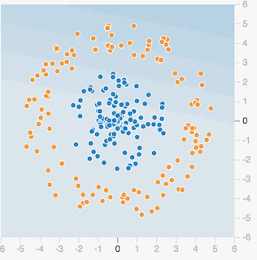

# 7.1 神经网络基础

## 学习目标

- 目标
  - 了解感知机结构、作用以及优缺点
  - 了解tensorflow playground的使用
  - 说明感知机与神经网络的联系
  - 说明神经网络的组成
- 应用
  - 无

## 7.1.1 神经网络

**人工神经网络（ Artificial Neural Network， 简写为ANN）也简称为神经网络（NN）**。是一种模仿生物神经网络（动物的中枢神经系统，特别是大脑）结构和功能的 **计算模型**。经典的神经网络结构包含三个层次的神经网络。**分别输入层，输出层以及隐藏层。**

**其中每层的圆圈代表一个神经元，隐藏层和输出层的神经元有输入的数据计算后输出，输入层的神经元只是输入。**

- 神经网络的特点
  - 1、每个连接都有个权值 
  - 2、同一层神经元之间没有连接
  - 3、最后的输出结果对应的层也称之为**全连接层**

* 组成：
  * 输入层：神经网络的第一层，原始的样本数据
  * 输出层：神经网络的最后一层，最终的计算结果
  * 隐藏层：其余的中间层都被称为隐藏层（hidden layer）
  * **权重（weight）：就是之前所说的参数，这里被称为一个神经节点的权重。**
  * **激活函数（activation function）：激活函数是两层神经元之间的映射函数，是一种输出到输入的转换，一般是非线性的，而且是单调可微函数（因为优化方法是基于梯度的）。常见的激活函数有：sigmoid,tanh**

那么为什么设计这样的结构呢？首先从一个最基础的结构说起，神经元。以前也称之为感知机。神经元就是要模拟人的神经元结构。

> 一个神经元通常具有多个**树突**，主要用来接受传入信息；而**轴突**只有一条，轴突尾端有许多轴突末梢可以给其他多个神经元传递信息。轴突末梢跟其他神经元的树突产生连接，从而传递信号。这个连接的位置在生物学上叫做“**突触**”。

要理解神经网络，其实要从感知机开始。

### 7.1.1.1 感知机(PLA: Perceptron Learning Algorithm))

感知机就是模拟这样的大脑神经网络处理数据的过程。感知机模型如下图：

感知机是一种最基础的分类模型，前半部分类似于回归模型。感知机最基础是这样的函数，而逻辑回归用的sigmoid。**这个感知机具有连接的权重和偏置**

我们通过一个平台去演示，就是tensorflow playground 

## 7.1.2 playground使用

> 网址：http://playground.tensorflow.org

那么在这整个分类过程当中，是怎么做到这样的效果那要受益于神经网络的一些特点

要区分一个数据点是橙色的还是蓝色的，你该如何编写代码？也许你会像下面一样任意画一条对角线来分隔两组数据点，定义一个阈值以确定每个数据点属于哪一个组。

其中 b 是确定线的位置的阈值。通过分别为 x1 和 x2 赋予权重 w1 和 w2，你可以使你的代码的复用性更强。

此外，如果你调整 w1 和 w2 的值，你可以按你喜欢的方式调整线的角度。你也可以调整 b 的值来移动线的位置。所以你可以重复使用这个条件来分类任何可以被一条直线分类的数据集。但问题的关键是程序员必须为 w1、w2 和 b 找到合适的值——即所谓的参数值，然后指示计算机如何分类这些数据点。

### 7.1.2.1 playground简单两类分类结果

#### 但是这种结构的线性的二分类器，但不能对非线性的数据并不能进行有效的分类。如下面异或问题例子：

* 感知机结构，能够很好去解决与、或等问题，但是并不能很好的解决异或等问题。我们通过一张图来看，有四个样本数据

与问题：每个样本的两个特征同时为1，结果为1

或问题：每个样本的两个特征一个为1，结果为1

如果解决异或：每个样本的两个特征相同为0， 不同为1？

画图理解：

公式理解：

其实上述我们可以就理解：Z= sigmoid(AX1+BX2+C)， 本身sigmoid函数是单调递增函数。

左上角点：x1=0，x2=1输出z=1

右上角点：x2=1，x2=1输出z=0

左下角点：x1=0，x2=0输出z=0

右下角点：x1=1，x2=0输出z=1

观察异或运算我们来看下面结果：

- 如果当X2=0， 将X1的取值从0到1，使得Z的结果也从0到1，意味着Z的变化时与X1正相关，需要设置A为正数
- 如果当X2=1， 将X1的取值从0到1，使得Z的结果也从1到0，意味着Z的变化时与X1负相关，需要设置A为负数

上面的两个结论是矛盾的，所有采用逻辑回归无法精确得到一个输出为异或的模型

#### 相当于给出这样的数据

### 7.1.2.2 单神经元复杂的两类-playground演示

#### 那么怎么解决这种问题呢？其实我们多增加层或者多几个感知机即可解决？也就是下图这样的结构，组成一层的结构？

####7.1.3.1多个神经元效果演示

### 7.1.4 神经网络发展史

* 1、深度学习其实并不是新的事物，深度学习所需要的神经网络技术起源于20世纪50年代，那个时候叫做**感知机**。当时也通常使用单层感知机，尽管结构简单，但是能够解决相当复杂的问题。
* 2、后来感知机被证明存在严重的问题，因为只能学习线性可分函数，连简单的异或(XOR)等线性不可分问题都无能为力，1969年Marvin Minsky写了一本叫做《Perceptrons》的书，他提出了著名的两个观点：**1.单层感知机没用，我们需要多层感知机来解决复杂问题 2.没有有效的训练算法。**
* 3、1974年哈佛大学博士毕业生Paul J. Werbos首次提出反向传播算法应用在神经网络的可能，但并未得到学术界的重视。直到1986年BP算法才真正开始流行起来，主要是因为Rumelhart、Hinton、Williams合著的《Learning representations by back-propagating errors》
* 4、 虽然训练算法有了突破，但是还存在很多问题，比如以当时计算机的计算能力，训练一次神经网络耗时太久，不具备实际使用价值。同时还会存在过拟合以及梯度消失等问题。而90年代中期，由Vapnik等人发明的支持向量机（Support Vector Machines，SVM）算法诞生，它同样解决了线性不可分问题，但是对比神经网络有全方位优势：
  * 1、高效，可以快速训练；
  * 2无需调参，没有梯度消失问题；
  * 3高效泛化，全局最优解，不存在过拟合问题，几乎全方位的碾压神经网络。
* 5、几乎在这10几年的时间，只有Hinton等几位学者在研究神经网络。直到2006年，提出了"深度置信网络"概念，有一个预训练的过程。使用微调技术作为反向传播和调优手段。减少了网络训练时间，并且提出了一个新的概念叫做"深度学习"
* 6、直到2012年，在ImageNet竞赛中，Hinton教授的团队，使用以卷积神经网络为基础的深度学习方案，他们训练的模型面对15万张测试图像时，预测的头五个类别的错误率只有 15.3%，而排名第二的日本团队，使用的SVM方法构建的模型，相应的错误率则高达 26.2%。从此一战成名！2012年后深度学习就成为主流。

