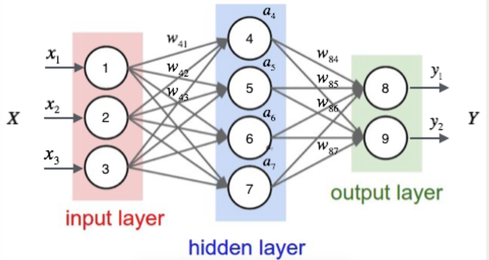

# 7.2 神经网络多分类原理与反向传播原理

## 学习目标

- 目标
  - 说明神经网络的softmax以及分类损失计算公式
  - 知道浅层神经网络的前向计算过程
  - 知道选择激活函数的原因
  - 说明浅层网络的反向传播推导过程
  - 知道导数、导数计算图
  - 掌握链式法则、逻辑回归的梯度下降优化
  - 了解浅层神经网络的前向计算(传播)与反向计算过程
- 应用
  - 无

### 7.2.1 神经网络计算输出

假设有这样一个网络，我们根据设置的神经元个数以及权重来计算输出：



我们假设中间都是使用sigmoid激活函数,运算的表示为:


同理作为最后一层输出的两个结果

$$y_1= sigmoid(a_4w_{84}+a_5w_{85}+a_6w_{86}+a_7w_{87})$$

$$y_2 = sigmoid(a_4w_{94}+a_5w_{95}+a_6w_{96}+a_7w_{97})$$

神经网络的主要用途在于分类，那么整个神经网络分类的原理是怎么样的？我们还是围绕着损失、优化这两块去说。神经网络输出结果如何分类？到目前为止，我们所接触的都是二分类问题，神经网络输出层只有一个神经元，表示预测输出$$\hat{y}$$是正类的概率$${P}(y=1|x), \hat{y} > {0.5}$$则判断为正类，反之判断为负类。那么对于多分类问题怎么办？


 **神经网络解决多分类问题最常用的方法是设置n个输出节点，其中n为类别的个数。**

任意事件发生的概率都在0和1之间，且总有某一个事件发生（概率的和为1）。如果将分类问题中“一个样例属于某一个类别”看成一个概率事件，那么训练数据的正确答案就符合一个概率分布。如何将神经网络前向传播得到的结果也变成概率分布呢？Softmax回归就是一个常用的方法。

**神经网络是如何去进行训练优化的呢，首先得知道神经网络分类的损失函数？**

## 7.2.3 softmax回归

Softmax回归将神经网络输出转换成概率结果


- softmax特点

如何理解这个公式的作用呢？看一下计算案例


**这样就把神经网络的输出也变成了一个概率输出**


#### 那么如何去衡量神经网络预测的概率分布和真实答案的概率分布之间的距离？

## 7.2.4 交叉熵损失

### 7.2.4.1 公式


为了能够衡量距离，目标值需要进行one-hot编码，能与概率值一一对应，如下图


它的损失如何计算？

```python
0log(0.10)+0log(0.05)+0log(0.15)+0log(0.10)+0log(0.05)+0log(0.20)+1log(0.10)+0log(0.05)+0log(0.10)+0log(0.10)
```

**上述的结果为1log(0.10)，那么为了减少这一个样本的损失。神经网络应该怎么做？**所以会提高对应目标值为1的位置输出概率大小，由于softmax公式影响，其它的概率必定会减少。只要这样进行调整这样是不是就预测成功了！！！！！

## 7.2.5 梯度下降算法

目的：使损失函数的值找到最小值

方式：梯度下降

函数的**梯度（gradient）**指出了函数的最陡增长方向。**梯度的方向走，函数增长得就越快。那么按梯度的负方向走，函数值自然就降低得最快了**。模型的训练目标即是寻找合适的 w 与 b 以最小化代价函数值。假设 **w 与 b 都是一维实数**，那么可以得到如下的 J 关于 w 与 b 的图：


可以看到，此成本函数 J 是一个**凸函数**

参数w和b的更新公式为：

$$w := w - \alpha\frac{dJ(w, b)}{dw}$$，$$b := b - \alpha\frac{dJ(w, b)}{db}$$

> 注：其中 α 表示学习速率，即每次更新的 w 的步伐长度。当 w 大于最优解 w′ 时，导数大于 0，那么 w 就会向更小的方向更新。反之当 w 小于最优解 w′ 时，导数小于 0，那么 w 就会向更大的方向更新。迭代直到收敛。

通过平面来理解梯度下降过程：


###7.2.6 反向传播算法

反向传播是训练神经网络最重要的算法，可以这么说，没有反向传播算法就没有深度学习的今天。但是反向传播算法设计一大堆数据公式概念。所以我们先带大家复习回顾一下之前机器学习中回归算法的常见优化方式。会先得到假设函数和代价函数，然后使用梯度下降算法求出代价函数的最小值，最后得到最优参数

* 导数、导数计算图
* 链式法则、逻辑回归的梯度下降优化、向量化编程
* 浅层神经网络的前向计算(传播)与反向计算过程

###导数

理解梯度下降的过程之后，我们通过例子来说明梯度下降在计算导数意义或者说这个导数的意义。

#### 7.2.6.1 导数

导数也可以理解成某一点处的斜率。斜率这个词更直观一些。

- 各点处的导数值一样


我们看到这里有一条直线，这条直线的斜率为4。我们来计算一个例子

例：取一点为a=2,那么y的值为8，我们稍微增加a的值为a=2.001,那么y的值为8.004，也就是当a增加了0.001，随后y增加了0.004，即4倍

那么我们的这个斜率可以理解为当一个点偏移一个不可估量的小的值，所增加的为4倍。

可以记做$$\frac{f(a)}{da}$$或者$$\frac{d}{da}f(a)$$

- 各点的导数值不全一致


例：取一点为a=2,那么y的值为4，我们稍微增加a的值为a=2.001,那么y的值约等于4.004（4.004001），也就是当a增加了0.001，随后y增加了4倍

取一点为a=5,那么y的值为25，我们稍微增加a的值为a=5.001,那么y的值约等于25.01（25.010001），也就是当a增加了0.001，随后y增加了10倍

可以得出该函数的导数2为2a。

- 更多函数的导数结果

|                          函数                          |             导数              |
| :----------------------------------------------------: | :---------------------------: |
|                     $$f(a) = a^2$$                     |            $$2a$$             |
|                      $$f(a)=a^3$$                      |           $$3a^2$$            |
|                     $$f(a)=ln(a)$$                     |        $$\frac{1}{a}$$        |
|                     $$f(a) = e^a$$                     |            $$e^a$$            |
|           $$\sigma(z) = \frac{1}{1+e^{-z}}$$           |  $$\sigma(z)(1-\sigma(z))$$   |
| $$g(z) = tanh(z) = \frac{e^z - e^{-z}}{e^z + e^{-z}}$$ | $$1-(tanh(z))^2=1-(g(z))^21$$ |

#### 7.2.6.2 导数计算图

那么接下来我们来看看含有多个变量的到导数流程图，假设$$J(a,b,c) = 3{(a + bc)}$$

我们以下面的流程图代替


这样就相当于从左到右计算出结果，然后从后往前计算出导数

- 导数计算

问题：那么现在我们要计算J相对于三个变量a,b,c的导数？

假设b=4,c=2,a=7,u=8,v=15,j=45

- $$\frac{dJ}{dv}=3$$

增加v从15到15.001，那么$$J\approx45.003$$

- $$\frac{dJ}{da}=3$$

增加a从7到7.001,那么$$v=\approx15.001$$，$$J\approx45.003$$

这里也涉及到链式法则

#### 7.2.6.3 链式法则

- $$\frac{dJ}{da}=\frac{dJ}{dv}\frac{dv}{da}=3 * 1=3$$

J相对于a增加的量可以理解为J相对于$$v$$相对于a增加的

接下来计算

- $$\frac{dJ}{db}=6=\frac{dJ}{du}\frac{du}{db}=3 * 2$$
- $$\frac{dJ}{dc}=9=\frac{dJ}{du}\frac{du}{dc}=3* 3$$

#### 7.2.6.4 逻辑回归的梯度下降

逻辑回归的梯度下降过程计算图，首先从前往后的计算图得出如下。

- $$z = w^Tx + b$$
- $$\hat{y} =a= \sigma(z)$$
- $$L(\hat{y},y) = -(y\log{a})-(1-y)\log(1-a)$$

那么计算图从前向过程为,假设样本有两个特征


问题：计算出J关于z的导数

- $$dz = \frac{dJ}{da}\frac{da}{dz} = a-y$$
  - $$\frac{dJ}{da} = -\frac{y}{a} + \frac{1-y}{1-a}$$
  - $$\frac{da}{dz} = a(1-a)$$

所以我们这样可以求出总损失相对于$$w_1,w_2,b$$参数的某一点导数，从而可以更新参数

- $$\frac{dJ}{dw_1} = \frac{dJ}{dz}\frac{dz}{dw_1}=dz * x1$$
- $$\frac{dJ}{dw_2} = \frac{dJ}{dz}\frac{dz}{dw_1}=dz * x2 $$
- $$\frac{dJ}{db}=dz$$

相信上面的导数计算应该都能理解了，所以当我们**计算损失函数的某个点相对于$$w_1,w_2,b$$的导数之后，就可以更新这次优化后的结果。**

$$w_1 := w_1 - \alpha\frac{dJ(w_1, b)}{dw_1}$$

$$w_2 := w_2 - \alpha\frac{dJ(w_2, b)}{dw_2}$$

$$b := b - \alpha\frac{dJ(w, b)}{db}$$

反向传播算法实际就是：**我们使用链式求导法则，反向层层推进，计算出每一层神经节点的偏导数，然后使用梯度下降，不断调整每一个节点的权重（也就是参数theta），从而达到求得全局最小值的目的。**

### 7.2.7 向量化编程

**每更新一次梯度时候，在训练期间我们会拥有m个样本，那么这样每个样本提供进去都可以做一个梯度下降计算。所以我们要去做在所有样本上的计算结果、梯度等操作**

$$J(w,b) = \frac{1}{m}\sum_{i=1}^mL({a}^{(i)},y^{(i)})$$

计算参数的梯度为：$$d(w_1)^{i}, d(w_2)^{i},d(b)^{i}$$,这样，我们想要得到最终的$$d{w_1},d{w_2},d{b}$$，如何去设计一个算法计算？伪代码实现：

> 初始化，假设
>
> $${J} = 0, dw_1=0, dw_2=0, db={0}$$
>
> for i in m:
>
> $$z^i = w^Tx^i+{b}$$
>
> $$a^i = \sigma(z^i)$$
>
> $$J +=-[y^ilog(a^i)+(1-y^i)log(1-a^i)]$$
>
> 每个梯度计算结果相加
>
> $$dz^i = a^i-y^{i}$$
>
> $$dw_1 += x_1^idz^i$$
>
> $$dw_2 +=x_2^idz^i$$
>
> $$db+=dz^i$$
>
> 最后求出平均梯度
>
> $$J /=m$$
>
> $$dw_1 /= m$$
>
> $$dw_2 /= m$$
>
> $$db /= m$$

####7.2.7.1 向量化优势

**什么是向量化**

由于在进行计算的时候，最好不要使用for循环去进行计算，因为有Numpy可以进行更加快速的向量化计算。

在公式$$z = w^Tx+b$$中$$w,x$$都可能是多个值，也就是$$\bar w = \left( \begin{array}{c}w_{1} \\ \vdots \\w_{n}\end{array}\right)  \bar x= \left(\begin{array}{c}x_{1} \\\vdots \\x_{n} \end{array}\right)$$

```python
import numpy as np
import time
a = np.random.rand(100000)
b = np.random.rand(100000)
```

- 第一种方法

```python
# 第一种for 循环
c = 0
start = time.time()
for i in range(100000):
    c += a[i]*b[i]
end = time.time()

print("计算所用时间%s " % str(1000*(end-start)) + "ms")
```

- 第二种向量化方式使用np.dot

```python
# 向量化运算
start = time.time()
c = np.dot(a, b)
end = time.time()
print("计算所用时间%s " % str(1000*(end-start)) + "ms")
```

Numpy能够充分的利用并行化，Numpy当中提供了很多函数使用

|        函数         |       作用       |
| :-----------------: | :--------------: |
| np.ones or np.zeros | 全为1或者0的矩阵 |
|       np.exp        |     指数计算     |
|       np.log        |     对数计算     |
|       np.abs        |    绝对值计算    |

**所以上述的m个样本的梯度更新过程，就是去除掉for循环。原本这样的计算**

#### 7.2.7.2 向量化反向传播实现伪代码

- 思路

|  $$z^1 = w^Tx^1+b$$   |  $$z^2 = w^Tx^2+b$$   |  $$z^3 = w^Tx^3+b$$   |
| :-------------------: | :-------------------: | :-------------------: |
| $$a^1 = \sigma(z^1)$$ | $$a^2 = \sigma(z^2)$$ | $$a^3 = \sigma(z^3)$$ |

可以变成这样的计算

$$\bar w = \left(\begin{array}{c}w_{1} \\ \vdots \\w_{n}\end{array}\right) \bar{x} = \left(\begin{array}{cccc}\vdots & \vdots & \vdots & \vdots &\vdots \\ x^1& x^2 & x^3 & \vdots & x^m \\ \vdots &\vdots & \vdots & \vdots & \vdots \end{array}\right)$$

注：w的形状为(n,1), x的形状为(n, m)，其中n为特征数量，m为样本数量

我们可以让$$Z= {W^T}X + b=\left(z^1, z^2,z^3\cdots z^m \right)+b=np.dot(W^T,X)+b$$，得出的结果为(1, m)大小的矩阵 注：大写的W,X为多个样本表示

- 实现多个样本向量化计算的伪代码

> 初始化，假设n个特征,m个样本
>
> $$J = 0, W=np.zeros([n,1]), b={0}$$
>
> $$Z= np.dot(W^T,X)+{b}$$
>
> $$A = \sigma(Z)$$
>
> 每个样本梯度计算过程为：
>
> $$dZ = {A}-{Y}$$
>
> $$dW = \frac{1}{m}X{dZ}^{T}$$
>
> $$db=\frac{1}{m}np.sum(dZ)$$
>
> 更新
>
> $$W := W - \alpha{dW}$$
>
> $$b := b - \alpha{db}$$

这相当于一次使用了M个样本的所有特征值与目标值，那我们知道如果想多次迭代，使得这M个样本重复若干次计算。

总结：前面我们所做的整个过程分为两个部分，一个是从前往后的计算出梯度与损失，另外一部分是从后往前计算参数的更新梯度值。所以在神经网络当中会经常出现两个概念，正向传播与反向传播。

### 7.2.8 浅层神经网络的前向传播与反向传播

### 浅层神经网络表示

之前已经说过神经网络的结构了，在这不重复叙述。假设我们有如下结构的网络


对于这个网络我们建立一个简单的图示？我们对第一个隐藏层记为[1]，输出层为[2]。如下图


计算图如下


* 每个神经元的计算分解步骤如下


* 第一层中的第一个神经元

$$z _1^{[1]} = (W _1^{[1]})^Tx+b _1^{[1]}$$

$$a _1^{[1]} = \sigma(z _1^{[1]})$$

* 第一层中的第一个神经元

$$z _2^{[1]} = (W _2^{[1]})^Tx+b _2^{[1]}$$

$$a _2^{[1]} = \sigma(z _2^{[1]})$$

得出第一层的计算：


* 多个样本的向量化表示

#### 激活函数的前向传播和反向传播(了解)

将上述网络的隐层激活函数修改为tanh，最后一层同样还是二分类，所以激活函数选择依然是sigmoid函数

* 前向传播

> $$Z^{[1]} = W^{[1]}X+b^{[1]}$$    
>
> $${A}^{[1]}=tanh(Z^{[1]})$$             
>
> $$Z^{[2]} = W^{[2]}A^{[1]}+b^{[2]}$$ 
>
> $$A^{[2]}=\sigma(Z^{[2]})$$             

* 反向梯度下降

那么通过这个计算图来理解这个过程，单个样本的导数推导过程：


由于网络已经存在两层，所以我们需要从后往前得到导数结果,并且多个样本的情况下改写成

> 最后一个输出层的参数的导数：
>
> $$dZ^{[2]} = A^{[2]} - Y$$
>
> $$dW^{[2]}=\frac{1}{m}dZ^{[2]}{A^{[1]}}^{T}$$
>
> $$db^{[2]}=\frac{1}{m}np.sum(dZ^{[2]}, axis=1)$$
>
> 隐藏层的导数计算：
>
> $$dZ^{[1]} = {W^{[2]}}^{T}dZ^{[2]}*{(1-g(Z^{[1]})}^{2}={W^{[2]}}^{T}dZ^{[2]}*{(1-A^{[1]})}^{2}$$
>
> $$dW^{[1]}=\frac{1}{m}dZ^{[1]}X^{T}$$
>
> $$db^{[1]} = \frac{1}{m}np.sum(dZ^{[1]}, axis=1)$$ 

### 7.2.9 激活函数的选择

**涉及到网络的优化时候，会有不同的激活函数选择有一个问题是神经网络的隐藏层和输出单元用什么激活函数。之前我们都是选用 sigmoid 函数，但有时其他函数的效果会好得多，大多数通过实践得来，没有很好的解释性。**

可供选用的激活函数有：

- tanh 函数（the hyperbolic tangent function，双曲正切函数）：


效果比 sigmoid 函数好,因为函数输出介于 -1 和 1 之间。

注 :tanh 函数存在和 sigmoid 函数一样的缺点：当 z 趋紧无穷大（或无穷小），导数的梯度（即函数的斜率）就趋紧于 0，这使得梯度算法的速度会减慢。

* ReLU 函数（the rectified linear unit，修正线性单元）


当 z > 0 时，梯度始终为 1，从而提高神经网络基于梯度算法的运算速度，收敛速度远大于 sigmoid 和 tanh。然而当 z < 0 时，梯度一直为 0，但是实际的运用中，该缺陷的影响不是很大。

- Leaky ReLU（带泄漏的 ReLU）：

  

Leaky ReLU 保证在 z < 0 的时候，梯度仍然不为 0。理论上来说，Leaky ReLU 有 ReLU 的所有优点，但在实际操作中没有证明总是好于 ReLU，因此不常用。

#### 7.2.9.1 为什么需要非线性的激活函数

使用线性激活函数和不使用激活函数、直接使用 Logistic 回归没有区别，那么无论神经网络有多少层，输出都是输入的线性组合，与**没有隐藏层**效果相当，就成了最原始的感知器了。

> $$a^{[1]} = z^{[1]} = W^{[1]}x+b^{[1]}$$
>
> $${a}^{[2]}=z^{[2]} = W^{[2]}a^{[1]}+b^{[2]}$$
>
> 那么这样的话相当于
>
> $${a}^{[2]}=z^{[2]} = W^{[2]}(W^{[1]}x+b^{[1]})+b^{[2]}=(W^{[2]}W^{[1]})x+(W^{[2]}b^{[1]}+b^{[2]})=wx+b$$

### 7.2.10 总结

* 神经网络分类原理、损失
* 知道选择激活函数的原因
* 说明浅层网络的反向传播推导过程
* 知道导数、导数计算图
* 掌握链式法则、逻辑回归的梯度下降优化
* 了解浅层神经网络的前向计算(传播)与反向计算过程