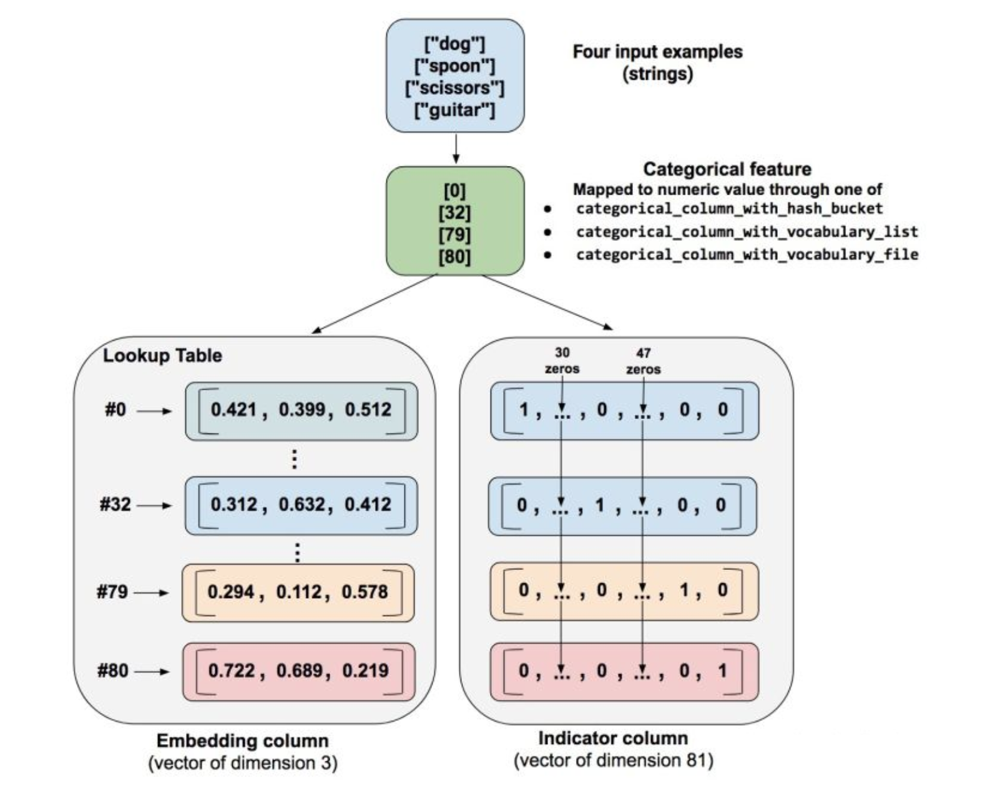

# 7.3 案例：神经网络分类

## 学习目标

- 目标
  - 掌握tf.dataset使用
  - 掌握tf.feature_column使用
- 应用
  - 应用tf.estimator进行神经网络分类案例

### 7.3.1 美国普查数据神经网络分类

将tf.estimator原来为线性模型替换成神经网络模型, 当使用神经网络进行分类的时候，注意输入的特征列

* 连续型特征列不需要处理
* 离散型特征列需要进行embedding_column或者indicator column处理，不能直接输入DNN模型中以categorical类别
  * embedding columns 不能直接作用在原始特征上，而是作用在categorical columns
  * Embedding column与indicator column之间的区别可以用下图表示
  * 使用indicator_column来把原始数据转换为神经网络的输入就变得非常不灵活，这时通常使用embedding column把原始特征映射为一个低维稠密的实数向量。同一类别的embedding向量间的距离通常可以用来度量类别直接的相似性。



特征列处理

```python
def get_feature_column_v2():
    """对于普查数据，进行特征列指定
    :return:
    """
    # 连续型特征
    age = tf.feature_column.numeric_column('age')
    education_num = tf.feature_column.numeric_column('education_num')
    capital_gain = tf.feature_column.numeric_column('capital_gain')
    capital_loss = tf.feature_column.numeric_column('capital_loss')
    hours_per_week = tf.feature_column.numeric_column('hours_per_week')

    numeric_columns = [age, education_num, capital_gain, capital_loss, hours_per_week]

    # 离散特征列指定
    relationship = tf.feature_column.categorical_column_with_vocabulary_list(
        'relationship',
        ['Husband', 'Not-in-family', 'Wife', 'Own-child', 'Unmarried', 'Other-relative'])

    occupation = tf.feature_column.categorical_column_with_hash_bucket(
        'occupation', hash_bucket_size=1000)

    education = tf.feature_column.categorical_column_with_vocabulary_list(
        'education', [
            'Bachelors', 'HS-grad', '11th', 'Masters', '9th', 'Some-college',
            'Assoc-acdm', 'Assoc-voc', '7th-8th', 'Doctorate', 'Prof-school',
            '5th-6th', '10th', '1st-4th', 'Preschool', '12th'])

    marital_status = tf.feature_column.categorical_column_with_vocabulary_list(
        'marital_status', [
            'Married-civ-spouse', 'Divorced', 'Married-spouse-absent',
            'Never-married', 'Separated', 'Married-AF-spouse', 'Widowed'])

    workclass = tf.feature_column.categorical_column_with_vocabulary_list(
        'workclass', [
            'Self-emp-not-inc', 'Private', 'State-gov', 'Federal-gov',
            'Local-gov', '?', 'Self-emp-inc', 'Without-pay', 'Never-worked'])

    categorical_columns = [tf.feature_column.embedding_column(relationship, dimension=6),
                           tf.feature_column.embedding_column(occupation, dimension=1000),
                           tf.feature_column.embedding_column(education, dimension=16),
                           tf.feature_column.embedding_column(marital_status, dimension=7),
                           tf.feature_column.embedding_column(workclass, dimension=9)]

    return numeric_columns + categorical_columns
```

模型的输入与训练

* tf.estimator.DNNClassifier(feature_columns=columns, hidden_units=[512, 256])
  * hidden_units：指定多少层网络以及每一层神经元

```python
estimator = tf.estimator.DNNClassifier(feature_columns=columns, hidden_units=[512, 256])

# 训练数据输入函数不能有参数
import functools
# input_func三个参数u，指定默认值
train_input = functools.partial(input_func, train_file, epoches=1, batch_size=32)
test_input = functools.partial(input_func, test_file, epoches=1, batch_size=32)
# train_input()
# 训练评估
estimator.train(train_input)
res = estimator.evaluate(test_input)
print(res)
for key, value in sorted(res.items()):
print('%s: %s' % (key, value))
```

### 7.3.2 tf.data

使用 tf.data API 可以轻松处理大量数据、不同的数据格式以及复杂的转换。[`tf.data`](https://www.tensorflow.org/api_docs/python/tf/data) API 在 TensorFlow 中引入了两个新的抽象类：

- [`tf.data.Dataset`](https://www.tensorflow.org/api_docs/python/tf/data/Dataset) 表示一系列元素，其中每个元素包含一个或多个 `Tensor` 对象。：
  - 创建**来源**（例如 `Dataset.from_tensor_slices()`），以通过一个或多个 [`tf.Tensor`](https://www.tensorflow.org/api_docs/python/tf/Tensor) 对象构建数据集。
  - 应用**转换**（例如 `Dataset.batch()`），以通过一个或多个 [`tf.data.Dataset`](https://www.tensorflow.org/api_docs/python/tf/data/Dataset) 对象构建数据集。
  - **dataset如果用于tf.estimator， 必须是字典形式的feature, label**
- [`tf.data.Iterator`](https://www.tensorflow.org/api_docs/python/tf/data/Iterator) 提供了从数据集中提取元素的主要方法。`Iterator.get_next()` 返回的操作会在执行时生成 `Dataset` 的下一个元素，并且此操作通常充当输入管道代码和模型之间的接口。

我们建议使用 TensorFlow 的 Dataset API，它可以解析各种数据。概括来讲，Dataset API 包含下列类：


- `Dataset` - 包含创建和转换数据集的方法的基类。您还可以通过该类从内存中的数据或 Python 生成器初始化数据集。
- `TextLineDataset` - 从文本文件中读取行。
- `TFRecordDataset` - 从 TFRecord 文件中读取记录。
- `FixedLengthRecordDataset` - 从二进制文件中读取具有固定大小的记录。
- `Iterator` - 提供一次访问一个数据集元素的方法。

**1 使用机制**

* 1、要启动输入管道，您必须定义来源。例如，要通过内存中的某些张量构建 `Dataset`，可以使用 `tf.data.Dataset.from_tensor_slices()`。或者，如果输入数据以推荐的 TFRecord 格式存储在磁盘上，那么您可以构建 [`tf.data.TFRecordDataset`](https://www.tensorflow.org/api_docs/python/tf/data/TFRecordDataset)。

* 2、一旦有了 `Dataset` 对象，可以将其转换为新的 `Dataset`，方法是链接 [`tf.data.Dataset`](https://www.tensorflow.org/api_docs/python/tf/data/Dataset) 对象上的方法调用。例如，您可以应用单元素转换，例如 `Dataset.map()`（为每个元素应用一个函数），也可以应用多元素转换（例如 `Dataset.batch()`）。

* 3、如果需要获取 `Dataset` 中的值。通过此对象，可以一次访问数据集中的一个元素（通过调用 `Dataset.make_one_shot_iterator()`），  `Iterator.get_next()`。

**2 tf.data.Dataset.from_tensor_slices获取数据**

一个数据集包含多个元素，每个元素的结构都相同。一个元素包含一个或多个 [`tf.Tensor`](https://www.tensorflow.org/api_docs/python/tf/Tensor) 对象，这些对象称为组件。可以通过 `Dataset.output_types` 和 `Dataset.output_shapes` 属性检查数据集元素各个组件的推理类型和形状。这些属性的嵌套结构映射到元素的结构，此元素可以是单个张量、张量元组，也可以是张量的嵌套元组。例如：

```python
dataset1 = tf.data.Dataset.from_tensor_slices(tf.random_uniform([4, 10]))
print(dataset1.output_types)
print(dataset1.output_shapes)

dataset2 = tf.data.Dataset.from_tensor_slices(
   (tf.random_uniform([4]),
    tf.random_uniform([4, 100], maxval=100, dtype=tf.int32)))
print(dataset2.output_types)
print(dataset2.output_shapes)
```

为元素的每个组件命名通常会带来便利性，例如，如果它们表示训练样本的不同特征。除了元组之外，还可以使用 `collections.namedtuple` 或将字符串映射到张量的字典来表示 `Dataset` 的单个元素

```
dataset = tf.data.Dataset.from_tensor_slices(
   {"a": tf.random_normal([4]),
    "b": tf.random_normal([4, 100], dtype=tf.float32)})
print(dataset.output_types)
print(dataset.output_shapes)
```

**3 创建迭代器**

构建了表示输入数据的 `Dataset` 后，下一步就是创建 `Iterator` 来访问该数据集中的元素。

**单次**迭代器是最简单的迭代器形式，仅支持对数据集进行一次迭代，不需要显式初始化。单次迭代器可以处理基于队列的现有输入管道支持的几乎所有情况，但它们不支持参数化。以 `Dataset.range()` 为例：

注：`Dataset.make_one_shot_iterator()` does not support datasets that capture stateful objects，不能用于来自于静态的数组对象

```python
dataset = tf.data.Dataset.range(100)
iterator = dataset.make_one_shot_iterator()
next_element = iterator.get_next()

for i in range(100):
  value = sess.run(next_element)
  print(value)
```

> 注：要在 `input_fn` 中使用 `Dataset`（input_fn 属于 [`tf.estimator.Estimator`](https://www.tensorflow.org/api_docs/python/tf/estimator/Estimator?hl=zh-CN)），只需返回 `Dataset` 即可，框架将负责创建和初始化迭代器。

**4 读取输入数据**

* 读取现有数组数据

- `features`：Python 字典，其中：
  - 每个键都是特征的名称。
  - 每个值都是包含此特征所有值的数组。
- `label` - 包含每个样本的[标签](https://developers.google.com/machine-learning/glossary/?hl=zh_cn#label)值的数组。

```python
  features = {'SepalLength': np.array([6.4, 5.0]),
              'SepalWidth':  np.array([2.8, 2.3]),
              'PetalLength': np.array([5.6, 3.3]),
              'PetalWidth':  np.array([2.2, 1.0])}
  labels = np.array([2, 1])
```

在函数中调用

```python
def train_input_fn(features, labels, batch_size):
    """
    """
    dataset = tf.data.Dataset.from_tensor_slices((dict(features), labels))

    dataset = dataset.shuffle(1000).repeat().batch(batch_size)

    return dataset

dataset = train_input_fn(features=features, labels=labels, batch_size=32) 
dataset.make_one_shot_iterator().get_next()
```

上面的代码段会将 `features` 和 `labels` 数组作为 `tf.constant()` 指令嵌入在 TensorFlow 图中。**这样非常适合小型数据集，但会浪费内存，因为会多次复制数组的内容，但是不能达到 tf.GraphDef协议缓冲区的 2GB 上限**。

* 读取CSV、文本数据

```python
filenames = ["1.txt", "2.txt"]
dataset = tf.data.TextLineDataset(filenames)
```

默认情况下，`TextLineDataset` 会生成每个文件的每一行。所以通过长会使用 `Dataset.map()` 预处理数据

`Dataset.map(f)` 转换通过将指定函数 `f` 应用于输入数据集的每个元素来生成新数据集。

**4 Dataset的转换（transformations）**

当使用Dataset.map()，Dataset.flat_map()，以及Dataset.filter()转换时，它们会对每个element应用一个function

```python
dataset1 = dataset1.map(lambda x: ...)
```

* 读取TFRecord 数据
  * TFRecords部分讲解

**5 训练的数据集大小指定**

[`tf.data`](https://www.tensorflow.org/api_docs/python/tf/data) API 提供了两种主要方式来处理同一数据的多个epoch。要迭代数据集多个周期，最简单的方法是使用 `Dataset.repeat()` 转换。例如，要创建一个将其输入重复 10 个周期的数据集：

```python
dataset = dataset.map(...)
dataset = dataset.repeat(10)
dataset = dataset.batch(32)
```

如果 `Dataset.repeat()`中没有参数 转换将无限次地重复输入。

* 随机重排输入数据

`Dataset.shuffle()` 转换会使用算法随机重排输入数据集：它会维持一个固定大小的缓冲区，并从该缓冲区统一地随机选择下一个元素。

```python
dataset = dataset.map(...)
dataset = dataset.shuffle(buffer_size=10000)
dataset = dataset.batch(32)
dataset = dataset.repeat()
```

### 7.3.3 特征处理tf.feature_colum

**特征列**

 Estimator 的 `feature_columns` 参数来指定模型的输入。特征列在输入数据（由`input_fn`返回）与模型之间架起了桥梁。要创建特征列，请调用 `tf.feature_column` 模块的函数。本文档介绍了该模块中的 9 个函数。如下图所示，除了 `bucketized_column` 外的函数要么返回一个 Categorical Column 对象，要么返回一个 Dense Column 对象。


要创建特征列，请调用 `tf.feature_column` 模块的函数。本文档介绍了该模块中的 9 个函数。如下图所示，除了 `bucketized_column` 外的函数要么返回一个 Categorical Column 对象，要么返回一个 Dense Column 对象。


1，数值列（[tf.feature_column.numeric_column](https://www.tensorflow.org/api_docs/python/tf/feature_column/numeric_column)）

2，分桶列（[tf.feature_column.bucketized_column](https://www.tensorflow.org/api_docs/python/tf/feature_column/bucketized_column)）

3，分类标识列（[tf.feature_column.categorical_column_with_identity](https://www.tensorflow.org/api_docs/python/tf/feature_column/categorical_column_with_identity)）

4，分类词汇列（[tf.feature_column.categorical_column_with_vocabulary_list](https://www.tensorflow.org/api_docs/python/tf/feature_column/categorical_column_with_vocabulary_list) 或者 [tf.feature_column.categorical_column_with_vocabulary_file](https://www.tensorflow.org/api_docs/python/tf/feature_column/categorical_column_with_vocabulary_file)）

5，经过哈希处理的列（[tf.feature_column.categorical_column_with_hash_bucket](https://www.tensorflow.org/api_docs/python/tf/feature_column/categorical_column_with_hash_bucket)）

6，组合列（[tf.feature_column.crossed_column](https://www.tensorflow.org/api_docs/python/tf/feature_column/crossed_column)）

7，指标列（[tf.feature_column.indicator_column](https://www.tensorflow.org/api_docs/python/tf/feature_column/indicator_column)）

8，嵌入列（[tf.feature_column.embedding_column](https://www.tensorflow.org/api_docs/python/tf/feature_column/embedding_column)）

- Numeric column（数值列）

Iris 分类器对所有输入特徵调用 `tf.feature_column.numeric_column` 函数：SepalLength、SepalWidth、PetalLength、PetalWidth

`tf.feature_column` 有许多可选参数。如果不指定可选参数，将默认指定该特征列的数值类型为 `tf.float32`。

```python
numeric_feature_column = tf.feature_column.numeric_column(key="SepalLength")
```

- Bucketized column（分桶列）

通常，我们不直接将一个数值直接传给模型，而是根据数值范围将其值分为不同的 categories。上述功能可以通过 `tf.feature_column.bucketized_column` 实现。以表示房屋建造年份的原始数据为例。我们并非以标量数值列表示年份，而是将年份分成下列四个分桶：


模型将按以下方式表示这些分桶：

| 日期范围               | 表示为…      |
| :--------------------- | :----------- |
| < 1960 年              | [1, 0, 0, 0] |
| >= 1960 年但 < 1980 年 | [0, 1, 0, 0] |
| >= 1980 年但 < 2000 年 | [0, 0, 1, 0] |
| >= 2000 年             | [0, 0, 0, 1] |

```
# 首先，将原始输入转换为一个numeric column
numeric_feature_column = tf.feature_column.numeric_column("Year")

# 然后，按照边界[1960,1980,2000]将numeric column进行bucket
bucketized_feature_column = tf.feature_column.bucketized_column(
    source_column = numeric_feature_column,
    boundaries = [1960, 1980, 2000])
```

- Categorical identity column（类别标识列）

输入的列数据就是为固定的离散值，假设您想要表示整数范围 [0, 4)。在这种情况下，分类标识映射如下所示：


```python
identity_feature_column = tf.feature_column.categorical_column_with_identity(
    key='my_feature_b',
    num_buckets=4) # Values [0, 4)
```

- Categorical vocabulary column（类别词汇表）

我们不能直接向模型中输入字符串。我们必须首先将字符串映射为数值或类别值。Categorical vocabulary column 可以将字符串表示为**one_hot格式**的向量。


```python
vocabulary_feature_column =
    tf.feature_column.categorical_column_with_vocabulary_list(
        key=feature_name_from_input_fn,
        vocabulary_list=["kitchenware", "electronics", "sports"])
```

- Hashed Column（哈希列）

处理的示例都包含很少的类别。但当类别的数量特别大时，我们不可能为每个词汇或整数设置单独的类别，因为这将会消耗非常大的内存。对于此类情况，我们可以反问自己：“我愿意为我的输入设置多少类别？

```python
hashed_feature_column =
    tf.feature_column.categorical_column_with_hash_bucket(
        key = "some_feature",
        hash_bucket_size = 100) # The number of categories
```


- 其它列处理
  - **Crossed column（组合列）,深度排序算法进行讲解**

