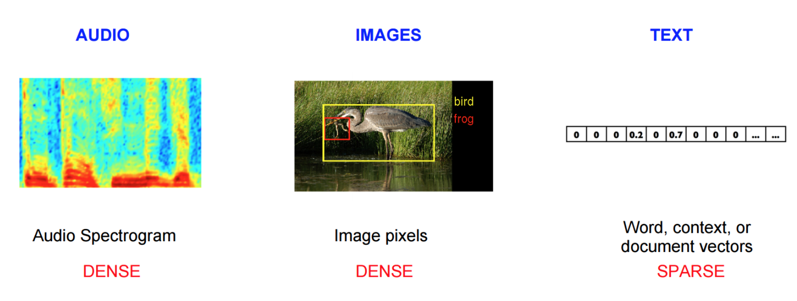
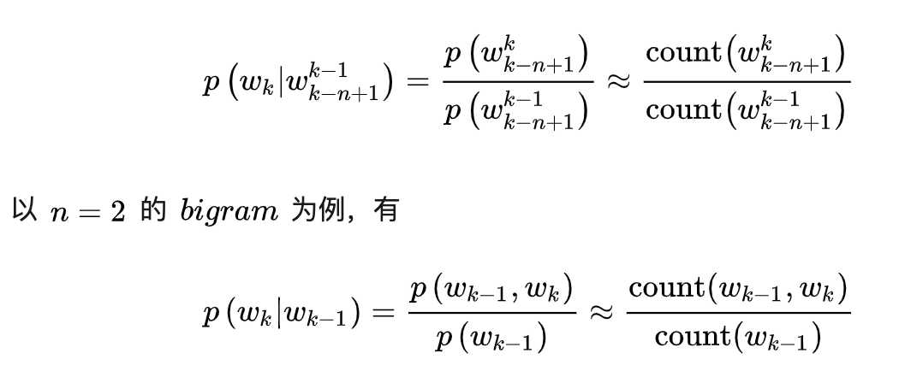
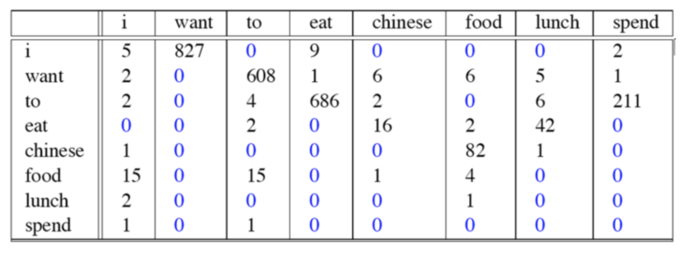
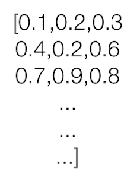
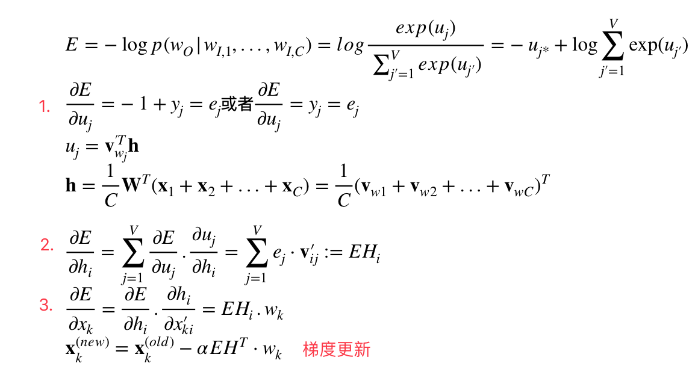

# 7.3 词向量-word2vec

## 学习目标

- 目标
  * 知道统计语言模型
  * 掌握神经网络语言模型NNLM原理
  * 掌握wor2vec的实现方式以及优化特点
- 应用
  - 无

### 7.3.1 Word2Vec模型介绍

#### 7.3.1.1 为什么学习词嵌入

图像和音频处理系统采用的是庞大的高维度数据集，对于图像数据来说，此类数据集会编码为单个原始像素强度的向量。不过，自然语言处理系统一直以来都将字词视为离散的原子符号，将字词表示为唯一的离散 ID 还会导致数据稀疏性，并且通常意味着我们可能需要更多数据才能成功训练统计模型。使用向量表示法可以扫除其中一些障碍。

- 计算相似度

- - 寻找相似词
  - 信息检索

- 作为 SVM/LSTM 等模型的输入

- - 中文分词
  - 命名体识别

- 句子表示

- - 情感分析

- 文档表示

- - 文档主题判别

* 机器翻译与聊天机器人

#### 7.3.1.2 词向量是什么

定义：将**文字**通过一串数字向量表示

- **词的独热表示**：One-hot Representation
  - 采用稀疏方式 存储，简单易实现
  - 灯泡:[0,0,0,0,0,1,0,0,0,0,0,0,0,0,0,0]、灯管：[0,0,0,0,0,0,0,1,0,0,0,0,0,0,0,0]

维度过大词汇鸿沟现象：任意两个词之间都是孤立的。光从这两个向量中看不出两个词是否有关系，哪怕”灯泡”和”灯管”这两个词是同义词也不行

- **词的分布式表示**：Distributed representation
  - 传统的独热表示（ one-hot representation）仅仅将词符号化，不包含任何语义信息
  - Distributed representation 最早由 Hinton在 1986 年提出。它是一种低维实数向量，这种向量一般长成这个样子： [0.792, −0.177, −0.107, 0.109, −0.542, …]
  - **最大的贡献就是让相关或者相似的词，在距离上更接近了**

#### 7.3.1.3 词向量训练来源思想-统计语言模型

**统计语言模型**

- 统计语言模型： 统计语言模型把语言（词的序列）看作一个随机事件，并赋予相应的概率来描述其属于某种语言集合的可能性

注：语言模型就是用来计算一个句子的概率的模型，也就是判断一句话是否是人话的概率？

例如：一个句子由w1,w2,w3,w4,w5,…….这些词组，使得P(w1,w2,w3,w4,w5……)概率大(可以从训练语料中得出)

- N-Gram：**N元模型就是假设当前词的出现概率只与它前面的N-1个词有关**
  - 语言是一种序列，词与词之间并不是相互独立
  - 一元模型(unigram model)：假设某个出现的概率与前面所有词无关
    - P(s) = P(w1)P(w2)P(w3)…P(w4)
  - 二元模型(bigram model)：假设某个出现的概率与前面一个词相关
    - P(s) = P(w1)P(w2|w1)P(w3|w2)…P(w_i|w_i-1)
  - 三元模型(trigram model)：假设某个出现的概率与前面两个词相关
    - P(s) = P(w1)P(w2|w1)P(w3|w1,w2)…P(w_i|w_i-2,w_i-1)

> 注：目前使用较多的是三元模型，由于训练语料限制,无法追求更大的N，并且N越大导致计算量越来越大

* 求解：
  * 根据**条件概率公式**与**大数定律**，当语料的规模足够大时，有

##### 统计语言模型案例

这个例子来自大一点的语料库，为了计算对应的二元模型的参数。即P(wi | wi-1)，我们要先计数即c(wi-1，wi)，然后计数c(wi-1)，再用除法可得到这些条件概率。

**共现次数：**

**每个词个数**

最终我们可以计算比如，$$P(want|i) = \frac{827}{2533} \approx 0.33$$, 当然当你简历好整个次数模型之后，我们就可以计算出一个句子组成出现的概率

P(  I want english food ) = P(I) × P(want|I) × P(english|want) × P(food|english) × P(food) = 0.000031

##### 统计语言模型缺点

**N-gram语言模型**还存在**OOV问题**(Out Of Vocabulary)，也就是序列中出现了词表外词(也叫做**未登录词**)，或者说在测试集和验证集上出现了训练集中没有过的词。它采用一般的解决办法：

- 设置一个词频阈值，只有高于该阈值的词才会加入词表。
- 所有低于阈值的词替换为 UNK（一个特殊符号）。

统计语言模型这样的思想可以用来做很多事情。

#### 7.3.1.4 神经网络语言模型NNLMNNLM

**神经网络语言模型NNLM**依然是一个概率语言模型，它通过神经网络来计算概率语言模型中每个参数。

* 2003年，Bengio等人发表的《A Neural Probabilistic Language Model》论文就提出了这个模型。

* 模型解释：
  * 输入层：将context(w)每个词映射成一个长度为m的词向量(长度训练者指定)，词向量在开始是随机的，也**参与网络训练**
    * **使用随机初始化的方法建立一个|m|×N个词大小的查找表(lookup table)**
    * context(w):可以称之为上下文窗口长度，类似N-gram取多少个词作为添加
  * 投影层：将所有的上下文此项来给你拼接成一个长向量，作为目标w的特征向量。长度为m(n-1)
  * 隐藏层：拼接后的向量会经过一个规模为h的隐藏层，论文中使用tanh
    * $$y = U\cdot tanh(Wx+b1) + b2$$
  * 输出层：最后输出会通过softmax输出所有词个数大小比如N的大小概率分布
* 训练过程：
  * 训练时，使用**交叉熵**作为损失函数，反向传播算法进行训练
  * **当训练完成时**，就得到了 N-gram 神经语言模型，以及副产品**词向量**
    * **初始化的矩阵查找表是和神经网络的参数同时训练更新**

##### 神经网络语言模型例子

* 语料库：
  * "训练 神经网络 语言 模型 需要 反向 传播 算法"
  * 假设只有这样一句语料库，设定上下文窗口为c=3,总不同次数N=8，会分割成如下组合
  * "训练 神经网络 语言 模型”
  * "神经网络 语言 模型 需要"
  * "语言 模型 需要 反向 传播"
  * "模型 需要 反向 传播 算法"

下面这个例子，我们自定义初始化向量为3,会得到一个|3|×8个词大小的查找表(lookup table)：

过程描述为：

#### 7.3.1.4  Word2Vec

**word2Vec** 本质上也是一个神经语言模型，但是它的目标并不是语言模型本身，而是**词向量**；因此，其所作的一系列优化，都是为了更快更好的得到词向量

* **word2vec**提供了两套模型：**CBOW**和**Skip-Gram**，其基本思想如下：
  - **CBOW**在已知$$context(w)$$的情况下，预测$$w$$
  - **Skip-Gram**在已知 $$w$$ 的情况下预测$$context(w)$$

在这里我们讲一种模型，就是CBOW也是python gensim库以及google Tensorflow word2vec使用的模型。

#### 举例：CBOW前向计算与向量（参数）更新推导

CBOW与2003年Bengio的结构有些不同，不同点在于CBOW去掉了最耗时的非线性隐层、并且所有词共享隐层。该推导公式不包含下面的分层softmax与负采样优化过程！！！

*  前向计算：

**输入层和隐藏层**：输入上下文词的平均值与W权重计算，[1,V]x[V, N] = [1, N]得到中间向量h，

公式：$$\mathbf h=\frac {1}{C}\mathbf W^T(\mathbf x_1+\mathbf x_2+...+\mathbf x_C)=\frac {1}{C}(\mathbf v_{w1}+\mathbf v_{w2}+...+\mathbf v_{wC})^T$$

注：C是输入上下文单词的总数，w1,w2,...,wC是上下文单词，**v**是单词w的输入向量

**隐藏层和输出层**：有一个不同的权重矩阵v′=v_ij，这是一个N×V矩阵

公式：$$u_j=\mathbf v_{w_j}^T\mathbf h$$

**输出层接softmax**:以得到每个单词的后验概率
公式：$$p(w_j|w_I)=y_j=\frac {exp(u_j)}{\sum _{j'=1}^{V} exp(u_{j'})}$$

* 训练的目标是为了概率最大化：

$$\max y_{j*}
= \max \log y_{j*}
=E=-\log p(w_O|w_{I,1},...,w_{I,C})$$

**意义就是：使得 exp(目标位置的输出)/exp(所有的位置的输出和）的概率最大，目标简写为E，最大化问题会取-号变成最小化问题(常见损失优化都是最小)**

* 输入向量参数更新推导：

  

最终得到梯度更新输入向量的公式，其中我们给了一些中间值临时表示结果，防止式子变的过长。$$y_{j}$$的推导过程如下：

**这里的U代表输出目标的大小等同上面的V（隐层到输出的权重）；Vc代表上面的h就是隐层的输出结果，包含输入到隐层的权重和输入词向量**

复合函数，所以两部分继续对输入词向量Vc求偏导，最终结果得到：

整个过程就是一个符合函数的求导链式法则过程，所以常见函数的导数要记清楚有利于复杂公式求导；

#### 7.3.1.5 拓展- Word2vec 的训练trick（优化）

**Skip-Gram模型**和**CBOW模型**计算softmax的时候都需要整个词表 V，但实际当中，词语的个数非常非常多，会给计算造成很大困难效率低，所以需要用技巧来加速训练。

- hierarchical softmax：分层softmax

- - 本质是把 N 分类问题变成 log(N)次二分类，从O(N)时间复杂度编程O(log(N))

- negative sampling

- - 本质是预测总体类别的一个子集

>  其它：Skip与CBOW模型的推导过程，以及word2vec分层softmax的推导原理，word2vec负采样参数更新公式推导。

我们可以可视化学到的向量，方法是使用（t-SNE降维）等技术将它们投射到二维空间。在检查这些可视化效果时，这些向量很明显捕获了一些关于字词及其相互关系的一般语义信息，而且这些语义信息实际上非常有用。第一次发现诱导向量空间中的某些方向专门表示了字词之间特定的语义关系，例如男性-女性、动词时态，甚至国家/地区-首都关系。<https://distill.pub/2016/misread-tsne/>

### 7.3.2 Word2vec 词向量工具使用

* 可以使用python 的gensim库进行词向量训练
* 使用google word2vec工具。地址： [models/tutorials/embedding/word2vec.py](https://github.com/tensorflow/models/tree/master/tutorials/embedding/word2vec.py)
* Pyspark ml中的Word2Vec训练词向量

### 7.3.3 总结

* 掌握神经网络语言模型NNLM原理
* 掌握wor2vec的实现方式以及优化特点

