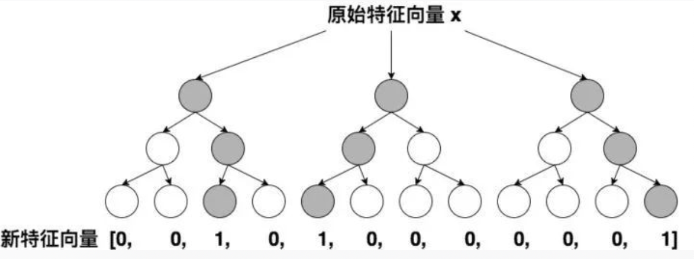

# 8.5 传统CTR排序模型

## 学习目标

- 目标
  - 了解深度学习排序模型的发展
- 应用
  - 无

### 8.5.1 传统CTR模型发展衍生图

CTR/CVR预估经历了从传统机器学习模型到深度学习模型的过渡。下面先介绍下传统机器学习模型。然后再详细介绍在深度学习模型的迭代。

* 为了解决特征交叉的问题，演化出**PLOY2，FM，FFM**等模型；
* 使用模型化、自动化的手段解决之前特征工程的难题，Facebook将LR与GBDT进行结合，提出了**GBDT+LR**组合模型
* Google从online learning的角度解决模型时效性的问题，提出了**FTRL**
* 阿里基于样本分组的思路增加模型的非线性，提出了**LS-PLM（MLR）**模型

#### LR

$$y(\mathbf{x}) = sigmoid(w_0+ \sum_{i=1}^n w_i x_i)$$

2012左右之后，各大中小公司的主流CTR模型无一例外全都是LR模型。

* 优点：
  * 1、数学基础：结合CTR模型的问题来说，x就是输入的特征向量，h(x)就是我们最终希望得到的点击率，所以采用LR作为CTR 模型是符合“点击”这一事件的物理意义的。
  * 2、可解释性：LR模型具有极强的可解释性，算法工程师们可以轻易的解释哪些特征比较重要，在CTR模型的预测有偏差的时候，也可以轻易找到哪些因素影响了最后的结果。
  * 3、工程化需要：在GPU尚未流行开来的2012年之前，LR模型也凭借其易于并行化、模型简单、训练开销小等特点占据着工程领域的主流

#### POLY2-特征交叉的引入

由于LR仅使用单一特征，无法利用高维信息，在“辛普森悖论”：<https://zh.wikipedia.org/wiki/%E8%BE%9B%E6%99%AE%E6%A3%AE%E6%82%96%E8%AE%BA>现象的存在下，只用单一特征进行判断，甚至会得出错误的结论。针对这个问题，当时的算法工程师们经常采用手动组合特征，再通过各种分析手段筛选特征的方法。采用 PLOY2模型进行特征的“暴力”组合成为了可行的选择。

1. 为什么要考虑特征之间的关联信息？

   大量的研究和实际数据分析结果表明：某些特征之间的关联信息（相关度）对事件结果的的发生会产生很大的影响。从实际业务线的广告点击数据分析来看，也正式了这样的结论。

2. 如何表达特征之间的关联？

   表示特征之间的关联，最直接的方法的是构造组合特征。样本中特征之间的关联信息在one-hot编码和浅层学习模型（如LR、SVM）是做不到的。目前工业界主要有两种手段得到组合特征：

   1. 人工特征工程（数据分析＋人工构造）；
   2. 通过模型做组合特征的学习（深度学习方法、FM/FFM方法）

缺点：

* 由于在处理互联网数据时，**经常采用one-hot的方法处理id类数据，致使特征向量极度稀疏，POLY2进行无选择的特征交叉使原本就非常稀疏的特征向量更加稀疏**，使得大部分交叉特征的权重缺乏有效的数据进行训练，无法收敛。

假设一个广告分类的问题，根据用户和广告位相关的特征，预测用户是否点击了广告。元数据如下：

| Clicked? | Country | Day      | Ad_type |
| :------- | :------ | :------- | :------ |
| 1        | USA     | 26/11/15 | Movie   |
| 0        | China   | 1/7/14   | Game    |
| 1        | China   | 19/2/15  | Game    |

“Clicked？”是label，Country、Day、Ad_type是特征。由于三种特征都是categorical类型的，需要经过独热编码（One-Hot Encoding）转换成数值型特征。

| Clicked? | Country=USA | Country=China | Day=26/11/15 | Day=1/7/14 | Day=19/2/15 | Ad_type=Movie | Ad_type=Game |
| :------- | :---------- | :------------ | :----------- | :--------- | :---------- | :------------ | :----------- |
| 1        | 1           | 0             | 1            | 0          | 0           | 1             | 0            |
| 0        | 0           | 1             | 0            | 1          | 0           | 0             | 1            |
| 1        | 0           | 1             | 0            | 0          | 1           | 0             | 1            |

* 权重参数的数量由n直接上升到n^2，极大增加了训练复杂度。

- 特征交叉：
  - 例子：年龄：[1990,2000],[2000,2010]
  - 性别：male, female
  - 交叉特征：male and [1990，2000]，female and [1990，2000] ,male and [2000，2010], female and [2000, 2010]
- 特征交叉问题：如果是简单的进行组合，会造成特征列数量过多，大量特征列。
  - 交叉项中的组合特征参数总共有n*(n−1)/ 2
  - 在数据稀疏性普遍存在的实际应用场景中，交叉项参数的训练是很困难的。

#### FM **隐向量特征交叉**

FM可以看做带特征交叉的LR，如下图所示：

2010年德国康斯坦茨大学的Steffen Rendle提出了FM（Factorization Machine）。

$$y(\mathbf{x}) = w_0 + \sum_{i=1}^n w_i x_i + \sum_{i=1}^n \sum_{j=i+1}^n \langle \mathbf{v}_{i, f_j}, \mathbf{v}_{j, f_i} \rangle x_i x_j$$

**隐向量的引入还使得FM比POLY2能够更好的解决数据稀疏性的问题**

* 工程上，FM同样可以用梯度下降进行学习的特点使其不失实时性和灵活性。相比之后深度学习模型复杂的网络结构，FM比较容易实现。因此FM在2012-2014年前后逐渐成为业界CTR模型的重要选择。

#### FFM(了解)

2015年，基于FM提出的FFM（Field-aware Factorization Machine ，简称FFM）在多项CTR预估大赛中一举夺魁，并随后被Criteo、美团等公司深度应用在CTR预估

相比FM，FFM由于引入了field这一概念，为模型引入了更多有价值信息，使模型表达能力更强，但与此同时，FFM的计算复杂度上升到kn^2，远远大于FM的k*n。

####GBDT+LR——特征工程模型化的开端(了解)

FFM模型采用引入特征域的方式增强了模型的表达能力，但无论如何，FFM只能够做二阶的特征交叉，如果要继续提高特征交叉的维度，不可避免的会发生组合爆炸和计算复杂度过高的情况。那么有没有其他的方法可以有效的处理高维特征组合和筛选的问题？2014年，Facebook提出了基于GBDT+LR组合模型的解决方案。

简而言之，Facebook提出了一种利用GBDT自动进行特征筛选和组合，进而生成新的离散特征向量，再把该特征向量当作LR模型输入，预估CTR的模型结构。

举例来说，如上图所示，GBDT由三颗子树构成，每个子树有4个叶子节点，一个训练样本进来后，先后落入“子树1”的第3个叶节点中，那么特征向量就是[0,0,1,0]，“子树2”的第1个叶节点，特征向量为[1,0,0,0]，“子树3”的第4个叶节点，特征向量为[0,0,0,1]，最后连接所有特征向量，形成最终的特征向量[0,0,1,0,1,0,0,0,0,0,0,1]。

果。GBDT+LR比FM重要的意义在于，**它大大推进了特征工程模型化这一重要趋势**，某种意义上来说，之后深度学习的各类网络结构，以及embedding技术的应用，都是这一趋势的延续。

#### FTRL-在线实时训练(了解)

FTRL的全称是Follow-the-regularized-Leader，是一种在线实时训练模型的方法，Google在2010年提出了FTRL的思路，2013年实现了FTRL的工程化，之后快速成为online learning的主流方法。与模型演化图中的其他模型不同，FTRL本质上是模型的训练方法。虽然Google的工程化方案是针对LR模型的，但理论上FTRL可以应用在FM，NN等任何通过梯度下降训练的模型上。

为了更清楚的认识FTRL，这里对梯度下降方法做一个简要的介绍，从训练样本的规模角度来说，梯度下降可以分为：batch，mini-batch，SGD（随机梯度下降）三种，batch方法每次都使用全量训练样本计算本次迭代的梯度方向，mini-batch使用一小部分样本进行迭代，而SGD每次只利用一个样本计算梯度。对于online learning来说，为了进行实时得将最新产生的样本反馈到模型中，SGD无疑是最合适的训练方式。但SGD对于互利网广告和推荐的场景来说，有比较大的缺陷，就是难以产生稀疏解。为什么稀疏解对于CTR模型如此重要呢？

* 由于one hot等id类特征处理方法导致广告和推荐场景下的样本特征向量极度稀疏，维度极高，动辄达到百万、千万量级。为了不割裂特征选择和模型训练两个步骤，如果能够在保证精度的前提下尽可能多的让模型的参数权重为0，那么我们就可以自动过滤掉这些权重为0的特征，生成一个“轻量级”的模型。“轻量级”的模型不仅会使样本部署的成本大大降低，而且可以极大降低模型inference的计算延迟。这就是模型稀疏性的重要之处。

FTRL算法细节比较晦涩难懂，后面还有一个机遇FTRL的案例，我们会简单介绍。想更多了解具体算法细节原理参考：在线最优化求解(Online Optimization)-冯扬.pdf

#### **LS-PLM——阿里曾经的主流CTR模型（了解）**

MLR模型虽然在2017年才公之于众，但其早在2012年就是阿里主流的CTR模型，并且在深度学习模型提出之前长时间应用于阿里的各类广告场景。

* MLR可以看做是对LR的自然推广，它**在LR的基础上采用分而治之的思路**，先对样本进行分片，再在样本分片中应用LR进行CTR预估。在LR的基础上加入聚类的思想，其动机其实来源于对计算广告领域样本特点的观察 

### 8.2.3 类别特征在推荐系统中作用

深度学习的这一波热潮，发源于CNN在图像识别上所取得的巨大成功，后来才扩展到推荐、搜索等领域。但是实际上，推荐系统中所使用的深度学习与计算机视觉中用到的深度学习有很大不同。其中一个重要不同，就是图像都是稠密特征，而推荐、搜索中大量用到的是稀疏的类别/ID类特

优点：

- LR, DNN在底层还是一个线性模型，但是实际工业中，**标签y与特征x之间较少存在线性关系，而往往是分段的**。以“点击率~历史曝光次数”之间的关系为例，之前曝光过1、2次的时候，“点击率~历史曝光次数”之间一般是正相关的，再多曝光1、2次，用户由于好奇，没准就点击了；但是，如果已经曝光过8、9次了，由于用户已经失去了新鲜感，越多曝光，用户越不可能再点，这时“点击率~历史曝光次数”就表现出负相关性。因此，categorical特征相比于numeric特征，更加符合现实场景。
- 推荐、搜索一般都是基于用户、商品的标签画像系统，而标签大多数都是categorical的
- 稀疏的类别/ID类特征，可以**稀疏地存储、传输、运算，提升运算效率**。

缺点：

稀疏的categorical/ID类特征，也有着**单个特征表达能力弱、特征组合爆炸、分布不均匀导致受训程度不均匀**的缺点。但是**对于CTR预估和排序学习的领域，目前深度学习尚未在自动特征挖掘上对人工特征工程形成碾压之势，因此人工特征工程依然很重要**。当然，深度学习在特征工程上与传统模型的特征工程也存在着一些区别，工作主要集中在如下几个方面。为此，一系列的新技术被提出来：

- 1、算法上，FTRL这样的算法，充分利用输入的稀疏性在线更新模型，训练出的模型也是稀疏的，便于快速预测。
- **2、特征预处理**
  - **特征归一化**：深度网络的学习几乎都是基于反向传播，而此类梯度优化的方法对于特征的尺度非常敏感。因此，需要对特征进行归一化或者标准化以促使模型更好的收敛。
  - **特征离散化**
    - 工业界一般很少直接使用连续值作为特征，而是将特征离散化后再输入到模型中。一方面因为离散化特征对于异常值具有更好的鲁棒性，其次可以为特征引入非线性的能力。**并且，离散化可以更好的进行Embedding**，我们主要使用如下两种离散化方法：
    - **等频分桶**：按样本频率进行等频切分，缺失值可以选择给一个默认桶值或者单独设置分桶。
  - **特征组合**：基于业务场景对基础特征进行组合，形成更丰富的行为表征，为模型提供先验信息，可加速模型的收敛速度。典型示例如下：
    - 用户性别与类目之间的交叉特征，能够刻画出不同性别的用户在类目上的偏好差异，比如男性用户可能会较少关注“丽人”相关的商户。
    - 时间与类目之间的交叉特征，能够刻画出不同类目商户在时间上的差异，例如，酒吧在夜间会更容易被点击。
  - **多考虑Embedding**
    - 通过Embedding去表征用户的个性化偏好和商户的精准画像
- 3、增加模型的DNN层级也会增加效果